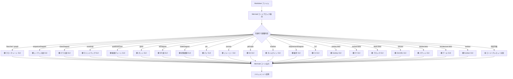

# Mermaid 対応状況・操作マトリクス

| ドキュメントバージョン | 3.0 |
|---|---|
| 対象拡張機能バージョン | Markdown Visual Editor v0.5.6 |
| 対象 Mermaid バージョン | 11.14.x（本拡張のバンドル版） |
| 作成日 | 2026-04-26 / 更新 2026-07-19 |

本書は本拡張機能における Mermaid 図のサポート状況をまとめたものです。

- **§1** Mermaid 全図種と本拡張の対応表（§1.4 挿入ピッカーの内訳を含む）
- **§2** 各図に対する GUI 操作マトリクス（§2.8 ズーム/パン実装の系統、§2.9 図種別の既知の制限事項を含む）
- **§3** 編集形態の概念図（Mermaid フローチャート）

---

## 1. Mermaid 図種別 対応表

### 1.1 凡例

| 記号 | 意味 |
|---|---|
| 🟢 GUI（高機能） | 専用ビジュアルエディタ（フォーム + SVG 直接操作）で編集可能 |
| 🟢 GUI（汎用フォーム） | 汎用フォーム型エディタ（セクション別リスト編集 + ライブ SVG プレビュー + コードモード切替）で編集可能 |
| 🟡 Code | コード + ライブプレビューの分割エディタで編集可能（GUI 操作なし） |

### 1.2 対応表

| # | 図種別 | Mermaid 構文キーワード | Mermaid 11.14 提供 | 本拡張の対応 | 担当エディタ |
|---|---|---|---|---|---|
| 1 | フローチャート | `flowchart` / `graph` | ✅ | 🟢 GUI（高機能） | `MermaidVisualEditor` ([media/mermaid-visual-editor.js](../media/mermaid-visual-editor.js)) |
| 2 | シーケンス図 | `sequenceDiagram` | ✅ | 🟢 GUI（高機能） | `SequenceDiagramEditor` ([media/diagram-editors.js](../media/diagram-editors.js)) |
| 3 | クラス図 | `classDiagram` | ✅ | 🟢 GUI（高機能） | `ClassDiagramEditor` ([media/diagram-editors.js](../media/diagram-editors.js)) |
| 4 | マインドマップ | `mindmap` | ✅ | 🟢 GUI（高機能） | `MindmapEditor` ([media/diagram-editors.js](../media/diagram-editors.js)) |
| 5 | 象限チャート | `quadrantChart` | ✅ | 🟢 GUI（高機能） | `QuadrantChartEditor` ([media/diagram-editors.js](../media/diagram-editors.js)) |
| 6 | ガントチャート | `gantt` | ✅ | 🟢 GUI（高機能） | `GanttChartEditor` ([media/diagram-editors.js](../media/diagram-editors.js)) |
| 7 | ER 図 | `erDiagram` | ✅ | 🟢 GUI（高機能） | `ERDiagramEditor` ([media/diagram-editors.js](../media/diagram-editors.js)) |
| 8 | 状態遷移図 | `stateDiagram` / `stateDiagram-v2` | ✅ | 🟢 GUI（汎用フォーム） | `StateDiagramEditor` ([media/extra-diagram-editors.js](../media/extra-diagram-editors.js)) |
| 9 | パイチャート | `pie` | ✅ | 🟢 GUI（汎用フォーム） | `PieChartEditor` |
| 10 | ユーザージャーニー | `journey` | ✅ | 🟢 GUI（汎用フォーム） | `JourneyEditor` |
| 11 | Git グラフ | `gitGraph` | ✅ | 🟢 GUI（汎用フォーム） | `GitGraphEditor` |
| 12 | タイムライン | `timeline` | ✅ | 🟢 GUI（汎用フォーム） | `TimelineEditor` |
| 13 | 要求図 | `requirementDiagram` | ✅ | 🟢 GUI（汎用フォーム） | `RequirementEditor` |
| 14 | C4 図 | `C4Context` 他 | ✅ | 🟢 GUI（汎用フォーム） | `C4Editor` |
| 15 | Sankey 図 | `sankey-beta` | ✅ | 🟢 GUI（汎用フォーム） | `SankeyEditor` |
| 16 | XY チャート | `xychart-beta` | ✅ | 🟢 GUI（汎用フォーム） | `XYChartEditor` |
| 17 | ブロック図 | `block-beta` | ✅ | 🟢 GUI（汎用フォーム） | `BlockDiagramEditor` |
| 18 | ZenUML | `zenuml` | ✅ | 🟢 GUI（汎用フォーム）※ | `ZenUmlEditor` |
| 19 | パケット図 | `packet-beta` | ✅（11.x 以降） | 🟢 GUI（汎用フォーム） | `PacketEditor` |
| 20 | アーキテクチャ図 | `architecture-beta` | ✅（11.x 以降） | 🟢 GUI（汎用フォーム） | `ArchitectureEditor` |
| 21 | Kanban | `kanban` | ✅（11.x 以降） | 🟢 GUI（汎用フォーム） | `KanbanEditor` |

### 1.3 集計

| カテゴリ | 件数 |
|---|---|
| Mermaid 11.14 提供 図種 | 21 |
| └ 本拡張で **GUI** 対応 | **21（100%）** |
| 　├ うち高機能 GUI（SVG 直接操作・形状選択など） | 7 |
| 　└ うち汎用フォーム GUI（リスト編集 + SVG プレビュー + コードモード） | 14 |
| └ Code+Preview のみ | **0** |
| 挿入ピッカー（後述 §1.4）に表示される件数 | **20**（ZenUML を除外） |

> **判定ロジック:** ダイアグラム種別は Mermaid コードブロック先頭行の文字列で判定されます（[docs/SPECIFICATION.md](SPECIFICATION.md)）。判定不能な構文は自動でコード+プレビュー分割エディタにフォールバックします。
>
> ※ ZenUML は `ZenUmlEditor`（フォームでタイトル・ステートメント列を編集）が存在し上表では GUI 対応として数えていますが、Mermaid 側の ZenUML レンダラー（`mermaid-zenuml`）がバンドルに同梱されていないため実運用上はコード編集が中心になります。挿入ピッカーからも除外されます（詳細は §2.9）。

---

### 1.4 挿入ピッカー（ダイアグラム種別選択画面）

ツールバーの「◇ Mermaid」またはブロック右クリック「◇ Mermaid ダイアグラム…」から開くピッカーは、**20 種を 5 カテゴリに分類**して表示します（`editor.js` の `DIAGRAM_CATEGORIES`）。ZenUML はレンダラー未同梱のため一覧から除外されています。

| カテゴリ | 件数 | 図種 |
|---|:---:|---|
| フロー系 | 3 | フローチャート / 状態遷移図 / ユーザージャーニー |
| シーケンス・関係系 | 4 | シーケンス図 / クラス図 / ER 図 / C4 図 |
| データ・チャート系 | 4 | パイチャート / 四象限チャート / Sankey 図 / XY チャート |
| プロジェクト系 | 5 | ガントチャート / タイムライン / Kanban / Git グラフ / 要求図 |
| その他 | 4 | マインドマップ / ブロック図 / パケット図 / アーキテクチャ図 |
| **合計** | **20** | — |

---

## 2. GUI 操作マトリクス

### 2.1 凡例

| 記号 | 意味 |
|---|---|
| ✅ | 対応 |
| — | 非対応／概念上存在しない |
| ⚠ | 制限あり（注釈参照） |

### 2.2 高機能 GUI 7 種 — 共通操作

| 操作 | フローチャート | シーケンス図 | クラス図 | マインドマップ | 象限チャート | ガント | ER 図 |
|---|:---:|:---:|:---:|:---:|:---:|:---:|:---:|
| SVG ライブプレビュー | ✅ | ✅ | ✅ | ✅ | ✅ | ✅ | ✅ |
| Mermaid コード手動編集 | ✅ | ✅ | ✅ | ✅ | ✅ | ✅ | ✅ |
| 設定パネル（フォーム入力） | ✅ | ✅ | ✅ | ✅ | ✅ | ✅ | ✅ |
| Undo / Redo | ✅ | ✅ | ✅ | ✅ | ✅ | ✅ | ✅ |
| ズーム | ✅ | ✅ | ✅ | ✅ | ✅ | ✅ | ✅ |
| パン（画面移動） | ⚠ ¹ | ✅ ² | ✅ ² | ✅ ² | ✅ ² | ✅ ² | ✅ ² |

¹ フローチャート編集画面のズーム/パンは独自実装（`mermaid-visual-editor.js`）で、**ズームのみ対応**。方向ボタン・中ボタンドラッグによるパンは非対応（他 20 種と非対称）。詳細は §2.8。
² 共通実装 `DiagramZoom`（`diagram-editors.js`）による。🔍+ / 🔍− / ⊞フィット / 方向ボタン(60px) / `Ctrl`+ホイールに加え、**中ボタンドラッグでパン**。倍率 0.2〜3.0（step 0.15）。詳細は §2.8。

### 2.3 高機能 GUI — 要素の追加・編集・削除

| 操作 | フローチャート | シーケンス図 | クラス図 | マインドマップ | 象限チャート | ガント | ER 図 |
|---|:---:|:---:|:---:|:---:|:---:|:---:|:---:|
| ノード／要素 追加 | ✅ | ✅ | ✅ | ✅ | ✅ | ✅ | ✅ |
| ノード／要素 編集 | ✅ | ✅ | ✅ | ✅ | ✅ | ✅ | ✅ |
| ノード／要素 削除 | ✅ | ✅ | ✅ | ✅ | ✅ | ✅ | ✅ |
| 接続 追加 | ✅ | ✅ | ✅ | — | — | ✅ | ✅ |
| 接続 編集 | ✅ | ✅ | ✅ | — | — | ✅ | ✅ |
| 接続 削除 | ✅ | ✅ | ✅ | — | — | ✅ | ✅ |

### 2.4 高機能 GUI — SVG 上の直接操作

| 操作 | フローチャート | シーケンス図 | クラス図 | マインドマップ | 象限チャート | ガント | ER 図 |
|---|:---:|:---:|:---:|:---:|:---:|:---:|:---:|
| クリック → 選択／パネル連動 | ✅ | ✅ | ✅ | ✅ | ✅ | ✅ | ✅ |
| ダブルクリックで編集 | ✅ | ✅ | — | ✅ | ✅ | — | ✅ |
| ドラッグ＆ドロップ | — | — | — | ✅ | ✅ | ✅ | — |
| エッジ反転／削除 | ✅ | — | — | — | — | — | — |
| 線種・ラベル変更 | ✅ | ✅ | — | — | — | — | — |

### 2.5 高機能 GUI — 構造・スタイル

| 操作 | フローチャート | シーケンス図 | クラス図 | マインドマップ | 象限チャート | ガント | ER 図 |
|---|:---:|:---:|:---:|:---:|:---:|:---:|:---:|
| 方向切替（TB/LR/RL/BT） | ✅ | — | — | — | — | — | — |
| レイアウト切替（Dagre/ELK/ELK ツリー、v0.3.1） | ✅ | — | — | — | — | — | — |
| サブグラフ／グルーピング | ✅ | — | — | — | — | — | — |
| サブグラフの入れ子化（v0.3.1） | ✅ | — | — | — | — | — | — |
| 背景色・色カスタマイズ | — | — | — | — | — | ✅ | — |
| 並び替え | — | ✅ | — | — | — | ✅ | — |
| 折りたたみ／階層 | — | — | — | ✅ | — | ✅ | — |

### 2.6 高機能 GUI — 入力補助

| 操作 | フローチャート | シーケンス図 | クラス図 | マインドマップ | 象限チャート | ガント | ER 図 |
|---|:---:|:---:|:---:|:---:|:---:|:---:|:---:|
| ノード形状選択 | ✅ | — | — | ✅ | — | — | — |
| ステータス／キー種別 | — | ✅ | ✅ | — | — | ✅ | ✅ |
| 軸・タイトル設定 | — | — | — | — | ✅ | ✅ | — |
| 日本語ラベル | ✅ | ✅ | ✅ | ✅ | ⚠ ¹ | ✅ | ✅ |

¹ v0.5.1 で軸ラベル・象限ラベル・データポイント名を生成時に自動で `"..."` 引用符化するようになり、**日本語などの非 ASCII 文字も問題なく使用可能**（旧版の「ASCII 推奨」制限は解消済み）。残る注意点: `title` のみ引用符なしで出力される（Mermaid 文法上、行末まで読むため問題なし）。ラベル内に `"`（ダブルクォート）を含めると、保存時に**エスケープではなく削除**される。

### 2.7 汎用フォーム GUI 14 種 — 操作マトリクス

| 操作 | 状態 | パイ | ジャーニー | Git | タイム | 要求 | C4 | Sankey | XY | ブロック | ZenUML | パケット | アーキ | Kanban |
|---|:---:|:---:|:---:|:---:|:---:|:---:|:---:|:---:|:---:|:---:|:---:|:---:|:---:|:---:|
| SVG ライブプレビュー | ✅ | ✅ | ✅ | ✅ | ✅ | ✅ | ✅ | ✅ | ✅ | ✅ | ✅ | ✅ | ✅ | ✅ |
| セクション別リスト編集 | ✅ | ✅ | ✅ | ✅ | ✅ | ✅ | ✅ | ✅ | ✅ | ✅ | ✅ | ✅ | ✅ | ✅ |
| 要素 追加（ダイアログ） | ✅ | ✅ | ✅ | ✅ | ✅ | ✅ | ✅ | ✅ | ✅ | ✅ | ✅ | ✅ | ✅ | ✅ |
| 要素 編集（ダイアログ） | ✅ | ✅ | ✅ | ✅ | ✅ | ✅ | ✅ | ✅ | ✅ | ✅ | ✅ | ✅ | ✅ | ✅ |
| 要素 削除 | ✅ | ✅ | ✅ | ✅ | ✅ | ✅ | ✅ | ✅ | ✅ | ✅ | ✅ | ✅ | ✅ | ✅ |
| コードモード（生 Mermaid 直接編集） | ✅ | ✅ | ✅ | ✅ | ✅ | ✅ | ✅ | ✅ | ✅ | ✅ | ✅ | ✅ | ✅ | ✅ |
| 要素の並べ替え | ✅ ¹ | ✅ ¹ | ✅ ¹ | ✅ ¹ | ✅ ¹ | ✅ ¹ | ✅ ¹ | ✅ ¹ | ✅ ¹ | ✅ ¹ | ✅ ¹ | ✅ ¹ | ✅ ¹ | ✅ ¹ |
| エディタ内 Undo | — ² | — ² | — ² | — ² | — ² | — ² | — ² | — ² | — ² | — ² | — ² | — ² | — ² | — ² |
| 表編集モード（Excel 風テーブル編集） | — | ✅ ⁴ | — | — | — | — | — | ✅ | ✅ ⁴ | — | — | — | — | — |
| ズーム／パン | ✅ ³ | ✅ ³ | ✅ ³ | ✅ ³ | ✅ ³ | ✅ ³ | ✅ ³ | ✅ ³ | ✅ ³ | ✅ ³ | ✅ ³ | ✅ ³ | ✅ ³ | ✅ ³ |

¹ 並べ替えは**ドラッグ＆ドロップ**または**右クリックメニューの「↑ 上に移動 / ↓ 下に移動」**で行う。リスト項目にフォーカスがある状態で `↑` / `↓` キー単体を押しても**フォーカスが移動するだけで並べ替えは行われない**（旧版ドキュメントの誤記を訂正）。
² 編集画面内に専用の Undo スタックはない。`Ctrl+Z` / `Ctrl+Shift+Z` / `Ctrl+Y` はドキュメント全体に対する操作（VS Code 標準の undo/redo）としてのみ機能する（旧版ドキュメントの誤記を訂正）。
³ 共通実装 `DiagramZoom`（高機能 GUI 6 種と共通、§2.2 参照）。🔍+ / 🔍− / ⊞フィット / 方向ボタン / `Ctrl`+ホイールに加え、**中ボタンドラッグでパン**。倍率 0.2〜3.0（step 0.15）。詳細は §2.8。
⁴ 既定で ON（開いた直後から表編集モードで表示）。Sankey は表編集⇄コードの切替のみで既定は表編集。

> 汎用フォーム GUI の編集対象（要素種別）の詳細は次表のとおり。

| 図種 | 編集セクション |
|---|---|
| 状態遷移図 | 状態 / 遷移 |
| パイチャート | スライス / タイトル |
| ジャーニー | セクション / タスク |
| Git グラフ | コミット・ブランチ・チェックアウト・マージ命令列 |
| タイムライン | セクション / 期間 / イベント |
| 要求図 | 要件 / 要素 / 関係 |
| C4 図 | Person / System / Container / Rel |
| Sankey 図 | フロー（source,target,value） |
| XY チャート | 向き（縦 / 横）/ カテゴリ / Y 軸（ラベル・min・max・**自動追従**、既定 ON）/ bar・line データ系列 / **表編集モードが既定** |
| ブロック図 | 列数 / ブロック行 |
| ZenUML | タイトル / ステートメント列（コード編集が中心、§2.9 参照） |
| パケット図 | フィールド範囲 / ラベル |
| アーキテクチャ図 | グループ / サービス / 接続 |
| Kanban | レーン / カード |

> **XY チャートの表示モードについて**: v0.4.3 の CHANGELOG に記載されていた「表示モード（重ね合わせ / 積み上げ / 横並び）」と `%% mdve:xy=` メタコメントは、**リポジトリの全履歴を通じて実装されたことがない**（`.js` ソースに一度も出現しない）ため、本書からは削除しています。実際に XY チャートが備えるのは上表の内容（向き・カテゴリ・Y 軸自動追従・bar/line 系列・表編集モード）のみです。

---

### 2.8 ズーム／パン実装の系統（v0.5.5）

Mermaid 図のズーム/パンには、目的の異なる **3 つの独立した実装**があります。

| 系統 | 対象 | 操作 |
|---|---|---|
| **A. `DiagramZoom` 共通実装**（`diagram-editors.js`） | 編集モードの **20 種**（高機能 GUI 6 種: シーケンス／クラス／マインドマップ／象限／ガント／ER ＋ 汎用フォーム GUI 14 種） | 🔍+ / 🔍− / ⊞フィット / ◀▶▲▼ 方向ボタン(60px) / 倍率 % 表示、`Ctrl`+ホイール、**中ボタンドラッグでパン**。倍率 0.2〜3.0、step 0.15 |
| **B. フローチャート独自実装**（`mermaid-visual-editor.js`） | フローチャート編集のみ | 🔍+ / 🔍− / ⊞フィット、`Ctrl`+ホイール。**パン非対応**（方向ボタン・中ボタンドラッグなし）— 他 20 種と非対称な制限 |
| **C. ドキュメントプレビュー用**（`editor.js`） | **本文中に描画された全 Mermaid 図**（種別問わず、編集モードでなくても適用） | 🔍+ / 🔍− / ⊞フィット / ◀▶▲▼、`Ctrl`+ホイール、**左ドラッグでパン**（Pointer Capture）。倍率 0.2〜4.0、step 0.2。はみ出す図は初回自動フィット。コンテナは `max-height:70vh` |

> 系統 A・B は「編集 GUI 画面内」のズーム/パンであるのに対し、系統 C は「ドキュメント本文のプレビュー表示」に適用される別実装です。1 つの Mermaid 図でも、編集中は系統 A/B、閲覧中（未編集時のプレビュー）は系統 C が働きます。
>
> **既知の非対称性**: フローチャートだけが編集画面でパン操作ができません（系統 B にはパン機能自体が実装されていない）。他の 20 種はすべて中ボタンドラッグでパンできます。

### 2.9 図種別ごとの既知の制限事項

- **シーケンス図**: `alt` / `opt` / `loop` / `par` / `activate` には非対応。GUI で生成できるのは参加者・メッセージ・ノート（right of / left of / over）・`rect` 色ブロックまで。
- **ガントチャート**: `after` 依存で開始日を指定したタスクは、タスクバーのドラッグによる日付変更が**できない**。色指定は Mermaid 標準構文ではなく、本拡張独自の `%%gantt-style bg:...` メタコメントを使用する。
- **アーキテクチャ図**: 組み込みアイコン **5 種**（cloud / database / disk / internet / server）のみ対応。カスタムアイコンパックは CSP（Content-Security-Policy）により読み込めない。
- **ブロック図・C4 図**: ソースコード上のコメントで「簡易版（simplified）」と明記されている実装。ブロック図は行単位の自由テキスト編集が中心。
- **パケット図**: フィールドのビット範囲について**重複検証を行わない**（範囲が重なっていてもエラーにならない）。
- **要求図**: 非 ASCII の値は自動的に引用符化されるが、パース処理は**正規表現ベース**であり、ネストした波括弧 `{}` を含む構文には弱い。
- **ZenUML**: Mermaid 側のレンダラー（`mermaid-zenuml`）がバンドルに同梱されていないため、実質的に**コード編集のみ**で運用する図種。挿入ピッカー（§1.4）からも除外される。
- **象限チャート**: 日本語などの非 ASCII ラベルに対応済み（v0.5.1）。残る制限は §2.6 の注釈¹を参照（`title` は引用符なし出力、ラベル内の `"` は保存時に削除）。
- **XY チャート**: 「表示モード」（積み上げ・重ね合わせ等）は実装されていない。実際の対応範囲は §2.7 の編集セクション表を参照。

---

## 3. 編集形態フロー（Mermaid 種別判定 → ルーティング）

---

## 4. 補足

- 本表は v0.5.6 時点の実装に基づきます（Mermaid 11.14.x バンドル）。
- 「Code+Preview」フォールバックは、判定外の実験的構文や将来の Mermaid 新図種にも汎用的に対応します。
- **フローチャート拡張機能（v0.3.1）**
  - ツールバーにレイアウト選択セレクタを追加し、**Dagre / ELK / ELK ツリー** を切替可能。Mermaid の `%%{init:{"layout":"..."}}%%` ディレクティブとして保存される。
  - **サブグラフの入れ子化** に対応。複数選択で 1 つに結合、または「親グループ」を選ぶことで階層構造を構築できる（サイクル防止付き）。
- **象限チャートの日本語対応（v0.5.1）**: ラベル自動引用符化により、軸・象限ラベル・データポイント名で日本語が使用可能に（詳細は §2.6 注釈¹）。
- **Mermaid ズーム / パン（v0.5.5）**: 実装は 3 系統（§2.8）。フローチャートのみパン非対応という非対称性がある。
- 参考: [Mermaid 公式ドキュメント — Diagram Syntax](https://mermaid.js.org/intro/syntax-reference.html)
