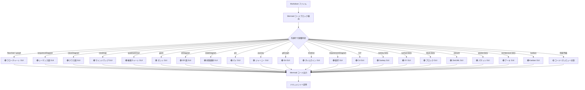

# Mermaid 対応状況・操作マトリクス

| ドキュメントバージョン | 2.1 |
|---|---|
| 対象拡張機能バージョン | Markdown Visual Editor v0.4.1 |
| 対象 Mermaid バージョン | 11.14.x（本拡張のバンドル版） |
| 作成日 | 2026-04-26 / 更新 2026-04-27 |

本書は本拡張機能における Mermaid 図のサポート状況をまとめたものです。

- **§1** Mermaid 全図種と本拡張の対応表
- **§2** 各図に対する GUI 操作マトリクス
- **§3** 編集形態の概念図（Mermaid フローチャート）

---

## 1. Mermaid 図種別 対応表

### 1.1 凡例

| 記号 | 意味 |
|---|---|
| 🟢 GUI（高機能） | 専用ビジュアルエディタ（フォーム + SVG 直接操作）で編集可能 |
| 🟢 GUI（汎用フォーム） | 汎用フォーム型エディタ（セクション別リスト編集 + ライブ SVG プレビュー + コードモード切替）で編集可能 |
| 🟡 Code | コード + ライブプレビューの分割エディタで編集可能（GUI 操作なし） |

### 1.2 対応表

| # | 図種別 | Mermaid 構文キーワード | Mermaid 11.14 提供 | 本拡張の対応 | 担当エディタ |
|---|---|---|---|---|---|
| 1 | フローチャート | `flowchart` / `graph` | ✅ | 🟢 GUI（高機能） | `MermaidVisualEditor` ([media/mermaid-visual-editor.js](../media/mermaid-visual-editor.js)) |
| 2 | シーケンス図 | `sequenceDiagram` | ✅ | 🟢 GUI（高機能） | `SequenceDiagramEditor` ([media/diagram-editors.js](../media/diagram-editors.js)) |
| 3 | クラス図 | `classDiagram` | ✅ | 🟢 GUI（高機能） | `ClassDiagramEditor` ([media/diagram-editors.js](../media/diagram-editors.js)) |
| 4 | マインドマップ | `mindmap` | ✅ | 🟢 GUI（高機能） | `MindmapEditor` ([media/diagram-editors.js](../media/diagram-editors.js)) |
| 5 | 象限チャート | `quadrantChart` | ✅ | 🟢 GUI（高機能） | `QuadrantChartEditor` ([media/diagram-editors.js](../media/diagram-editors.js)) |
| 6 | ガントチャート | `gantt` | ✅ | 🟢 GUI（高機能） | `GanttChartEditor` ([media/diagram-editors.js](../media/diagram-editors.js)) |
| 7 | ER 図 | `erDiagram` | ✅ | 🟢 GUI（高機能） | `ERDiagramEditor` ([media/diagram-editors.js](../media/diagram-editors.js)) |
| 8 | 状態遷移図 | `stateDiagram` / `stateDiagram-v2` | ✅ | 🟢 GUI（汎用フォーム） | `StateDiagramEditor` ([media/extra-diagram-editors.js](../media/extra-diagram-editors.js)) |
| 9 | パイチャート | `pie` | ✅ | 🟢 GUI（汎用フォーム） | `PieChartEditor` |
| 10 | ユーザージャーニー | `journey` | ✅ | 🟢 GUI（汎用フォーム） | `JourneyEditor` |
| 11 | Git グラフ | `gitGraph` | ✅ | 🟢 GUI（汎用フォーム） | `GitGraphEditor` |
| 12 | タイムライン | `timeline` | ✅ | 🟢 GUI（汎用フォーム） | `TimelineEditor` |
| 13 | 要求図 | `requirementDiagram` | ✅ | 🟢 GUI（汎用フォーム） | `RequirementEditor` |
| 14 | C4 図 | `C4Context` 他 | ✅ | 🟢 GUI（汎用フォーム） | `C4Editor` |
| 15 | Sankey 図 | `sankey-beta` | ✅ | 🟢 GUI（汎用フォーム） | `SankeyEditor` |
| 16 | XY チャート | `xychart-beta` | ✅ | 🟢 GUI（汎用フォーム） | `XYChartEditor` |
| 17 | ブロック図 | `block-beta` | ✅ | 🟢 GUI（汎用フォーム） | `BlockDiagramEditor` |
| 18 | ZenUML | `zenuml` | ✅ | 🟢 GUI（汎用フォーム） | `ZenUmlEditor` |
| 19 | パケット図 | `packet-beta` | ✅（11.x 以降） | 🟢 GUI（汎用フォーム） | `PacketEditor` |
| 20 | アーキテクチャ図 | `architecture-beta` | ✅（11.x 以降） | 🟢 GUI（汎用フォーム） | `ArchitectureEditor` |
| 21 | Kanban | `kanban` | ✅（11.x 以降） | 🟢 GUI（汎用フォーム） | `KanbanEditor` |

### 1.3 集計

| カテゴリ | 件数 |
|---|---|
| Mermaid 11.14 提供 図種 | 21 |
| └ 本拡張で **GUI** 対応 | **21（100%）** |
| 　├ うち高機能 GUI（SVG 直接操作・形状選択など） | 7 |
| 　└ うち汎用フォーム GUI（リスト編集 + SVG プレビュー + コードモード） | 14 |
| └ Code+Preview のみ | **0** |

> **判定ロジック:** ダイアグラム種別は Mermaid コードブロック先頭行の文字列で判定されます（[docs/SPECIFICATION.md](SPECIFICATION.md)）。判定不能な構文は自動でコード+プレビュー分割エディタにフォールバックします。

---

## 2. GUI 操作マトリクス

### 2.1 凡例

| 記号 | 意味 |
|---|---|
| ✅ | 対応 |
| — | 非対応／概念上存在しない |
| ⚠ | 制限あり（注釈参照） |

### 2.2 高機能 GUI 7 種 — 共通操作

| 操作 | フローチャート | シーケンス図 | クラス図 | マインドマップ | 象限チャート | ガント | ER 図 |
|---|:---:|:---:|:---:|:---:|:---:|:---:|:---:|
| SVG ライブプレビュー | ✅ | ✅ | ✅ | ✅ | ✅ | ✅ | ✅ |
| Mermaid コード手動編集 | ✅ | ✅ | ✅ | ✅ | ✅ | ✅ | ✅ |
| 設定パネル（フォーム入力） | ✅ | ✅ | ✅ | ✅ | ✅ | ✅ | ✅ |
| Undo / Redo | ✅ | — | — | — | — | — | — |

### 2.3 高機能 GUI — 要素の追加・編集・削除

| 操作 | フローチャート | シーケンス図 | クラス図 | マインドマップ | 象限チャート | ガント | ER 図 |
|---|:---:|:---:|:---:|:---:|:---:|:---:|:---:|
| ノード／要素 追加 | ✅ | ✅ | ✅ | ✅ | ✅ | ✅ | ✅ |
| ノード／要素 編集 | ✅ | ✅ | ✅ | ✅ | ✅ | ✅ | ✅ |
| ノード／要素 削除 | ✅ | ✅ | ✅ | ✅ | ✅ | ✅ | ✅ |
| 接続 追加 | ✅ | ✅ | ✅ | — | — | ✅ | ✅ |
| 接続 編集 | ✅ | ✅ | ✅ | — | — | ✅ | ✅ |
| 接続 削除 | ✅ | ✅ | ✅ | — | — | ✅ | ✅ |

### 2.4 高機能 GUI — SVG 上の直接操作

| 操作 | フローチャート | シーケンス図 | クラス図 | マインドマップ | 象限チャート | ガント | ER 図 |
|---|:---:|:---:|:---:|:---:|:---:|:---:|:---:|
| クリック → 選択／パネル連動 | ✅ | ✅ | ✅ | ✅ | ✅ | ✅ | ✅ |
| ダブルクリックで編集 | ✅ | ✅ | — | ✅ | ✅ | — | ✅ |
| ドラッグ＆ドロップ | — | — | — | ✅ | ✅ | ✅ | — |
| エッジ反転／削除 | ✅ | — | — | — | — | — | — |
| 線種・ラベル変更 | ✅ | ✅ | — | — | — | — | — |

### 2.5 高機能 GUI — 構造・スタイル

| 操作 | フローチャート | シーケンス図 | クラス図 | マインドマップ | 象限チャート | ガント | ER 図 |
|---|:---:|:---:|:---:|:---:|:---:|:---:|:---:|
| 方向切替（TB/LR/RL/BT） | ✅ | — | — | — | — | — | — |
| レイアウト切替（Dagre/ELK/ELK ツリー、v0.3.1） | ✅ | — | — | — | — | — | — |
| サブグラフ／グルーピング | ✅ | — | — | — | — | — | — |
| サブグラフの入れ子化（v0.3.1） | ✅ | — | — | — | — | — | — |
| 背景色・色カスタマイズ | — | — | — | — | — | ✅ | — |
| 並び替え | — | ✅ | — | — | — | ✅ | — |
| 折りたたみ／階層 | — | — | — | ✅ | — | ✅ | — |

### 2.6 高機能 GUI — 入力補助

| 操作 | フローチャート | シーケンス図 | クラス図 | マインドマップ | 象限チャート | ガント | ER 図 |
|---|:---:|:---:|:---:|:---:|:---:|:---:|:---:|
| ノード形状選択 | ✅ | — | — | ✅ | — | — | — |
| ステータス／キー種別 | — | ✅ | ✅ | — | — | ✅ | ✅ |
| 軸・タイトル設定 | — | — | — | — | ✅ | ✅ | — |
| 日本語ラベル | ✅ | ✅ | ✅ | ✅ | ⚠ ¹ | ✅ | ✅ |

¹ `quadrantChart` 構文解析の制約により、タイトル・軸ラベル・象限ラベル・データポイント名は ASCII 推奨。

### 2.7 汎用フォーム GUI 14 種 — 操作マトリクス

| 操作 | 状態 | パイ | ジャーニー | Git | タイム | 要求 | C4 | Sankey | XY | ブロック | ZenUML | パケット | アーキ | Kanban |
|---|:---:|:---:|:---:|:---:|:---:|:---:|:---:|:---:|:---:|:---:|:---:|:---:|:---:|:---:|
| SVG ライブプレビュー | ✅ | ✅ | ✅ | ✅ | ✅ | ✅ | ✅ | ✅ | ✅ | ✅ | ✅ | ✅ | ✅ | ✅ |
| セクション別リスト編集 | ✅ | ✅ | ✅ | ✅ | ✅ | ✅ | ✅ | ✅ | ✅ | ✅ | ✅ | ✅ | ✅ | ✅ |
| 要素 追加（ダイアログ） | ✅ | ✅ | ✅ | ✅ | ✅ | ✅ | ✅ | ✅ | ✅ | ✅ | ✅ | ✅ | ✅ | ✅ |
| 要素 編集（ダイアログ） | ✅ | ✅ | ✅ | ✅ | ✅ | ✅ | ✅ | ✅ | ✅ | ✅ | ✅ | ✅ | ✅ | ✅ |
| 要素 削除 | ✅ | ✅ | ✅ | ✅ | ✅ | ✅ | ✅ | ✅ | ✅ | ✅ | ✅ | ✅ | ✅ | ✅ |
| コードモード（生 Mermaid 直接編集） | ✅ | ✅ | ✅ | ✅ | ✅ | ✅ | ✅ | ✅ | ✅ | ✅ | ✅ | ✅ | ✅ | ✅ |
| ズーム／パン | ✅ | ✅ | ✅ | ✅ | ✅ | ✅ | ✅ | ✅ | ✅ | ✅ | ✅ | ✅ | ✅ | ✅ |

> 汎用フォーム GUI の編集対象（要素種別）の詳細は次表のとおり。

| 図種 | 編集セクション |
|---|---|
| 状態遷移図 | 状態 / 遷移 |
| パイチャート | スライス / タイトル |
| ジャーニー | セクション / タスク |
| Git グラフ | コミット・ブランチ・チェックアウト・マージ命令列 |
| タイムライン | セクション / 期間 / イベント |
| 要求図 | 要件 / 要素 / 関係 |
| C4 図 | Person / System / Container / Rel |
| Sankey 図 | フロー（source,target,value） |
| XY チャート | 軸設定 / データ系列（bar/line） |
| ブロック図 | 列数 / ブロック行 |
| ZenUML | メッセージ列 |
| パケット図 | フィールド範囲 / ラベル |
| アーキテクチャ図 | グループ / サービス / 接続 |
| Kanban | レーン / カード |

---

## 3. 編集形態フロー（Mermaid 種別判定 → ルーティング）

---

## 4. 補足

- 本表は v0.4.1 時点の実装に基づきます（Mermaid 11.14.x バンドル）。
- 「Code+Preview」フォールバックは、判定外の実験的構文や将来の Mermaid 新図種にも汎用的に対応します。
- **フローチャート拡張機能（v0.3.1）**
  - ツールバーにレイアウト選択セレクタを追加し、**Dagre / ELK / ELK ツリー** を切替可能。Mermaid の `%%{init:{"layout":"..."}}%%` ディレクティブとして保存される。
  - **サブグラフの入れ子化** に対応。複数選択で 1 つに結合、または「親グループ」を選ぶことで階層構造を構築できる（サイクル防止付き）。
- 参考: [Mermaid 公式ドキュメント — Diagram Syntax](https://mermaid.js.org/intro/syntax-reference.html)
