# ペルソナ設計書
## グローバル品質トレーサビリティシステム（GQTS: Global Quality Traceability System）

---

## システム概要とペルソナマップ

### ペルソナ全体構造図

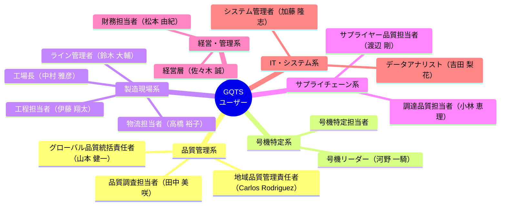
```mermaid
mindmap
  root((GQTS<br/>ユーザー))
    品質管理系
      グローバル品質統括責任者（山本 健一）
      地域品質管理責任者（Carlos Rodriguez）
      品質調査担当者（田中 美咲）
    号機特定系
      号機リーダー（河野 一騎）
      号機特定担当者
    製造現場系
      工場長（中村 雅彦）
      ライン管理者（鈴木 大輔）
      工程担当者（伊藤 翔太）
      物流担当者（高橋 裕子）
    サプライチェーン系
      調達品質担当者（小林 恵理）
      サプライヤー品質担当者（渡辺 剛）
    経営・管理系
      経営層（佐々木 誠）
      財務担当者（松本 由紀）
    IT・システム系
      システム管理者（加藤 隆志）
      データアナリスト（吉田 梨花）
```

### ペルソナ利用頻度・緊急度マトリクス

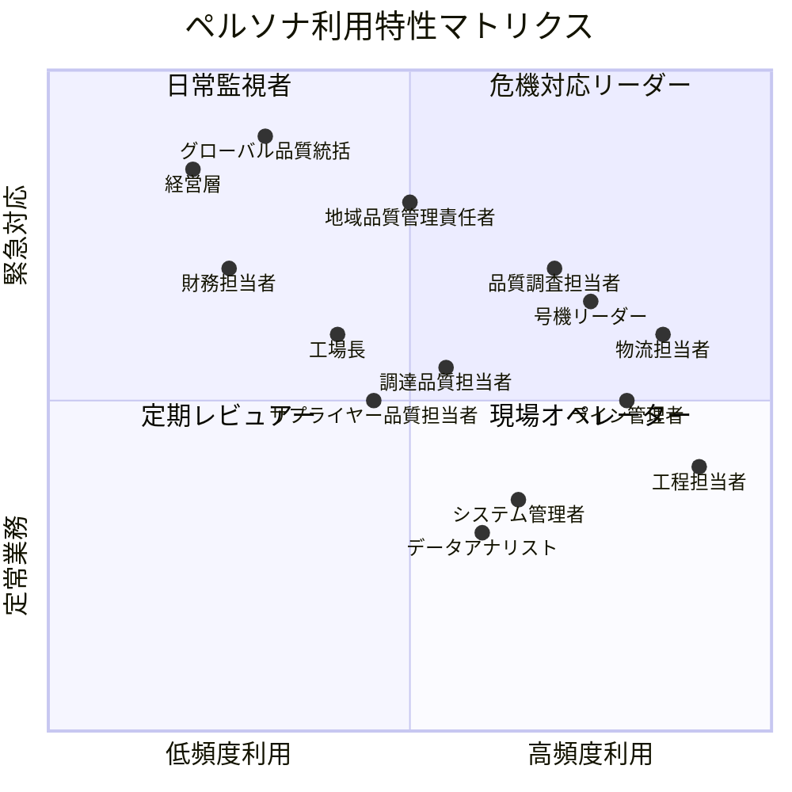
```mermaid
quadrantChart
    title ペルソナ利用特性マトリクス
    x-axis 低頻度利用 --> 高頻度利用
    y-axis 定常業務 --> 緊急対応
    quadrant-1 危機対応リーダー
    quadrant-2 日常監視者
    quadrant-3 定期レビュアー
    quadrant-4 現場オペレーター
    グローバル品質統括: [0.3, 0.9]
    地域品質管理責任者: [0.5, 0.8]
    品質調査担当者: [0.7, 0.7]
    号機リーダー: [0.75, 0.65]
    工場長: [0.4, 0.6]
    ライン管理者: [0.8, 0.5]
    工程担当者: [0.9, 0.4]
    物流担当者: [0.85, 0.6]
    経営層: [0.2, 0.85]
    調達品質担当者: [0.55, 0.55]
    サプライヤー品質担当者: [0.45, 0.5]
    財務担当者: [0.25, 0.7]
    システム管理者: [0.65, 0.35]
    データアナリスト: [0.6, 0.3]
```

---

## ペルソナ1：グローバル品質統括責任者

### ペルソナプロファイル

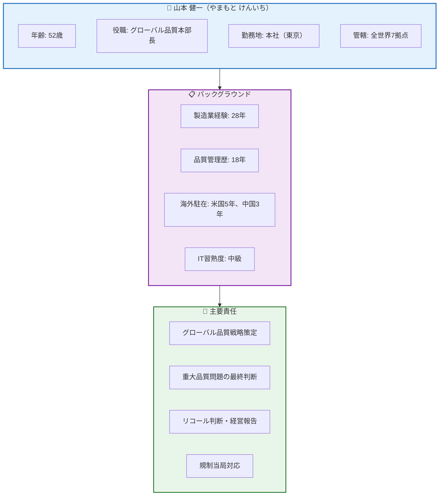
```mermaid
flowchart TD
    subgraph PROFILE["👤 山本 健一（やまもと けんいち）"]
        direction TB
        A1[年齢: 52歳]
        A2[役職: グローバル品質本部長]
        A3[勤務地: 本社（東京）]
        A4[管轄: 全世界7拠点]
    end
    
    subgraph BACKGROUND["📋 バックグラウンド"]
        B1[製造業経験: 28年]
        B2[品質管理歴: 18年]
        B3[海外駐在: 米国5年、中国3年]
        B4[IT習熟度: 中級]
    end
    
    subgraph RESPONSIBILITY["🎯 主要責任"]
        C1[グローバル品質戦略策定]
        C2[重大品質問題の最終判断]
        C3[リコール判断・経営報告]
        C4[規制当局対応]
    end
    
    PROFILE --> BACKGROUND
    BACKGROUND --> RESPONSIBILITY
    
    style PROFILE fill:#e3f2fd,stroke:#1565c0,stroke-width:2px
    style BACKGROUND fill:#f3e5f5,stroke:#7b1fa2,stroke-width:2px
    style RESPONSIBILITY fill:#e8f5e9,stroke:#2e7d32,stroke-width:2px
```

### 業務フローと課題

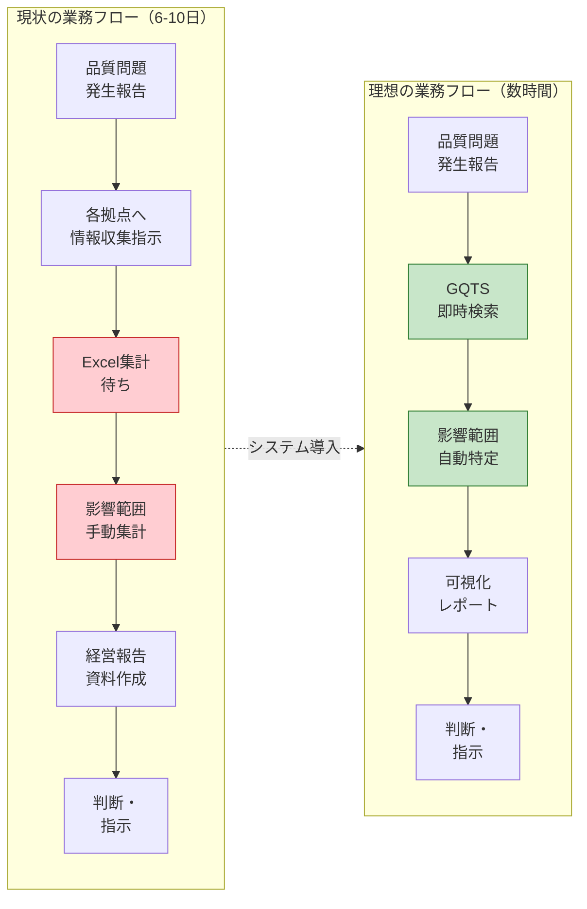
```mermaid
flowchart LR
    subgraph CURRENT["現状の業務フロー（6-10日）"]
        A1[品質問題<br/>発生報告] --> A2[各拠点へ<br/>情報収集指示]
        A2 --> A3[Excel集計<br/>待ち]
        A3 --> A4[影響範囲<br/>手動集計]
        A4 --> A5[経営報告<br/>資料作成]
        A5 --> A6[判断・<br/>指示]
    end
    
    subgraph IDEAL["理想の業務フロー（数時間）"]
        B1[品質問題<br/>発生報告] --> B2[GQTS<br/>即時検索]
        B2 --> B3[影響範囲<br/>自動特定]
        B3 --> B4[可視化<br/>レポート]
        B4 --> B5[判断・<br/>指示]
    end
    
    CURRENT -.->|システム導入| IDEAL
    
    style A3 fill:#ffcdd2,stroke:#c62828
    style A4 fill:#ffcdd2,stroke:#c62828
    style B2 fill:#c8e6c9,stroke:#2e7d32
    style B3 fill:#c8e6c9,stroke:#2e7d32
```

### ニーズ・ペインポイント・ゲイン

| カテゴリ | 内容 |
|---------|------|
| **ペインポイント** | ・重大品質問題発生時に全世界の影響台数確定まで10日以上を要する ・各拠点からの報告フォーマットが不統一 ・リアルタイムでの影響把握が不可能 ・経営層への報告資料作成に多大な工数 |
| **ニーズ** | ・数時間以内での全世界影響範囲特定 ・ワンクリックでの経営報告資料生成 ・リコール判断に必要な情報の即時可視化 ・規制当局報告フォーマットでの自動出力 |
| **ゲイン** | ・迅速な意思決定による企業リスク低減 ・顧客・社会からの信頼維持 ・品質問題対応コスト削減 |

### 利用シナリオ

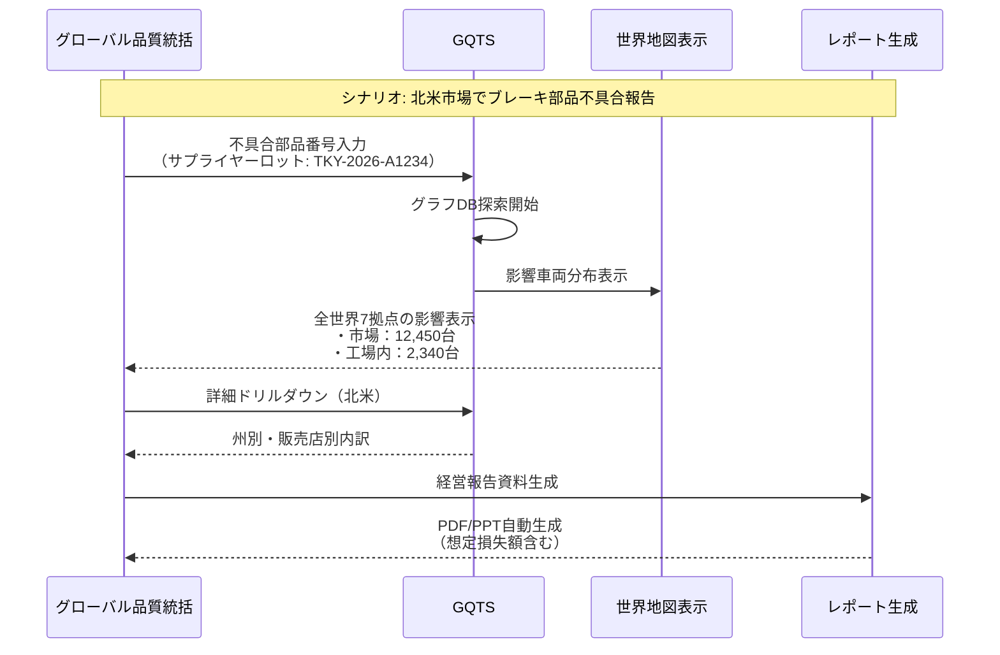
```mermaid
sequenceDiagram
    participant GQM as グローバル品質統括
    participant GQTS as GQTS
    participant MAP as 世界地図表示
    participant REPORT as レポート生成
    
    Note over GQM,REPORT: シナリオ: 北米市場でブレーキ部品不具合報告
    
    GQM->>GQTS: 不具合部品番号入力<br/>（サプライヤーロット: TKY-2026-A1234）
    GQTS->>GQTS: グラフDB探索開始
    GQTS->>MAP: 影響車両分布表示
    MAP-->>GQM: 全世界7拠点の影響表示<br/>・市場：12,450台<br/>・工場内：2,340台
    GQM->>GQTS: 詳細ドリルダウン（北米）
    GQTS-->>GQM: 州別・販売店別内訳
    GQM->>REPORT: 経営報告資料生成
    REPORT-->>GQM: PDF/PPT自動生成<br/>（想定損失額含む）
```

### 優先機能

| 優先度 | 機能 | 説明 |
|-------|------|------|
| ★★★★★ | グローバル影響範囲即時可視化 | 全拠点の影響台数を世界地図上に表示 |
| ★★★★★ | 経営報告自動生成 | リコール判断資料・規制当局報告の自動生成 |
| ★★★★☆ | 経済影響シミュレーション | リコール費用・機会損失の自動算出 |
| ★★★★☆ | アラート・エスカレーション | 重大問題の自動検知と通知 |
| ★★★☆☆ | 過去事例比較分析 | 類似問題との比較・教訓抽出 |

---

## ペルソナ2：ライン管理者

### ペルソナプロファイル

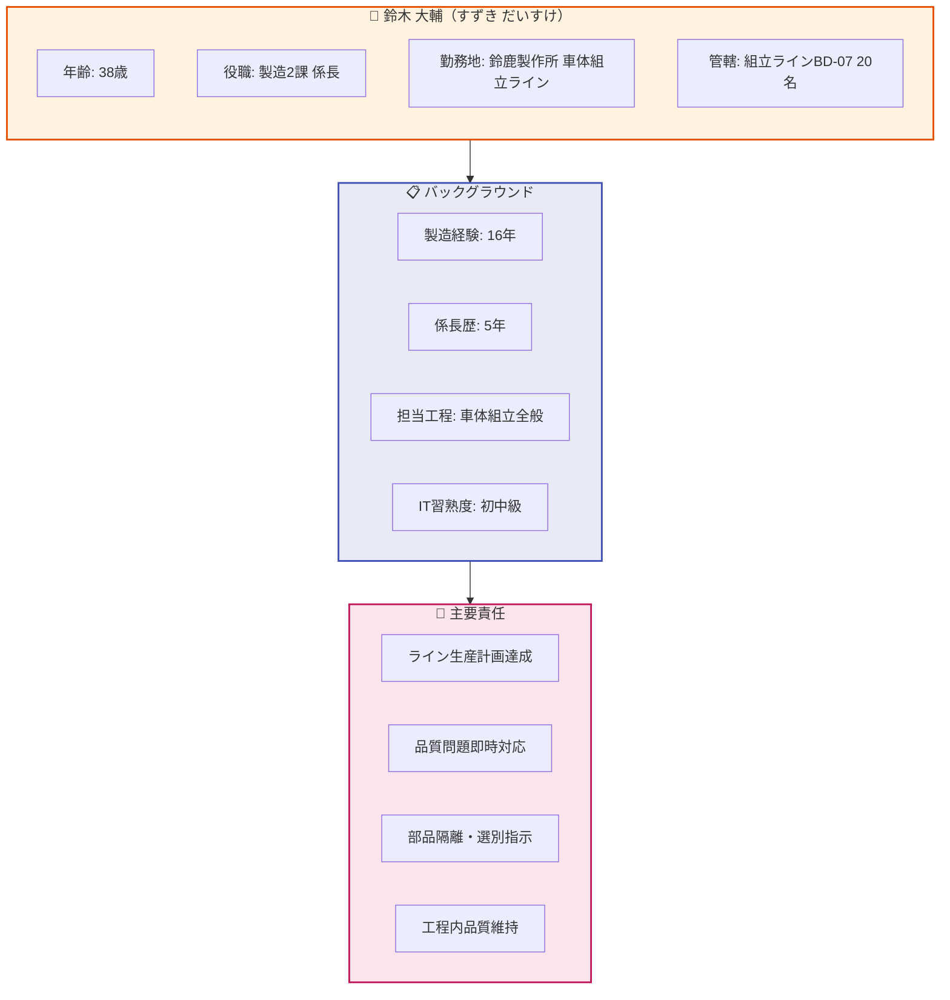
```mermaid
flowchart TD
    subgraph PROFILE["👤 鈴木 大輔（すずき だいすけ）"]
        direction TB
        A1[年齢: 38歳]
        A2[役職: 製造2課 係長]
        A3[勤務地: 鈴鹿製作所 車体組立ライン]
        A4[管轄: 組立ラインBD-07 20名]
    end
    
    subgraph BACKGROUND["📋 バックグラウンド"]
        B1[製造経験: 16年]
        B2[係長歴: 5年]
        B3[担当工程: 車体組立全般]
        B4[IT習熟度: 初中級]
    end
    
    subgraph RESPONSIBILITY["🎯 主要責任"]
        C1[ライン生産計画達成]
        C2[品質問題即時対応]
        C3[部品隔離・選別指示]
        C4[工程内品質維持]
    end
    
    PROFILE --> BACKGROUND
    BACKGROUND --> RESPONSIBILITY
    
    style PROFILE fill:#fff3e0,stroke:#e65100,stroke-width:2px
    style BACKGROUND fill:#e8eaf6,stroke:#3f51b5,stroke-width:2px
    style RESPONSIBILITY fill:#fce4ec,stroke:#c2185b,stroke-width:2px
```

### 業務フローと課題

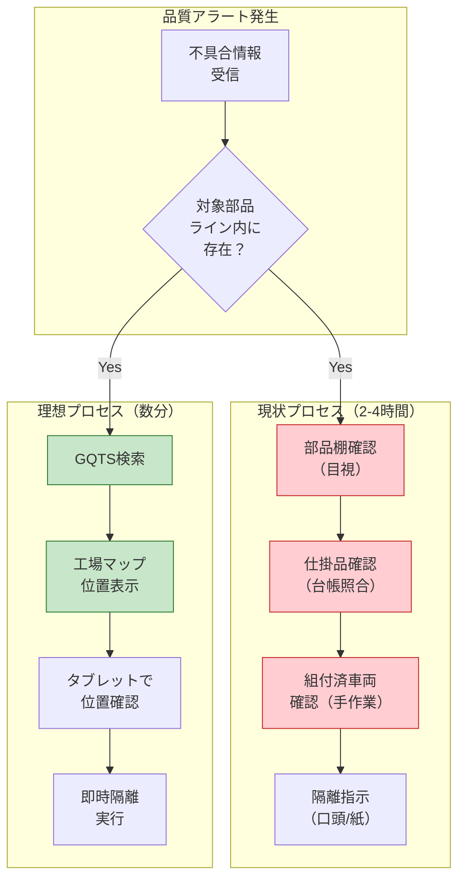
```mermaid
flowchart TB
    subgraph ALERT["品質アラート発生"]
        A1[不具合情報<br/>受信] --> A2{対象部品<br/>ライン内に<br/>存在？}
    end
    
    subgraph CURRENT["現状プロセス（2-4時間）"]
        A2 -->|Yes| B1[部品棚確認<br/>（目視）]
        B1 --> B2[仕掛品確認<br/>（台帳照合）]
        B2 --> B3[組付済車両<br/>確認（手作業）]
        B3 --> B4[隔離指示<br/>（口頭/紙）]
    end
    
    subgraph IDEAL["理想プロセス（数分）"]
        A2 -->|Yes| C1[GQTS検索]
        C1 --> C2[工場マップ<br/>位置表示]
        C2 --> C3[タブレットで<br/>位置確認]
        C3 --> C4[即時隔離<br/>実行]
    end
    
    style B1 fill:#ffcdd2,stroke:#c62828
    style B2 fill:#ffcdd2,stroke:#c62828
    style B3 fill:#ffcdd2,stroke:#c62828
    style C1 fill:#c8e6c9,stroke:#2e7d32
    style C2 fill:#c8e6c9,stroke:#2e7d32
```

### 工場内位置特定ニーズ

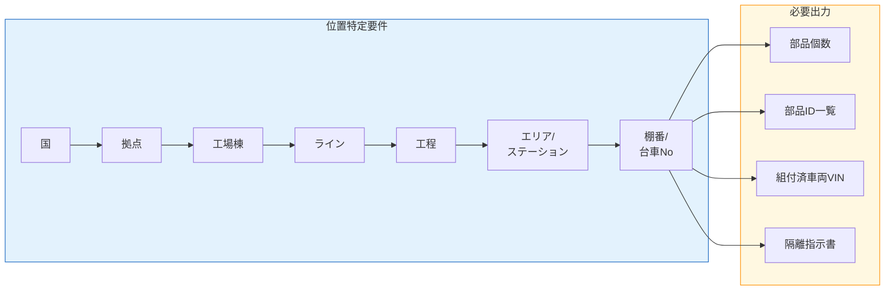
```mermaid
flowchart LR
    subgraph LOCATION["位置特定要件"]
        L1[国] --> L2[拠点]
        L2 --> L3[工場棟]
        L3 --> L4[ライン]
        L4 --> L5[工程]
        L5 --> L6[エリア/<br/>ステーション]
        L6 --> L7[棚番/<br/>台車No]
    end
    
    subgraph OUTPUT["必要出力"]
        O1[部品個数]
        O2[部品ID一覧]
        O3[組付済車両VIN]
        O4[隔離指示書]
    end
    
    L7 --> O1
    L7 --> O2
    L7 --> O3
    L7 --> O4
    
    style LOCATION fill:#e3f2fd,stroke:#1565c0
    style OUTPUT fill:#fff8e1,stroke:#ff8f00
```

### ニーズ・ペインポイント・ゲイン

| カテゴリ | 内容 |
|---------|------|
| **ペインポイント** | ・対象部品のライン内位置特定に2時間以上 ・複数工程にまたがる部品の追跡が困難 ・仕掛品と完成品の区別が煩雑 ・隔離漏れによる不良流出リスク |
| **ニーズ** | ・タブレットでの即時位置確認 ・工程別・エリア別の対象部品数表示 ・隔離確認のデジタル記録 ・生産影響（脇出し台数）の即時算出 |
| **ゲイン** | ・隔離作業時間90%短縮 ・隔離漏れゼロ ・生産ライン停止時間最小化 |

### 利用シナリオ

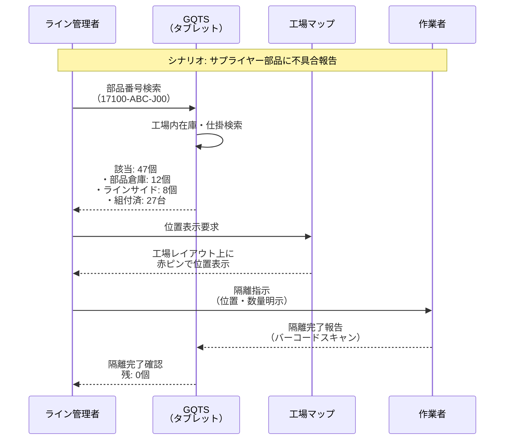
```mermaid
sequenceDiagram
    participant LM as ライン管理者
    participant GQTS as GQTS<br/>（タブレット）
    participant FMAP as 工場マップ
    participant WORKER as 作業者
    
    Note over LM,WORKER: シナリオ: サプライヤー部品に不具合報告
    
    LM->>GQTS: 部品番号検索<br/>（17100-ABC-J00）
    GQTS->>GQTS: 工場内在庫・仕掛検索
    GQTS-->>LM: 該当: 47個<br/>・部品倉庫: 12個<br/>・ラインサイド: 8個<br/>・組付済: 27台
    LM->>FMAP: 位置表示要求
    FMAP-->>LM: 工場レイアウト上に<br/>赤ピンで位置表示
    LM->>WORKER: 隔離指示<br/>（位置・数量明示）
    WORKER-->>GQTS: 隔離完了報告<br/>（バーコードスキャン）
    GQTS-->>LM: 隔離完了確認<br/>残: 0個
```

### 優先機能

| 優先度 | 機能 | 説明 |
|-------|------|------|
| ★★★★★ | 工場マップ位置表示 | 対象部品の位置を工場レイアウト上に表示 |
| ★★★★★ | 工程別集計 | ライン・工程・エリア別の対象数表示 |
| ★★★★★ | 隔離確認記録 | スキャンによる隔離完了のデジタル記録 |
| ★★★★☆ | 生産影響算出 | 脇出し台数・ライン停止影響の自動計算 |
| ★★★☆☆ | 作業指示書生成 | 隔離・選別作業指示書の自動生成 |

---

## ペルソナ3：物流担当者

### ペルソナプロファイル

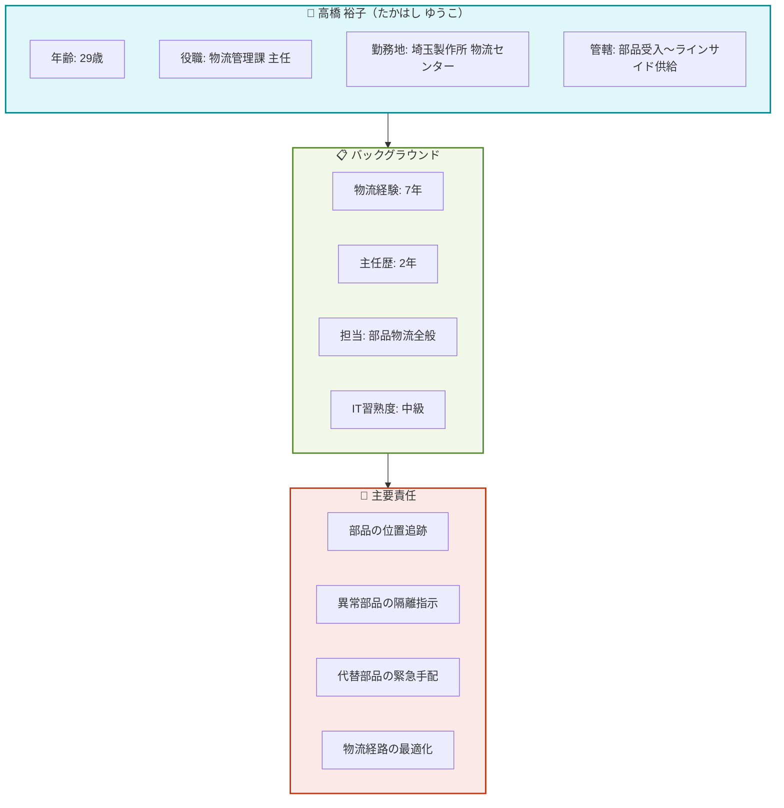
```mermaid
flowchart TD
    subgraph PROFILE["👤 高橋 裕子（たかはし ゆうこ）"]
        direction TB
        A1[年齢: 29歳]
        A2[役職: 物流管理課 主任]
        A3[勤務地: 埼玉製作所 物流センター]
        A4[管轄: 部品受入～ラインサイド供給]
    end
    
    subgraph BACKGROUND["📋 バックグラウンド"]
        B1[物流経験: 7年]
        B2[主任歴: 2年]
        B3[担当: 部品物流全般]
        B4[IT習熟度: 中級]
    end
    
    subgraph RESPONSIBILITY["🎯 主要責任"]
        C1[部品の位置追跡]
        C2[異常部品の隔離指示]
        C3[代替部品の緊急手配]
        C4[物流経路の最適化]
    end
    
    PROFILE --> BACKGROUND
    BACKGROUND --> RESPONSIBILITY
    
    style PROFILE fill:#e0f7fa,stroke:#00838f,stroke-width:2px
    style BACKGROUND fill:#f1f8e9,stroke:#558b2f,stroke-width:2px
    style RESPONSIBILITY fill:#fbe9e7,stroke:#bf360c,stroke-width:2px
```

### 物流トレーサビリティ要件

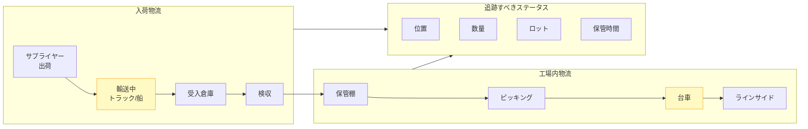
```mermaid
flowchart LR
    subgraph INBOUND["入荷物流"]
        I1[サプライヤー<br/>出荷] --> I2[輸送中<br/>トラック/船]
        I2 --> I3[受入倉庫]
        I3 --> I4[検収]
    end
    
    subgraph INTERNAL["工場内物流"]
        I4 --> IN1[保管棚]
        IN1 --> IN2[ピッキング]
        IN2 --> IN3[台車]
        IN3 --> IN4[ラインサイド]
    end
    
    subgraph STATUS["追跡すべきステータス"]
        S1[位置]
        S2[数量]
        S3[ロット]
        S4[保管時間]
    end
    
    INBOUND --> STATUS
    INTERNAL --> STATUS
    
    style I2 fill:#fff9c4,stroke:#f9a825
    style IN3 fill:#fff9c4,stroke:#f9a825
```

### ニーズ・ペインポイント・ゲイン

| カテゴリ | 内容 |
|---------|------|
| **ペインポイント** | ・輸送中部品の現在位置が不明 ・倉庫内での部品検索に時間がかかる ・FIFO管理の徹底が困難 ・緊急隔離時の部品特定に手間取る |
| **ニーズ** | ・リアルタイム部品位置追跡 ・ロット単位での一括検索 ・倉庫レイアウト上での位置表示 ・隔離対象の自動ピックリスト生成 |
| **ゲイン** | ・部品検索時間80%短縮 ・隔離漏れによる流出ゼロ ・FIFO徹底による滞留在庫削減 |

### 利用シナリオ

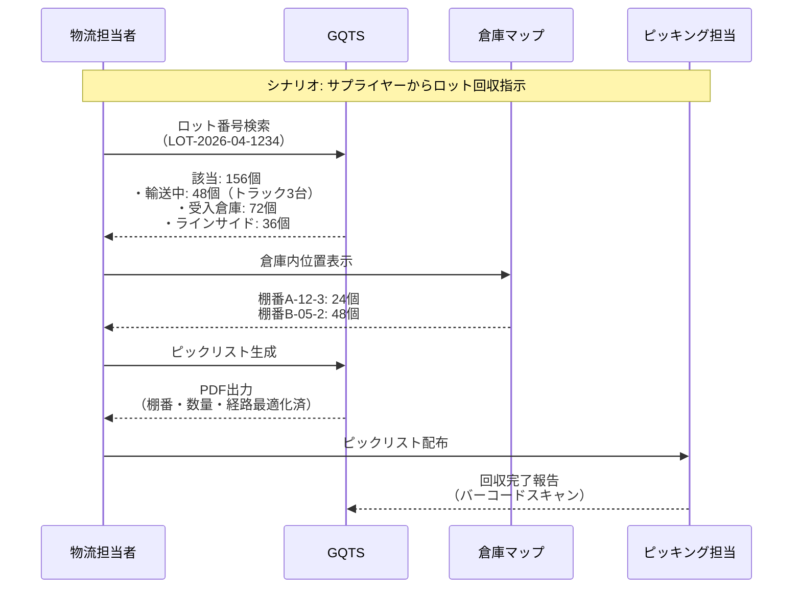
```mermaid
sequenceDiagram
    participant LOG as 物流担当者
    participant GQTS as GQTS
    participant WMS as 倉庫マップ
    participant PICKER as ピッキング担当
    
    Note over LOG,PICKER: シナリオ: サプライヤーからロット回収指示
    
    LOG->>GQTS: ロット番号検索<br/>（LOT-2026-04-1234）
    GQTS-->>LOG: 該当: 156個<br/>・輸送中: 48個（トラック3台）<br/>・受入倉庫: 72個<br/>・ラインサイド: 36個
    LOG->>WMS: 倉庫内位置表示
    WMS-->>LOG: 棚番A-12-3: 24個<br/>棚番B-05-2: 48個
    LOG->>GQTS: ピックリスト生成
    GQTS-->>LOG: PDF出力<br/>（棚番・数量・経路最適化済）
    LOG->>PICKER: ピックリスト配布
    PICKER-->>GQTS: 回収完了報告<br/>（バーコードスキャン）
```

### 優先機能

| 優先度 | 機能 | 説明 |
|-------|------|------|
| ★★★★★ | リアルタイム位置追跡 | 部品のサプライチェーン上の現在位置表示 |
| ★★★★★ | 倉庫マップ表示 | 倉庫レイアウト上での部品位置表示 |
| ★★★★☆ | ピックリスト自動生成 | 回収対象の位置・数量・経路を含むリスト |
| ★★★★☆ | 輸送中トラッキング | 輸送中部品のリアルタイム追跡 |
| ★★★☆☆ | FIFO警告 | 滞留在庫の自動アラート |

---

## ペルソナ4：品質調査担当者

### ペルソナプロファイル

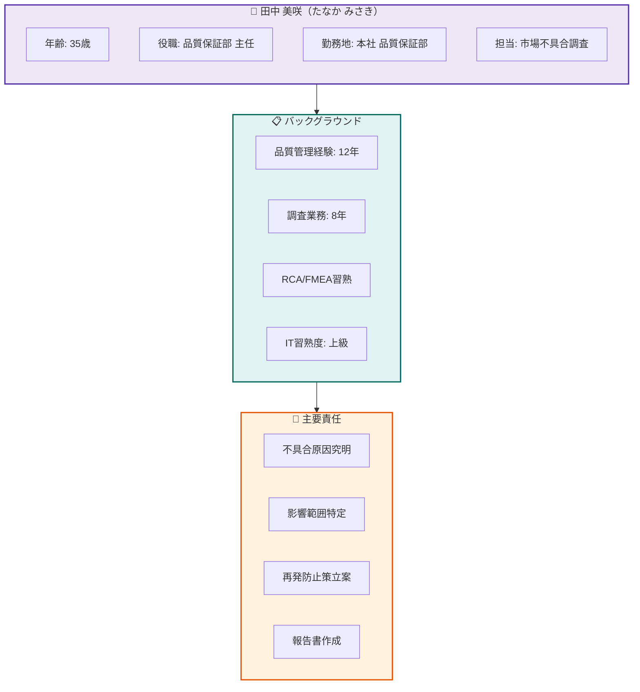
```mermaid
flowchart TD
    subgraph PROFILE["👤 田中 美咲（たなか みさき）"]
        direction TB
        A1[年齢: 35歳]
        A2[役職: 品質保証部 主任]
        A3[勤務地: 本社 品質保証部]
        A4[担当: 市場不具合調査]
    end
    
    subgraph BACKGROUND["📋 バックグラウンド"]
        B1[品質管理経験: 12年]
        B2[調査業務: 8年]
        B3[RCA/FMEA習熟]
        B4[IT習熟度: 上級]
    end
    
    subgraph RESPONSIBILITY["🎯 主要責任"]
        C1[不具合原因究明]
        C2[影響範囲特定]
        C3[再発防止策立案]
        C4[報告書作成]
    end
    
    PROFILE --> BACKGROUND
    BACKGROUND --> RESPONSIBILITY
    
    style PROFILE fill:#ede7f6,stroke:#512da8,stroke-width:2px
    style BACKGROUND fill:#e0f2f1,stroke:#00695c,stroke-width:2px
    style RESPONSIBILITY fill:#fff3e0,stroke:#e65100,stroke-width:2px
```

### 調査ワークフロー

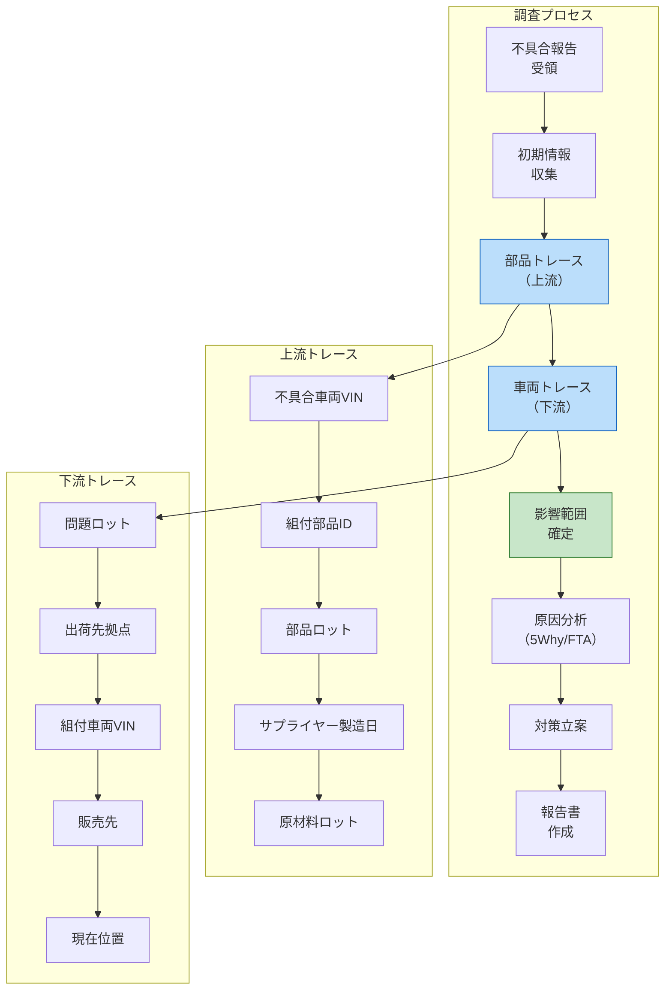
```mermaid
flowchart TB
    subgraph INVESTIGATE["調査プロセス"]
        A1[不具合報告<br/>受領] --> A2[初期情報<br/>収集]
        A2 --> A3[部品トレース<br/>（上流）]
        A3 --> A4[車両トレース<br/>（下流）]
        A4 --> A5[影響範囲<br/>確定]
        A5 --> A6[原因分析<br/>（5Why/FTA）]
        A6 --> A7[対策立案]
        A7 --> A8[報告書<br/>作成]
    end
    
    subgraph TRACE_UP["上流トレース"]
        U1[不具合車両VIN]
        U2[組付部品ID]
        U3[部品ロット]
        U4[サプライヤー製造日]
        U5[原材料ロット]
    end
    
    subgraph TRACE_DOWN["下流トレース"]
        D1[問題ロット]
        D2[出荷先拠点]
        D3[組付車両VIN]
        D4[販売先]
        D5[現在位置]
    end
    
    A3 --> U1
    U1 --> U2 --> U3 --> U4 --> U5
    
    A4 --> D1
    D1 --> D2 --> D3 --> D4 --> D5
    
    style A3 fill:#bbdefb,stroke:#1565c0
    style A4 fill:#bbdefb,stroke:#1565c0
    style A5 fill:#c8e6c9,stroke:#2e7d32
```

### ニーズ・ペインポイント・ゲイン

| カテゴリ | 内容 |
|---------|------|
| **ペインポイント** | ・複数システムを横断する調査が煩雑 ・トレース結果の信頼性検証が困難 ・類似事例の検索に時間がかかる ・報告書作成に多大な工数 |
| **ニーズ** | ・ワンストップでのトレース実行 ・トレース経路の可視化・根拠表示 ・過去事例との自動比較 ・報告書テンプレート自動入力 |
| **ゲイン** | ・調査時間50%短縮 ・トレース精度向上 ・ナレッジの蓄積・活用 |

### オントロジー・推論への期待

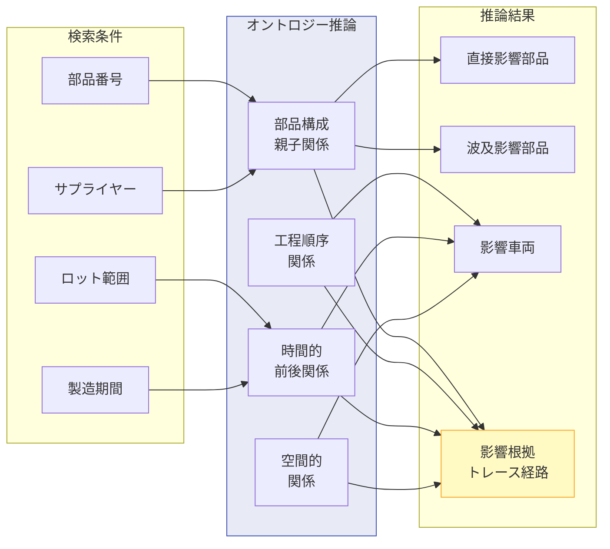
```mermaid
flowchart LR
    subgraph QUERY["検索条件"]
        Q1[部品番号]
        Q2[ロット範囲]
        Q3[製造期間]
        Q4[サプライヤー]
    end
    
    subgraph ONTOLOGY["オントロジー推論"]
        O1[部品構成<br/>親子関係]
        O2[工程順序<br/>関係]
        O3[時間的<br/>前後関係]
        O4[空間的<br/>関係]
    end
    
    subgraph RESULT["推論結果"]
        R1[直接影響部品]
        R2[波及影響部品]
        R3[影響車両]
        R4[影響根拠<br/>トレース経路]
    end
    
    Q1 --> O1
    Q2 --> O3
    Q3 --> O3
    Q4 --> O1
    
    O1 --> R1
    O1 --> R2
    O2 --> R3
    O3 --> R3
    O4 --> R3
    
    O1 & O2 & O3 & O4 --> R4
    
    style ONTOLOGY fill:#e8eaf6,stroke:#3f51b5
    style R4 fill:#fff9c4,stroke:#f9a825
```

### 優先機能

| 優先度 | 機能 | 説明 |
|-------|------|------|
| ★★★★★ | 双方向トレース | 上流（原因）・下流（影響）の両方向トレース |
| ★★★★★ | トレース根拠表示 | 結果がどのように導出されたかの経路表示 |
| ★★★★★ | VIN/ID一覧出力 | 影響車両・部品のリストCSV/Excel出力 |
| ★★★★☆ | 類似事例検索 | 過去の類似不具合事例の自動検索 |
| ★★★★☆ | 報告書自動生成 | 調査報告書テンプレートへの自動入力 |
| ★★★☆☆ | FTA/FMEA連携 | 原因分析ツールとのデータ連携 |

---

## ペルソナ5：経営層

### ペルソナプロファイル

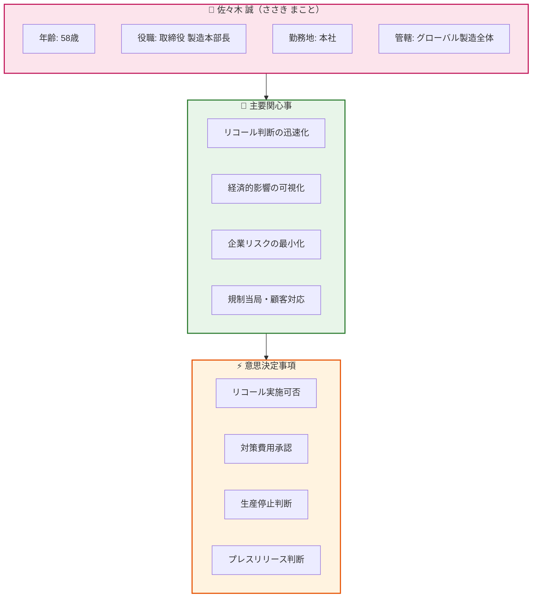
```mermaid
flowchart TD
    subgraph PROFILE["👤 佐々木 誠（ささき まこと）"]
        direction TB
        A1[年齢: 58歳]
        A2[役職: 取締役 製造本部長]
        A3[勤務地: 本社]
        A4[管轄: グローバル製造全体]
    end
    
    subgraph CONCERN["💼 主要関心事"]
        C1[リコール判断の迅速化]
        C2[経済的影響の可視化]
        C3[企業リスクの最小化]
        C4[規制当局・顧客対応]
    end
    
    subgraph DECISION["⚡ 意思決定事項"]
        D1[リコール実施可否]
        D2[対策費用承認]
        D3[生産停止判断]
        D4[プレスリリース判断]
    end
    
    PROFILE --> CONCERN --> DECISION
    
    style PROFILE fill:#fce4ec,stroke:#c2185b,stroke-width:2px
    style CONCERN fill:#e8f5e9,stroke:#2e7d32,stroke-width:2px
    style DECISION fill:#fff3e0,stroke:#e65100,stroke-width:2px
```

### 経営ダッシュボード要件

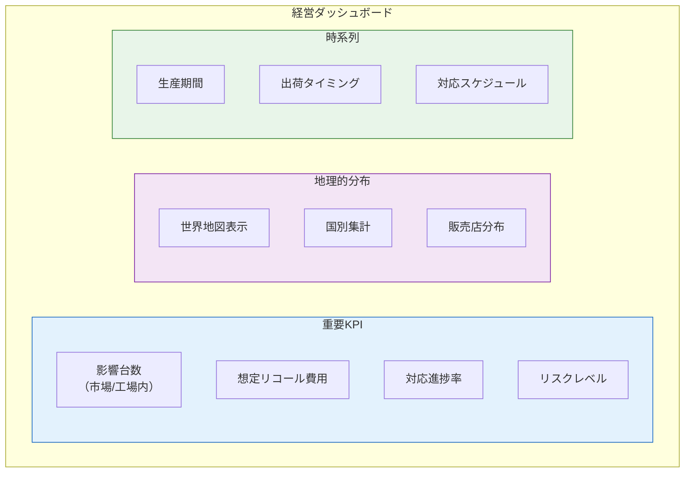
```mermaid
flowchart TB
    subgraph DASHBOARD["経営ダッシュボード"]
        subgraph KPI["重要KPI"]
            K1[影響台数<br/>（市場/工場内）]
            K2[想定リコール費用]
            K3[対応進捗率]
            K4[リスクレベル]
        end
        
        subgraph MAP["地理的分布"]
            M1[世界地図表示]
            M2[国別集計]
            M3[販売店分布]
        end
        
        subgraph TIMELINE["時系列"]
            T1[生産期間]
            T2[出荷タイミング]
            T3[対応スケジュール]
        end
    end
    
    style KPI fill:#e3f2fd,stroke:#1565c0
    style MAP fill:#f3e5f5,stroke:#7b1fa2
    style TIMELINE fill:#e8f5e9,stroke:#2e7d32
```

### 経済影響算出要件

| 影響項目 | 算出要素 | 表示形式 |
|---------|---------|---------|
| **リコール費用** | 部品費×台数 + 工賃×台数 + 通信費 | 金額（円/ドル） |
| **生産影響** | 脇出し台数×単価 + ライン停止損失 | 金額 + 台数 |
| **在庫影響** | 隔離在庫数×単価 + 廃棄費用 | 金額 + 数量 |
| **販売影響** | 出荷停止台数×販売単価 | 金額 + 台数 |
| **ブランド影響** | （定性評価） | リスクレベル |

### 優先機能

| 優先度 | 機能 | 説明 |
|-------|------|------|
| ★★★★★ | 経営サマリーダッシュボード | 1画面で全体像を把握できるサマリー |
| ★★★★★ | 経済影響自動算出 | リコール費用・損失の自動計算 |
| ★★★★☆ | シナリオ比較 | 対策オプション別の影響比較 |
| ★★★★☆ | 規制当局報告書出力 | 各国規制フォーマットでの自動出力 |
| ★★★☆☆ | ベンチマーク比較 | 過去事例・業界平均との比較 |

---

## ペルソナ6：号機リーダー（号機特定担当者）

### ペルソナプロファイル

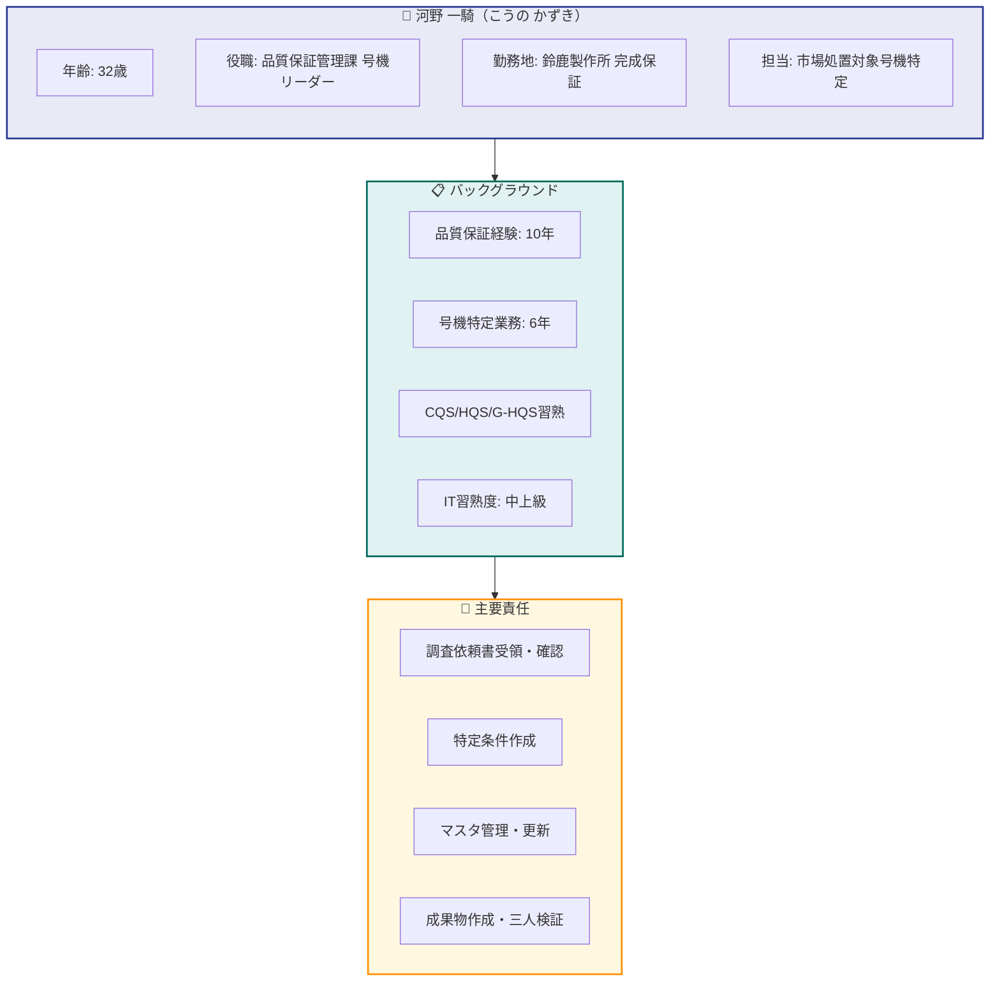
```mermaid
flowchart TD
    subgraph PROFILE["👤 河野 一騎（こうの かずき）"]
        direction TB
        A1[年齢: 32歳]
        A2[役職: 品質保証管理課 号機リーダー]
        A3[勤務地: 鈴鹿製作所 完成保証]
        A4[担当: 市場処置対象号機特定]
    end
    
    subgraph BACKGROUND["📋 バックグラウンド"]
        B1[品質保証経験: 10年]
        B2[号機特定業務: 6年]
        B3[CQS/HQS/G-HQS習熟]
        B4[IT習熟度: 中上級]
    end
    
    subgraph RESPONSIBILITY["🎯 主要責任"]
        C1[調査依頼書受領・確認]
        C2[特定条件作成]
        C3[マスタ管理・更新]
        C4[成果物作成・三人検証]
    end
    
    PROFILE --> BACKGROUND
    BACKGROUND --> RESPONSIBILITY
    
    style PROFILE fill:#e8eaf6,stroke:#283593,stroke-width:2px
    style BACKGROUND fill:#e0f2f1,stroke:#00695c,stroke-width:2px
    style RESPONSIBILITY fill:#fff8e1,stroke:#ff8f00,stroke-width:2px
```

### 業務フローと課題

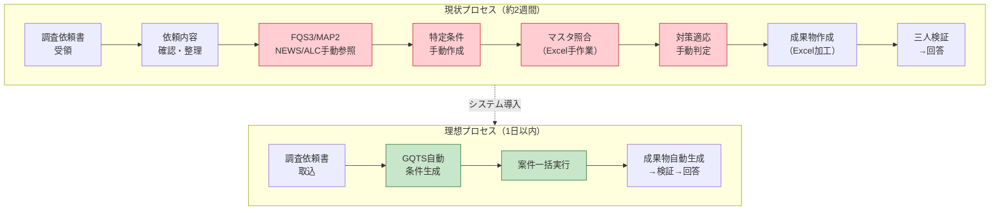
```mermaid
flowchart TB
    subgraph CURRENT["現状プロセス（約2週間）"]
        A1[調査依頼書<br/>受領] --> A2[依頼内容<br/>確認・整理]
        A2 --> A3[FQS3/MAP2<br/>NEWS/ALC手動参照]
        A3 --> A4[特定条件<br/>手動作成]
        A4 --> A5[マスタ照合<br/>（Excel手作業）]
        A5 --> A6[対策適応<br/>手動判定]
        A6 --> A7[成果物作成<br/>（Excel加工）]
        A7 --> A8[三人検証<br/>→回答]
    end
    
    subgraph IDEAL["理想プロセス（1日以内）"]
        B1[調査依頼書<br/>取込] --> B2[GQTS自動<br/>条件生成]
        B2 --> B3[案件一括実行]
        B3 --> B4[成果物自動生成<br/>→検証→回答]
    end
    
    CURRENT -.->|システム導入| IDEAL
    
    style A3 fill:#ffcdd2,stroke:#c62828
    style A4 fill:#ffcdd2,stroke:#c62828
    style A5 fill:#ffcdd2,stroke:#c62828
    style A6 fill:#ffcdd2,stroke:#c62828
    style B2 fill:#c8e6c9,stroke:#2e7d32
    style B3 fill:#c8e6c9,stroke:#2e7d32
```

### 調査3観点と利用システム

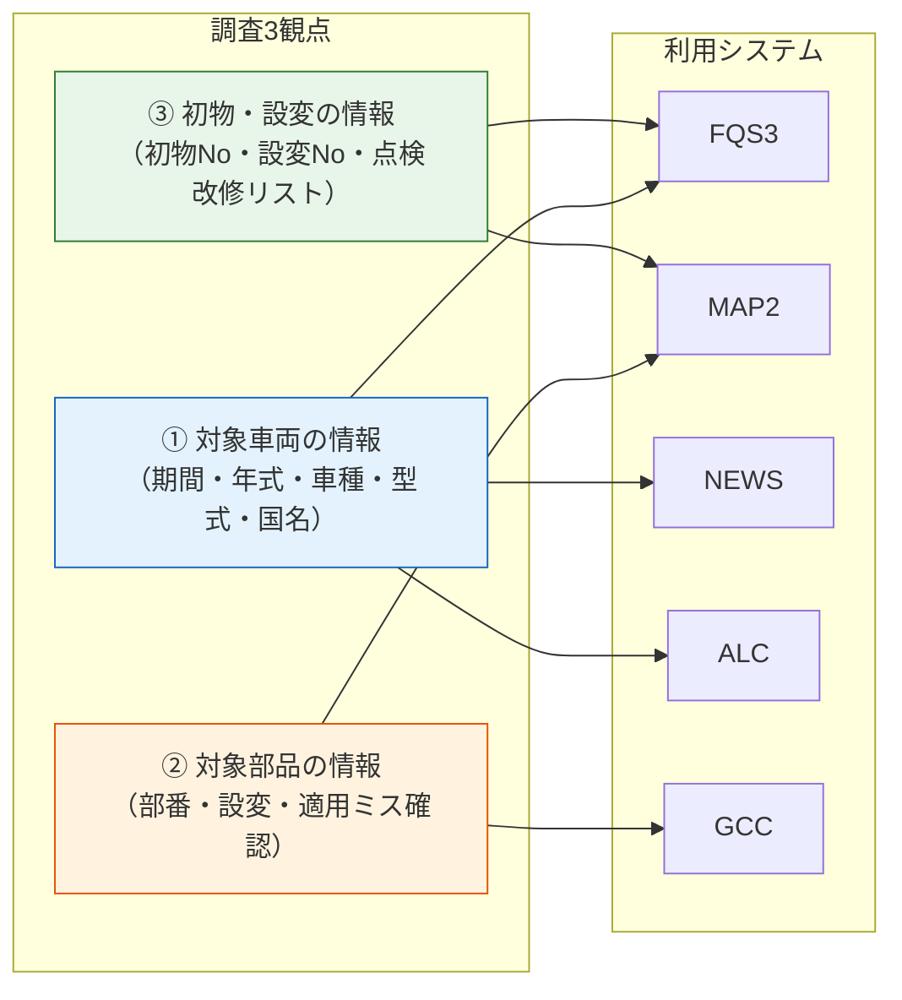
```mermaid
flowchart LR
    subgraph INVESTIGATE["調査3観点"]
        I1["① 対象車両の情報<br/>（期間・年式・車種・型式・国名）"]
        I2["② 対象部品の情報<br/>（部番・設変・適用ミス確認）"]
        I3["③ 初物・設変の情報<br/>（初物No・設変No・点検改修リスト）"]
    end
    
    subgraph SYSTEM["利用システム"]
        S1[FQS3]
        S2[MAP2]
        S3[NEWS]
        S4[ALC]
        S5[GCC]
    end
    
    I1 --> S1 & S3 & S4
    I2 --> S2 & S5
    I3 --> S1 & S2
    
    style I1 fill:#e3f2fd,stroke:#1565c0
    style I2 fill:#fff3e0,stroke:#e65100
    style I3 fill:#e8f5e9,stroke:#2e7d32
```

### ニーズ・ペインポイント・ゲイン

| カテゴリ | 内容 |
|---------|------|
| **ペインポイント** | ・特定条件作成に**複数システムの手動参照が必要**（FQS3, MAP2, NEWS, ALC, GCC） ・6種マスタ（イベント車・廃車・例外出荷・型式決済日・輸出DIST・輸出転売）を**Excelで都度管理** ・対策適応判定が複雑（初物エフ・納入実績・型式ごとの組合せ） ・熟練者以外では条件作成の品質にばらつき ・1案件あたり**約2週間、9名体制**で対応 |
| **ニーズ** | ・調査依頼書のシステム取込と条件自動生成 ・外部システム連携による**ワンクリック条件作成** ・マスタ類の一元管理と自動照合 ・対策適応の**自動判定**（パターンA/B/C） ・成果物（4帳票）の自動生成 |
| **ゲイン** | ・対応期間 **2週間 → 1日** ・担当者 **9名 → 1名** ・熟練者ノウハウのシステム化 ・三人検証の効率化 |

### 利用シナリオ

```mermaid
sequenceDiagram
    participant REQ as 依頼部門
    participant GL as 号機リーダー
    participant GQTS as GQTS
    participant EXT as 外部システム<br/>（FQS3/MAP2/ALC等）
    participant MASTER as マスタDB
    
    Note over REQ,MASTER: シナリオ: ENG部品の市場処置対象号機調査
    
    REQ->>GL: 調査依頼書送付<br/>（M/Y・型式・対象国・部番・期間）
    GL->>GQTS: 依頼書取込・案件登録
    GQTS->>EXT: 外部システム自動参照<br/>（車両・部品・初物情報）
    EXT-->>GQTS: データ取得完了
    GQTS->>GQTS: 特定条件自動生成
    GL->>GQTS: 条件確認・必要に応じて修正
    GL->>GQTS: 案件一括実行
    GQTS->>GQTS: 対象範囲特定
    GQTS->>MASTER: マスタ照合<br/>（イベント車・廃車・例外出荷等）
    MASTER-->>GQTS: 除外対象・補正情報
    GQTS->>GQTS: 対策適応号機判定<br/>（初物エフ・納入実績）
    GQTS->>GQTS: Lot崩れチェック
    GQTS-->>GL: 成果物自動生成<br/>（型式別リスト・サマリ・DWG・MTOチェックリスト）
    GL->>GL: 三人検証
    GL-->>REQ: 回答提出
```

### 優先機能

| 優先度 | 機能 | 説明 |
|-------|------|------|
| ★★★★★ | 調査依頼書取込 | 依頼書フォーマットのシステム取込・案件登録 |
| ★★★★★ | 特定条件自動生成 | 外部システム参照による条件自動生成 |
| ★★★★★ | 案件一括実行 | 対象特定→マスタ照合→対策適応→成果物の一括処理 |
| ★★★★★ | マスタ一元管理 | 6種マスタの統合管理（常時最新版維持） |
| ★★★★☆ | 成果物自動生成 | 4帳票（型式別リスト・サマリ・DWG・MTOチェック）の自動出力 |
| ★★★★☆ | 対策適応自動判定 | パターンA/B/Cの自動判定・可視化 |
| ★★★☆☆ | 三人検証支援 | 検証ワークフロー・承認記録 |

---

## ペルソナ7：地域品質管理責任者

### ペルソナプロファイル

```mermaid
flowchart TD
    subgraph PROFILE["👤 Carlos Rodriguez（カルロス・ロドリゲス）"]
        direction TB
        A1[年齢: 45歳]
        A2[役職: 北米品質管理責任者]
        A3[勤務地: オハイオ工場（北米拠点）]
        A4[管轄: 北米3拠点（アメリカ・カナダ・メキシコ）]
    end
    
    subgraph BACKGROUND["📋 バックグラウンド"]
        B1[自動車品質管理経験: 20年]
        B2[北米駐在: 15年]
        B3[本社品質保証部出身（日本3年）]
        B4[IT習熟度: 中級]
        B5[言語: 英語・スペイン語・日本語（ビジネスレベル）]
    end
    
    subgraph RESPONSIBILITY["🎯 主要責任"]
        C1[北米地域の品質問題統括]
        C2[本社品質本部への報告・連携]
        C3[NHTSA等規制当局対応]
        C4[地域内サプライヤー品質管理]
    end
    
    PROFILE --> BACKGROUND
    BACKGROUND --> RESPONSIBILITY
    
    style PROFILE fill:#e8f5e9,stroke:#2e7d32,stroke-width:2px
    style BACKGROUND fill:#fff3e0,stroke:#e65100,stroke-width:2px
    style RESPONSIBILITY fill:#e3f2fd,stroke:#1565c0,stroke-width:2px
```

### ニーズ・ペインポイント・ゲイン

| カテゴリ | 内容 |
|---------|------|
| **ペインポイント** | ・本社との時差（14時間）で緊急対応が遅延 ・北米3拠点の品質データが統一フォーマットでない ・NHTSA報告様式への手動変換に工数がかかる ・本社のExcel台帳が最新版か確認できない |
| **ニーズ** | ・地域内影響範囲のリアルタイム把握 ・本社との同一データでの即時連携 ・NHTSA報告フォーマット自動生成 ・地域別ダッシュボードでの状況俯瞰 |
| **ゲイン** | ・時差に依存しない即時情報共有 ・規制当局対応の迅速化 ・地域内品質対応の標準化 |

### 利用シナリオ

```mermaid
sequenceDiagram
    participant CR as 地域品質管理<br/>（Carlos）
    participant GQTS as GQTS
    participant HQ as 本社品質統括<br/>（山本）
    participant NHTSA as 規制当局
    
    Note over CR,NHTSA: シナリオ: 北米市場でステアリング不具合多発
    
    CR->>GQTS: 不具合部品で北米影響検索
    GQTS-->>CR: 北米影響: 8,200台<br/>・US: 5,400 / CA: 1,800 / MX: 1,000
    CR->>GQTS: 州別・販売店別ドリルダウン
    GQTS-->>CR: カリフォルニア: 1,200台（最多）
    CR->>HQ: GQTS上で本社と同一データ共有
    HQ-->>CR: グローバル対応方針指示
    CR->>GQTS: NHTSA報告書自動生成
    GQTS-->>CR: PDF出力（Part573形式）
    CR->>NHTSA: 報告書提出
```

### 優先機能

| 優先度 | 機能 | 説明 |
|-------|------|------|
| ★★★★★ | 地域別影響範囲表示 | 担当地域内の影響台数を地図上に表示 |
| ★★★★★ | 規制当局報告書生成 | NHTSA等の地域別フォーマットで自動出力 |
| ★★★★☆ | 本社リアルタイム連携 | 本社と同一データベースでの即時情報共有 |
| ★★★★☆ | 地域ダッシュボード | 担当地域の品質KPIサマリー表示 |
| ★★★☆☆ | 多言語対応 | 英語/スペイン語UIでの操作 |

---

## ペルソナ8：工場長

### ペルソナプロファイル

```mermaid
flowchart TD
    subgraph PROFILE["👤 中村 雅彦（なかむら まさひこ）"]
        direction TB
        A1[年齢: 54歳]
        A2[役職: 鈴鹿製作所 工場長]
        A3[勤務地: 鈴鹿製作所]
        A4[管轄: 工場全体（従業員3,000名）]
    end
    
    subgraph BACKGROUND["📋 バックグラウンド"]
        B1[製造業経験: 30年]
        B2[工場長歴: 4年]
        B3[製造技術・品質管理・生産管理を歴任]
        B4[IT習熟度: 初中級]
    end
    
    subgraph RESPONSIBILITY["🎯 主要責任"]
        C1[工場全体の生産・品質バランス判断]
        C2[ライン停止/稼働判断]
        C3[品質問題の工場内対応統括]
        C4[本社・経営層への報告]
    end
    
    PROFILE --> BACKGROUND
    BACKGROUND --> RESPONSIBILITY
    
    style PROFILE fill:#ffebee,stroke:#b71c1c,stroke-width:2px
    style BACKGROUND fill:#e8eaf6,stroke:#283593,stroke-width:2px
    style RESPONSIBILITY fill:#e0f2f1,stroke:#004d40,stroke-width:2px
```

### ニーズ・ペインポイント・ゲイン

| カテゴリ | 内容 |
|---------|------|
| **ペインポイント** | ・品質問題の生産影響を即時判断できない ・ライン停止の判断材料が揃うのに時間がかかる ・複数ラインにまたがる影響の全体像が見えない ・経営層への報告準備に時間を要する |
| **ニーズ** | ・工場全体の品質ステータス俯瞰ダッシュボード ・ライン停止判断に必要な影響台数・コストの即時算出 ・隔離進捗のリアルタイム監視 ・経営報告資料のワンクリック生成 |
| **ゲイン** | ・迅速なライン停止/稼働判断 ・品質問題の工場内影響最小化 ・経営層への即座の状況報告 |

### 利用シナリオ

```mermaid
sequenceDiagram
    participant FM as 工場長<br/>（中村）
    participant GQTS as GQTS
    participant LM as ライン管理者<br/>（鈴木）
    participant HQ as 経営層<br/>（佐々木）
    
    Note over FM,HQ: シナリオ: ブレーキ部品ロット異常発覚
    
    LM->>FM: ブレーキ部品不具合報告
    FM->>GQTS: 工場内影響検索
    GQTS-->>FM: 工場内影響: 計340台<br/>・ラインBD-07: 120台<br/>・ラインBD-08: 85台<br/>・完成品ヤード: 135台
    FM->>GQTS: 生産影響シミュレーション
    GQTS-->>FM: ライン停止: 推定4時間<br/>損失: 約2,400万円
    FM->>LM: BD-07/08隔離指示
    FM->>HQ: GQTS経由で状況報告
```

### 優先機能

| 優先度 | 機能 | 説明 |
|-------|------|------|
| ★★★★★ | 工場品質ダッシュボード | 全ライン横断の品質ステータス俯瞰 |
| ★★★★★ | 生産影響即時算出 | ライン停止時間・損失額の自動計算 |
| ★★★★☆ | 隔離進捗監視 | 工場内隔離作業の進捗リアルタイム表示 |
| ★★★★☆ | 経営報告自動生成 | 工場内品質状況の報告書自動出力 |
| ★★★☆☆ | 過去事例比較 | 類似問題との比較・対応時間ベンチマーク |

---

## ペルソナ9：工程担当者

### ペルソナプロファイル

```mermaid
flowchart TD
    subgraph PROFILE["👤 伊藤 翔太（いとう しょうた）"]
        direction TB
        A1[年齢: 26歳]
        A2[役職: 製造2課 エンジン組立班]
        A3[勤務地: 鈴鹿製作所 エンジン組立ライン]
        A4[担当: エンジン組付工程（ステーション5-8）]
    end
    
    subgraph BACKGROUND["📋 バックグラウンド"]
        B1[製造経験: 4年]
        B2[工程担当歴: 2年]
        B3[技能検定3級取得]
        B4[IT習熟度: 初級（スマートフォン操作レベル）]
    end
    
    subgraph RESPONSIBILITY["🎯 主要責任"]
        C1[担当工程の品質維持]
        C2[異常品の検出・仕分け]
        C3[隔離指示の現場実行]
        C4[作業記録の入力]
    end
    
    PROFILE --> BACKGROUND
    BACKGROUND --> RESPONSIBILITY
    
    style PROFILE fill:#f3e5f5,stroke:#7b1fa2,stroke-width:2px
    style BACKGROUND fill:#e0f7fa,stroke:#006064,stroke-width:2px
    style RESPONSIBILITY fill:#fff8e1,stroke:#ff6f00,stroke-width:2px
```

### ニーズ・ペインポイント・ゲイン

| カテゴリ | 内容 |
|---------|------|
| **ペインポイント** | ・隔離指示が口頭や紙で来るため見落としリスク ・対象部品を棚から目視で探す作業が非効率 ・隔離完了報告が台帳記入のため遅延する ・複数の指示が同時に来ると優先順位がわからない |
| **ニーズ** | ・タブレットでの隔離指示受信・確認 ・対象部品のバーコードスキャンによる特定 ・隔離完了のワンタップ報告 ・指示の優先度表示（緊急/通常） |
| **ゲイン** | ・隔離漏れゼロ達成 ・作業記録のデジタル化による工数削減 ・操作が簡単で迷わない |

### 利用シナリオ

```mermaid
sequenceDiagram
    participant OP as 工程担当者<br/>（伊藤）
    participant TAB as GQTS<br/>（タブレット）
    participant LM as ライン管理者<br/>（鈴木）
    
    Note over OP,LM: シナリオ: 隔離指示の現場実行
    
    LM->>TAB: 隔離指示配信<br/>（部品番号・数量・位置）
    TAB->>OP: プッシュ通知<br/>「緊急隔離：ST-6棚 12個」
    OP->>TAB: 指示確認・作業開始
    OP->>TAB: 部品バーコードスキャン<br/>（1個ずつ確認）
    TAB-->>OP: 12/12 完了表示
    OP->>TAB: 隔離完了報告
    TAB->>LM: 完了通知<br/>（隔離数: 12/12）
```

### 優先機能

| 優先度 | 機能 | 説明 |
|-------|------|------|
| ★★★★★ | タブレット隔離指示受信 | 隔離指示のプッシュ通知・一覧表示 |
| ★★★★★ | バーコードスキャン確認 | 対象部品のスキャンによる正確な特定 |
| ★★★★★ | ワンタップ完了報告 | 隔離完了の即時報告 |
| ★★★★☆ | 優先度表示 | 緊急/通常の優先順位表示 |
| ★★★☆☆ | 作業手順ガイド | 隔離・選別作業の手順表示 |

---

## ペルソナ10：調達品質担当者

### ペルソナプロファイル

```mermaid
flowchart TD
    subgraph PROFILE["👤 小林 恵理（こばやし えり）"]
        direction TB
        A1[年齢: 33歳]
        A2[役職: 調達部 品質管理グループ 主任]
        A3[勤務地: 本社 調達部]
        A4[担当: サプライヤー受入品質管理（取引先約120社）]
    end
    
    subgraph BACKGROUND["📋 バックグラウンド"]
        B1[調達経験: 10年]
        B2[品質管理歴: 5年]
        B3[海外出張: 年間20回程度]
        B4[IT習熟度: 中級]
    end
    
    subgraph RESPONSIBILITY["🎯 主要責任"]
        C1[受入検査結果の管理]
        C2[サプライヤー品質評価]
        C3[不良発生時のサプライヤー連絡]
        C4[代替部品の緊急調達判断]
    end
    
    PROFILE --> BACKGROUND
    BACKGROUND --> RESPONSIBILITY
    
    style PROFILE fill:#e8f5e9,stroke:#1b5e20,stroke-width:2px
    style BACKGROUND fill:#fce4ec,stroke:#880e4f,stroke-width:2px
    style RESPONSIBILITY fill:#e3f2fd,stroke:#0d47a1,stroke-width:2px
```

### ニーズ・ペインポイント・ゲイン

| カテゴリ | 内容 |
|---------|------|
| **ペインポイント** | ・部品ロット異常発覚時、どの拠点に納入済か把握に時間がかかる ・サプライヤーの品質実績が複数システムに分散 ・代替サプライヤーの選定根拠が属人的 ・同一サプライヤーの複数拠点への影響を横断で見られない |
| **ニーズ** | ・ロット単位のサプライチェーン上流→下流追跡 ・サプライヤー品質スコアの統合管理 ・影響拠点の即時横断検索 ・代替部品の在庫・調達可能性の即時確認 |
| **ゲイン** | ・サプライヤー品質問題の即時影響把握 ・調達判断の迅速化 ・サプライヤー品質の定量評価 |

### 利用シナリオ

```mermaid
sequenceDiagram
    participant KE as 調達品質担当<br/>（小林）
    participant GQTS as GQTS
    participant SUP as サプライヤー
    participant FAC as 各拠点工場
    
    Note over KE,FAC: シナリオ: サプライヤーからロット異常の自主申告
    
    SUP->>KE: ロット異常申告<br/>（LOT-2026-03-5678）
    KE->>GQTS: ロット番号で順方向トレース
    GQTS-->>KE: 影響: 4拠点に納入済<br/>・鈴鹿: 200個 / 埼玉: 150個<br/>・オハイオ: 300個 / インドネシア: 100個
    KE->>GQTS: サプライヤー品質スコア確認
    GQTS-->>KE: 品質スコア: 72点（要注意）<br/>過去1年: 不良3件
    KE->>FAC: 各拠点へ隔離指示
    KE->>SUP: 是正処置要求
```

### 優先機能

| 優先度 | 機能 | 説明 |
|-------|------|------|
| ★★★★★ | サプライヤーロット追跡 | ロット番号からの全拠点横断トレース |
| ★★★★★ | サプライヤー品質スコア | 品質実績の統合スコアリング表示 |
| ★★★★☆ | 影響拠点横断検索 | 複数拠点への影響を一括表示 |
| ★★★★☆ | 代替部品検索 | 代替サプライヤー・在庫の即時確認 |
| ★★★☆☆ | 受入検査履歴 | サプライヤー別の受入検査結果推移 |

---

## ペルソナ11：サプライヤー品質担当者

### ペルソナプロファイル

```mermaid
flowchart TD
    subgraph PROFILE["👤 渡辺 剛（わたなべ つよし）"]
        direction TB
        A1[年齢: 42歳]
        A2[役職: 品質保証部 サプライヤー品質課 課長]
        A3[勤務地: 本社 品質保証部]
        A4[担当: Tier1/Tier2サプライヤー監査・改善指導]
    end
    
    subgraph BACKGROUND["📋 バックグラウンド"]
        B1[品質保証経験: 18年]
        B2[サプライヤー監査歴: 10年]
        B3[IATF16949 主任審査員資格]
        B4[IT習熟度: 中級]
    end
    
    subgraph RESPONSIBILITY["🎯 主要責任"]
        C1[サプライヤー工場監査の実施]
        C2[品質改善指導・是正処置管理]
        C3[サプライヤーリスク評価]
        C4[新規サプライヤー認定審査]
    end
    
    PROFILE --> BACKGROUND
    BACKGROUND --> RESPONSIBILITY
    
    style PROFILE fill:#fff3e0,stroke:#e65100,stroke-width:2px
    style BACKGROUND fill:#e8eaf6,stroke:#283593,stroke-width:2px
    style RESPONSIBILITY fill:#e0f2f1,stroke:#00695c,stroke-width:2px
```

### ニーズ・ペインポイント・ゲイン

| カテゴリ | 内容 |
|---------|------|
| **ペインポイント** | ・サプライヤーの品質問題が自社のどの車両に影響するか即座にわからない ・Tier2以下の部品構成追跡が困難 ・過去の監査結果と不良発生の相関分析が手動 ・品質改善の効果測定に時間がかかる |
| **ニーズ** | ・サプライヤー別の影響車両・拠点の即時特定 ・Tier1→Tier2→原材料までの上流トレース ・サプライヤーリスクスコアの一元管理 ・是正処置の進捗追跡 |
| **ゲイン** | ・サプライヤー問題の影響範囲即時把握 ・リスクベースの監査計画最適化 ・品質改善効果の定量評価 |

### 利用シナリオ

```mermaid
sequenceDiagram
    participant WA as サプライヤー品質<br/>（渡辺）
    participant GQTS as GQTS
    participant SUP as サプライヤーA社
    participant KE as 調達品質<br/>（小林）
    
    Note over WA,KE: シナリオ: サプライヤーリスク評価と監査計画
    
    WA->>GQTS: サプライヤーA社の品質履歴検索
    GQTS-->>WA: 過去1年: 不良5件<br/>影響車両: 累計850台<br/>リスクスコア: 65点（高リスク）
    WA->>GQTS: A社部品の上流トレース<br/>（Tier2サプライヤー特定）
    GQTS-->>WA: Tier2: B社（原材料）<br/>同一材料使用他部品: 3品番
    WA->>SUP: 緊急監査実施
    WA->>KE: 関連部品の受入検査強化指示
```

### 優先機能

| 優先度 | 機能 | 説明 |
|-------|------|------|
| ★★★★★ | サプライヤーリスクスコア | 品質実績ベースのリスク評価表示 |
| ★★★★★ | 上流トレース | Tier1→Tier2→原材料の追跡 |
| ★★★★☆ | 是正処置管理 | 是正処置の発行・進捗追跡 |
| ★★★★☆ | 影響範囲横断分析 | サプライヤー起因の全影響を横断表示 |
| ★★★☆☆ | 監査計画支援 | リスクスコアに基づく監査優先度提案 |

---

## ペルソナ12：財務担当者

### ペルソナプロファイル

```mermaid
flowchart TD
    subgraph PROFILE["👤 松本 由紀（まつもと ゆき）"]
        direction TB
        A1[年齢: 37歳]
        A2[役職: 経理部 管理会計課 主任]
        A3[勤務地: 本社 経理部]
        A4[担当: 品質コスト管理・リコール費用試算]
    end
    
    subgraph BACKGROUND["📋 バックグラウンド"]
        B1[経理経験: 14年]
        B2[管理会計歴: 8年]
        B3[公認管理会計士（CMA）取得]
        B4[IT習熟度: 中上級（Excel/BIツール上級）]
    end
    
    subgraph RESPONSIBILITY["🎯 主要責任"]
        C1[リコール費用の試算・確定]
        C2[品質コスト（CoQ）分析]
        C3[引当金計上判断資料の作成]
        C4[経営層への経済影響レポート]
    end
    
    PROFILE --> BACKGROUND
    BACKGROUND --> RESPONSIBILITY
    
    style PROFILE fill:#e8eaf6,stroke:#1a237e,stroke-width:2px
    style BACKGROUND fill:#f1f8e9,stroke:#33691e,stroke-width:2px
    style RESPONSIBILITY fill:#fce4ec,stroke:#880e4f,stroke-width:2px
```

### ニーズ・ペインポイント・ゲイン

| カテゴリ | 内容 |
|---------|------|
| **ペインポイント** | ・リコール費用試算の前提数値（影響台数）取得に数日かかる ・品質コスト（内部失敗・外部失敗・予防・評価）の分類が手動 ・対策オプション別のコスト比較が属人的 ・引当金計上タイミングの判断材料が不足 |
| **ニーズ** | ・GQTS影響台数データとの直接連携 ・リコール費用の自動試算（部品費×台数＋工賃＋通信費） ・シナリオ別コスト比較シミュレーション ・品質コスト推移のダッシュボード |
| **ゲイン** | ・試算期間の大幅短縮（数日→数時間） ・引当金計上判断の迅速化 ・品質コストの可視化によるコスト削減 |

### 利用シナリオ

```mermaid
sequenceDiagram
    participant MY as 財務担当<br/>（松本）
    participant GQTS as GQTS
    participant MGT as 経営層<br/>（佐々木）
    
    Note over MY,MGT: シナリオ: リコール費用試算
    
    MY->>GQTS: リコール対象台数取得
    GQTS-->>MY: 市場影響: 12,450台<br/>内訳: 日本4,500/北米5,200/他2,750
    MY->>GQTS: 費用シミュレーション実行
    GQTS-->>MY: 想定費用:<br/>・部品費: 2.8億円<br/>・工賃: 1.5億円<br/>・通信費: 0.3億円<br/>・合計: 4.6億円
    MY->>GQTS: シナリオ比較<br/>（全数リコール vs ターゲットリコール）
    GQTS-->>MY: シナリオA: 4.6億 / シナリオB: 2.1億
    MY->>MGT: 経済影響レポート提出
```

### 優先機能

| 優先度 | 機能 | 説明 |
|-------|------|------|
| ★★★★★ | リコール費用自動試算 | 影響台数ベースの費用自動計算 |
| ★★★★★ | シナリオ別コスト比較 | 対策オプション別の費用シミュレーション |
| ★★★★☆ | 品質コストダッシュボード | CoQ分類別の推移・構成比表示 |
| ★★★★☆ | 影響台数データ連携 | GQTS影響分析結果との自動連携 |
| ★★★☆☆ | 引当金算出支援 | 会計基準に基づく引当金計上判断材料 |

---

## ペルソナ13：システム管理者

### ペルソナプロファイル

```mermaid
flowchart TD
    subgraph PROFILE["👤 加藤 隆志（かとう たかし）"]
        direction TB
        A1[年齢: 30歳]
        A2[役職: IT部門 システム基盤担当]
        A3[勤務地: 本社 IT部門]
        A4[担当: GQTS環境運用・ユーザー管理]
    end
    
    subgraph BACKGROUND["📋 バックグラウンド"]
        B1[SE経験: 8年]
        B2[インフラ担当: 5年]
        B3[PostgreSQL/Linux/Docker習熟]
        B4[IT習熟度: 上級]
    end
    
    subgraph RESPONSIBILITY["🎯 主要責任"]
        C1[GQTS基盤の運用・監視]
        C2[ユーザーアカウント・権限管理]
        C3[ETLジョブの監視・障害対応]
        C4[バックアップ・リカバリ管理]
    end
    
    PROFILE --> BACKGROUND
    BACKGROUND --> RESPONSIBILITY
    
    style PROFILE fill:#e0f2f1,stroke:#004d40,stroke-width:2px
    style BACKGROUND fill:#fff3e0,stroke:#e65100,stroke-width:2px
    style RESPONSIBILITY fill:#fce4ec,stroke:#b71c1c,stroke-width:2px
```

### ニーズ・ペインポイント・ゲイン

| カテゴリ | 内容 |
|---------|------|
| **ペインポイント** | ・7拠点のユーザー管理が煩雑（RBAC設定・パスワードリセット） ・ETLジョブ失敗時の原因特定に時間がかかる ・オンプレミス1-PC構成のため障害時の影響が大きい ・PostgreSQL＋Apache AGEの運用ノウハウが不足 |
| **ニーズ** | ・ユーザー管理画面での一元管理（SCR-110） ・ETLジョブの監視ダッシュボードと自動アラート ・システムヘルスチェック・リソース監視 ・バックアップ・リストア手順の標準化 |
| **ゲイン** | ・運用工数の削減 ・障害復旧時間（MTTR）の短縮 ・安定したシステム可用性の維持 |

### 利用シナリオ

```mermaid
sequenceDiagram
    participant KT as システム管理者<br/>（加藤）
    participant GQTS as GQTS管理画面
    participant DB as PostgreSQL<br/>＋ AGE
    participant MON as 監視システム
    
    Note over KT,MON: シナリオ: ETLジョブ異常検知と復旧
    
    MON->>KT: アラート: ETLジョブ失敗<br/>（FQS3連携 03:00実行分）
    KT->>GQTS: ETLジョブログ確認
    GQTS-->>KT: エラー: FQS3接続タイムアウト
    KT->>DB: DB接続・テーブル状態確認
    DB-->>KT: 正常（AGE拡張: 稼働中）
    KT->>GQTS: ETLジョブ手動再実行
    GQTS-->>KT: 再実行完了<br/>（取込: 15,200件 / エラー: 0件）
    KT->>MON: アラート解除
```

### 優先機能

| 優先度 | 機能 | 説明 |
|-------|------|------|
| ★★★★★ | ユーザー管理画面 | RBAC設定・アカウント管理の一元操作 |
| ★★★★★ | ETLジョブ監視 | ジョブ実行状況・エラーログの即時確認 |
| ★★★★☆ | システムヘルスチェック | CPU/メモリ/ディスク/DB接続の監視 |
| ★★★★☆ | バックアップ管理 | 自動バックアップ設定・リストア実行 |
| ★★★☆☆ | 監査ログ | ユーザー操作の監査証跡記録 |

---

## ペルソナ14：データアナリスト

### ペルソナプロファイル

```mermaid
flowchart TD
    subgraph PROFILE["👤 吉田 梨花（よしだ りか）"]
        direction TB
        A1[年齢: 28歳]
        A2[役職: DX推進部 データ分析担当]
        A3[勤務地: 本社 DX推進部]
        A4[担当: 品質データ分析・トレンド抽出]
    end
    
    subgraph BACKGROUND["📋 バックグラウンド"]
        B1[データサイエンス修士]
        B2[分析業務経験: 4年]
        B3[Python/SQL/Tableau習熟]
        B4[IT習熟度: 上級]
    end
    
    subgraph RESPONSIBILITY["🎯 主要責任"]
        C1[品質データの統計分析・可視化]
        C2[品質トレンドの早期検知]
        C3[予測モデルの構築・評価]
        C4[経営向けデータ分析レポート]
    end
    
    PROFILE --> BACKGROUND
    BACKGROUND --> RESPONSIBILITY
    
    style PROFILE fill:#f3e5f5,stroke:#4a148c,stroke-width:2px
    style BACKGROUND fill:#e8f5e9,stroke:#1b5e20,stroke-width:2px
    style RESPONSIBILITY fill:#fff8e1,stroke:#f57f17,stroke-width:2px
```

### ニーズ・ペインポイント・ゲイン

| カテゴリ | 内容 |
|---------|------|
| **ペインポイント** | ・品質データが8つのレガシーシステムに分散 ・データクレンジングに全体の60%の時間を消費 ・グラフDBとRDBの横断クエリが複雑 ・分析結果の再現性確保が困難 |
| **ニーズ** | ・統合データレイクへのアクセス（ETL済データ） ・Cypherクエリ＋SQLのハイブリッド分析基盤 ・品質トレンドの自動検知アラート ・分析結果の可視化・共有機能 |
| **ゲイン** | ・データ準備時間の大幅削減 ・品質問題の予兆検知による予防保全 ・データドリブンな品質改善の推進 |

### 利用シナリオ

```mermaid
sequenceDiagram
    participant YR as データアナリスト<br/>（吉田）
    participant GQTS as GQTS
    participant DASH as ダッシュボード
    participant QM as グローバル品質統括<br/>（山本）
    
    Note over YR,QM: シナリオ: 品質トレンド分析と予兆検知
    
    YR->>GQTS: 過去6ヶ月の不良データ抽出<br/>（拠点別×部品カテゴリ別）
    GQTS-->>YR: データセット: 23,000件
    YR->>GQTS: Cypherクエリで部品関係性分析<br/>（共通サプライヤーの不良集中）
    GQTS-->>YR: パターン検出:<br/>サプライヤーX社 → 不良率3.2%（閾値超過）
    YR->>DASH: 分析結果をダッシュボードに反映
    DASH-->>YR: 可視化完了（ヒートマップ＋トレンドグラフ）
    YR->>QM: 月次品質分析レポート提出<br/>「X社起因リスク上昇」
```

### 優先機能

| 優先度 | 機能 | 説明 |
|-------|------|------|
| ★★★★★ | 統合データアクセス | ETL済品質データへのクエリアクセス |
| ★★★★★ | トレンド分析・可視化 | 品質KPIの時系列分析とグラフ表示 |
| ★★★★☆ | 異常検知アラート | 統計的閾値超過の自動通知 |
| ★★★★☆ | Cypherクエリ実行 | グラフDB上のアドホック分析 |
| ★★★☆☆ | 分析レポート共有 | 分析結果のダッシュボード共有・PDF出力 |

---

## ペルソナ横断機能マトリクス

```mermaid
flowchart LR
    subgraph PERSONA_QM["品質管理・号機特定系"]
        P1["山本（品質統括）"]
        P7["Carlos（地域品管）"]
        P4["田中（品質調査）"]
        P6["河野（号機）"]
    end
    
    subgraph PERSONA_MFG["製造現場系"]
        P8["中村（工場長）"]
        P2["鈴木（ライン）"]
        P9["伊藤（工程）"]
        P3["高橋（物流）"]
    end
    
    subgraph PERSONA_SC["サプライチェーン系"]
        P10["小林（調達品質）"]
        P11["渡辺（サプ品質）"]
    end
    
    subgraph PERSONA_MGT["経営・管理・IT系"]
        P5["佐々木（経営）"]
        P12["松本（財務）"]
        P13["加藤（IT管理）"]
        P14["吉田（分析）"]
    end
    
    subgraph FUNCTION["主要機能"]
        F1[世界地図表示]
        F2[工場マップ表示]
        F3[VIN/ID一覧出力]
        F4[影響台数集計]
        F5[経済影響算出]
        F6[トレース根拠表示]
        F7[報告書生成]
        F8[案件管理・条件生成]
        F9[マスタ一元管理]
        F10[対策適応判定]
        F11[サプライヤーリスク評価]
        F12[ETL/システム監視]
        F13[データ分析・BI]
    end
    
    P1 --> F1 & F4 & F5 & F7
    P7 --> F1 & F4 & F7
    P4 --> F1 & F2 & F3 & F4 & F6 & F7
    P6 --> F3 & F4 & F8 & F9 & F10 & F7
    P8 --> F2 & F4 & F5 & F7
    P2 --> F2 & F3 & F4
    P9 --> F2 & F3
    P3 --> F2 & F3 & F4
    P10 --> F3 & F4 & F6 & F11
    P11 --> F4 & F6 & F11
    P5 --> F1 & F4 & F5 & F7
    P12 --> F5 & F7
    P13 --> F9 & F12
    P14 --> F4 & F6 & F13
    
    style P1 fill:#e3f2fd,stroke:#1565c0
    style P7 fill:#e8f5e9,stroke:#2e7d32
    style P4 fill:#ede7f6,stroke:#512da8
    style P6 fill:#e8eaf6,stroke:#283593
    style P8 fill:#ffebee,stroke:#b71c1c
    style P2 fill:#fff3e0,stroke:#e65100
    style P9 fill:#f3e5f5,stroke:#7b1fa2
    style P3 fill:#e0f7fa,stroke:#00838f
    style P10 fill:#e8f5e9,stroke:#1b5e20
    style P11 fill:#fff3e0,stroke:#e65100
    style P5 fill:#fce4ec,stroke:#c2185b
    style P12 fill:#e8eaf6,stroke:#1a237e
    style P13 fill:#e0f2f1,stroke:#004d40
    style P14 fill:#f3e5f5,stroke:#4a148c
```

### 機能×ペルソナ優先度マトリクス

> ペルソナ名は略称表記。★の数は優先度（5段階）。

| 機能 | 山本（品質統括） | Carlos（地域品管） | 田中（品質調査） | 河野（号機） | 中村（工場長） | 鈴木（ライン） | 伊藤（工程） | 高橋（物流） | 小林（調達） | 渡辺（サプ品質） | 佐々木（経営） | 松本（財務） | 加藤（IT） | 吉田（分析） |
|------|:---:|:---:|:---:|:---:|:---:|:---:|:---:|:---:|:---:|:---:|:---:|:---:|:---:|:---:|
| 世界地図での影響表示 | ★★★★★ | ★★★★★ | ★★★★☆ | ★★☆☆☆ | ★★☆☆☆ | ★☆☆☆☆ | ★☆☆☆☆ | ★★☆☆☆ | ★★★☆☆ | ★★★☆☆ | ★★★★★ | ★★☆☆☆ | ★☆☆☆☆ | ★★★☆☆ |
| 工場マップでの位置表示 | ★★☆☆☆ | ★★☆☆☆ | ★★★★☆ | ★☆☆☆☆ | ★★★★★ | ★★★★★ | ★★★★★ | ★★★★★ | ★★☆☆☆ | ★★☆☆☆ | ★☆☆☆☆ | ★☆☆☆☆ | ★☆☆☆☆ | ★★☆☆☆ |
| VIN/部品ID一覧出力 | ★★★★☆ | ★★★★☆ | ★★★★★ | ★★★★★ | ★★★☆☆ | ★★★★★ | ★★★★☆ | ★★★★★ | ★★★★★ | ★★★★☆ | ★★☆☆☆ | ★★☆☆☆ | ★☆☆☆☆ | ★★★☆☆ |
| 影響台数集計 | ★★★★★ | ★★★★★ | ★★★★★ | ★★★★★ | ★★★★☆ | ★★★★☆ | ★★☆☆☆ | ★★★★☆ | ★★★★★ | ★★★★☆ | ★★★★★ | ★★★★★ | ★☆☆☆☆ | ★★★★☆ |
| 経済影響算出 | ★★★★☆ | ★★★☆☆ | ★★★☆☆ | ★☆☆☆☆ | ★★★★☆ | ★★☆☆☆ | ★☆☆☆☆ | ★★☆☆☆ | ★★★☆☆ | ★★☆☆☆ | ★★★★★ | ★★★★★ | ★☆☆☆☆ | ★★★☆☆ |
| トレース根拠表示 | ★★★☆☆ | ★★★☆☆ | ★★★★★ | ★★★☆☆ | ★★☆☆☆ | ★★☆☆☆ | ★☆☆☆☆ | ★★☆☆☆ | ★★★★☆ | ★★★★★ | ★★☆☆☆ | ★☆☆☆☆ | ★☆☆☆☆ | ★★★★★ |
| 報告書自動生成 | ★★★★★ | ★★★★★ | ★★★★☆ | ★★★★★ | ★★★★☆ | ★★★☆☆ | ★☆☆☆☆ | ★★☆☆☆ | ★★★☆☆ | ★★★☆☆ | ★★★★☆ | ★★★★☆ | ★☆☆☆☆ | ★★★☆☆ |
| リアルタイム追跡 | ★★★★☆ | ★★★★☆ | ★★★☆☆ | ★★☆☆☆ | ★★★★☆ | ★★★★★ | ★★★★★ | ★★★★★ | ★★★☆☆ | ★★☆☆☆ | ★★★☆☆ | ★☆☆☆☆ | ★★☆☆☆ | ★★☆☆☆ |
| 案件管理・条件自動生成 | ★☆☆☆☆ | ★☆☆☆☆ | ★★★☆☆ | ★★★★★ | ★☆☆☆☆ | ★☆☆☆☆ | ★☆☆☆☆ | ★☆☆☆☆ | ★★☆☆☆ | ★★☆☆☆ | ★☆☆☆☆ | ★☆☆☆☆ | ★☆☆☆☆ | ★☆☆☆☆ |
| マスタ一元管理 | ★☆☆☆☆ | ★☆☆☆☆ | ★★☆☆☆ | ★★★★★ | ★☆☆☆☆ | ★☆☆☆☆ | ★☆☆☆☆ | ★☆☆☆☆ | ★★☆☆☆ | ★★☆☆☆ | ★☆☆☆☆ | ★☆☆☆☆ | ★★★★☆ | ★★☆☆☆ |
| 対策適応自動判定 | ★★☆☆☆ | ★★☆☆☆ | ★★★☆☆ | ★★★★★ | ★☆☆☆☆ | ★☆☆☆☆ | ★☆☆☆☆ | ★☆☆☆☆ | ★☆☆☆☆ | ★☆☆☆☆ | ★★☆☆☆ | ★☆☆☆☆ | ★☆☆☆☆ | ★★☆☆☆ |
| サプライヤーリスク評価 | ★★★☆☆ | ★★★☆☆ | ★★★☆☆ | ★★☆☆☆ | ★★☆☆☆ | ★☆☆☆☆ | ★☆☆☆☆ | ★★☆☆☆ | ★★★★★ | ★★★★★ | ★★★☆☆ | ★★☆☆☆ | ★☆☆☆☆ | ★★★★☆ |
| ETL/システム監視 | ★☆☆☆☆ | ★☆☆☆☆ | ★☆☆☆☆ | ★☆☆☆☆ | ★☆☆☆☆ | ★☆☆☆☆ | ★☆☆☆☆ | ★☆☆☆☆ | ★☆☆☆☆ | ★☆☆☆☆ | ★☆☆☆☆ | ★☆☆☆☆ | ★★★★★ | ★★★☆☆ |
| データ分析・BI | ★★★☆☆ | ★★★☆☆ | ★★★★☆ | ★★☆☆☆ | ★★☆☆☆ | ★☆☆☆☆ | ★☆☆☆☆ | ★☆☆☆☆ | ★★★☆☆ | ★★★☆☆ | ★★★☆☆ | ★★★☆☆ | ★☆☆☆☆ | ★★★★★ |

---

## 非機能要件（ペルソナ視点）

### 応答時間要件

| ペルソナ | シナリオ | 許容応答時間 | 根拠 |
|---------|---------|------------|------|
| 山本（グローバル品質統括） | 全世界影響台数検索 | 30秒以内 | 緊急会議中での即時確認 |
| Carlos（地域品質管理） | 地域内影響台数検索 | 30秒以内 | 規制当局対応時の即時確認 |
| 田中（品質調査） | 双方向トレース | 60秒以内 | 詳細分析を許容 |
| 河野（号機リーダー） | 案件一括実行（条件生成～成果物） | 180秒以内 | 複数外部システム参照を含む一括処理 |
| 河野（号機リーダー） | 特定条件自動生成 | 30秒以内 | 依頼書取込後の即時条件提案 |
| 中村（工場長） | 工場全体品質ダッシュボード | 10秒以内 | ライン停止判断の即時材料 |
| 鈴木（ライン管理） | 工場内位置検索 | 5秒以内 | ライン稼働中の即時対応 |
| 伊藤（工程担当） | 隠離指示受信・スキャン | 3秒以内 | 作業中の単純操作待ち時間 |
| 高橋（物流） | 倉庫内位置検索 | 10秒以内 | ピッキング作業の効率化 |
| 小林（調達品質） | ロット番号トレース | 30秒以内 | 緊急時の全拠点横断検索 |
| 渡辺（サプライヤー品質） | サプライヤーリスクスコア | 15秒以内 | 監査計画策定時の参照 |
| 佐々木（経営層） | ダッシュボード表示 | 10秒以内 | 経営会議での即時確認 |
| 松本（財務） | 費用シミュレーション実行 | 30秒以内 | 引当金計上判断時 |
| 加藤（IT管理） | ETLジョブログ確認 | 5秒以内 | 障害復旧の迅速化 |
| 吉田（分析） | データ抽出クエリ | 60秒以内 | 大規模データセットの分析処理 |

### 可用性要件

| 要件 | 内容 | 根拠 |
|-----|------|------|
| 稼働時間 | 24時間365日 | グローバル拠点対応、緊急時対応 |
| 可用性 | 99.9%以上 | 重大品質問題はいつでも発生しうる |
| 災害対策 | DR（Disaster Recovery）対応 | 工場停止時でもシステム利用可能 |

---

## 改訂履歴

| 版数 | 日付 | 変更内容 | 作成者 |
|-----|------|---------|--------|
| 1.0 | 2026-04-06 | 初版作成 | GQTS設計チーム |
| 2.0 | 2026-04-09 | ペルソナ6（号機リーダー）追加、横断機能マトリクス・優先度マトリクス・非機能要件に号機特定業務を反映 | copilot |
| 3.0 | 2026-04-10 | ペルソナ7～14（8名）追加。全ペルソナに名前・プロフィール設定。マインドマップ・横断マトリクス・非機能要件を全14ペルソナ対応に拡張 | copilot |
