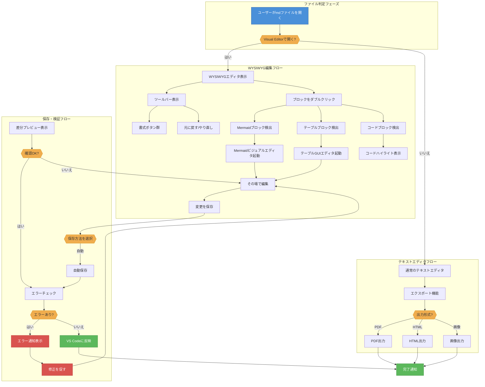
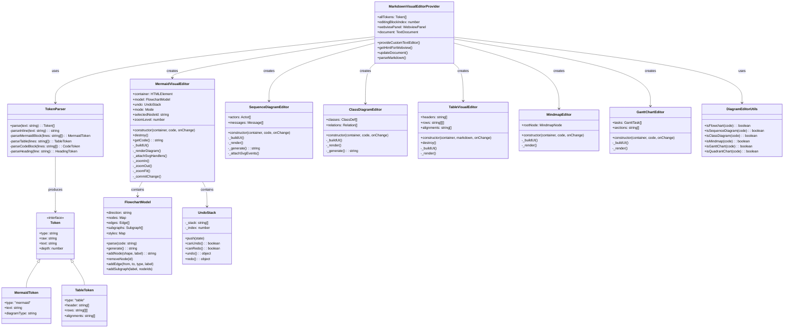
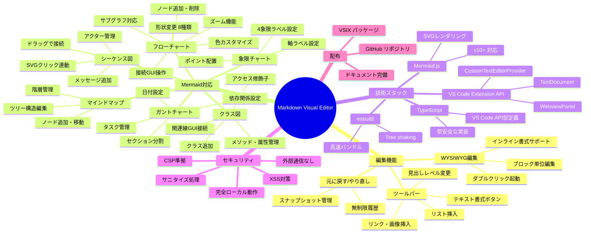
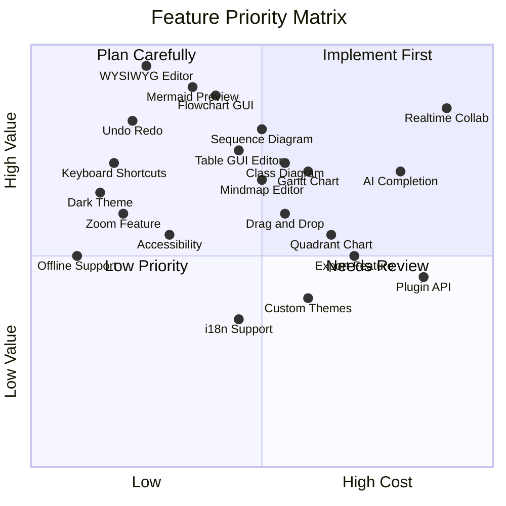
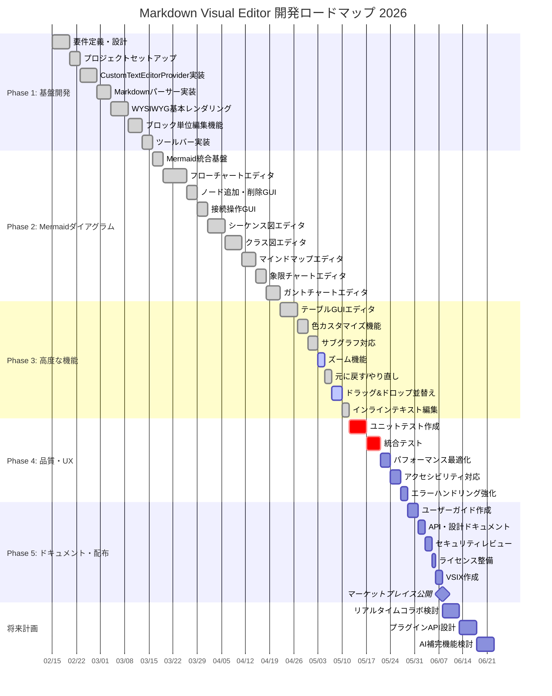
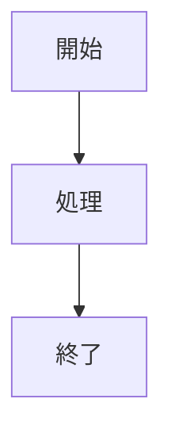

# Markdown Visual Editor テスト

このファイルは **Markdown Visual Editor** のテスト用ドキュメントです。

## 基本的なテキスト書式

これは通常の段落です。**太字**、*斜体*、~~取り消し線~~、`インラインコード` を含みます。

## リスト

- 項目1
- 項目2
  - サブ項目2-1
  - サブ項目2-2
- 項目3

### 番号付きリスト

1. 最初の項目
2. 次の項目
3. 最後の項目

## テーブル

実装状況は v1.0.0 時点。凡例: ✅ 対応済み ／ ⚠️ 部分対応・制限あり ／ ❌ 未対応 ／ 🚧 開発中（現時点で該当項目なし）。

| 機能カテゴリ | 機能名 | 実装状態 | 対応バージョン | 備考 |
| --- | --- | --- | --- | --- |
| テキスト編集 | インライン書式 (太字・斜体・取り消し線・インラインコード) | ✅ 対応済み | v0.1.1 | ダブルクリックで編集、Ctrl+B/Ctrl+Iで選択範囲に適用 |
| テキスト編集 | 見出し (H1〜H6) | ✅ 対応済み | v0.1.1 | ツールバーはH1/H2/H3＋「…」でH4〜H6 |
| テキスト編集 | 箇条書き・番号付きリスト | ✅ 対応済み | v0.1.1 | ネスト対応 |
| テキスト編集 | 引用ブロック・水平線 | ✅ 対応済み | v0.1.1 | 複数行の引用に対応 |
| テキスト編集 | コードブロック（言語指定） | ✅ 対応済み | v0.1.1 | フェンス全体（開始〜終了）が1ブロック |
| テキスト編集 | リンク挿入 | ✅ 対応済み | v0.1.1 | ツールバー「🔗 リンク」から挿入 |
| ブロック構造・操作 | H1/H2 セクション単位のブロックモデル | ✅ 対応済み | v0.5.4 | H1またはH2見出しから次のH1/H2直前までを1ブロックとして編集（H3〜H6・段落・リスト・引用・hrを含む）。表・コード・Mermaid・数式は従来どおり単独ブロック |
| ブロック構造・操作 | ブロックのドラッグ&ドロップ並べ替え | ✅ 対応済み | v0.4.3 | ハンドル「⋮⋮」またはブロック本体を掴んで移動、複数選択はまとめて移動 |
| ブロック構造・操作 | 右クリックで上/下にブロックを追加 | ✅ 対応済み | v0.5.2 | 段落・見出し・リスト・タスクリスト・表・コード・数式・引用・水平線・Mermaidから選択し、挿入後そのまま編集状態に入る |
| ブロック構造・操作 | キーボードのみでのブロック移動・追加・編集 | ✅ 対応済み | v0.5.2〜v0.5.3 | ↑↓で前後ブロックへ移動、Ctrl+Enter/Ctrl+Shift+Enterで追加メニュー、Alt+↑↓で編集を確定して隣接ブロックの編集へ直接ジャンプ。v0.5.3でEscape/Ctrl+Enter完了後にフォーカス・選択が戻るよう改善 |
| ブロック構造・操作 | 複数選択・コピー/切り取り/貼り付け | ✅ 対応済み | v0.1.1 | クリック=単一選択、Ctrl+Click=トグル、Shift+Click=範囲選択、Ctrl+C/X/Vで操作 |
| ブロック構造・操作 | 挿入位置ピッカー | ✅ 対応済み | v0.2.1 | ブロック未編集時のツールバー挿入で挿入位置を選択。ブロック選択中はその項目を初期選択 |
| テーブル編集 | GUIテーブルエディタ（セル編集・行列の追加削除） | ✅ 対応済み | v0.1.1 | 全セルは自動高さ調整のtextarea。列は2列以上、行は2行以上で削除可 |
| テーブル編集 | セル内改行 | ✅ 対応済み | v0.5.0 | セル内改行とMarkdown上の`<br>`を双方向変換 |
| テーブル編集 | 列幅調整 | ✅ 対応済み | v0.5.0 | ヘッダー境界をドラッグ（最小50px）。表示のみの調整で、Markdownのテーブルは列幅情報を持たないため文書には保存されない |
| テーブル編集 | セル結合 | ❌ 未対応 | — | Markdownテーブルにセル結合の概念がなく、エディタも実装していない |
| テーブル編集 | 列の配置指定（左寄せ/中央/右寄せ、`:---:`） | ❌ 未対応（既存指定は保存で消失） | — | 生成時は常に`-`のみの区切り行を出力し、読み込み時も区切り行を読み捨てる。既存の`:---:`指定はビジュアルエディタで開いて保存すると失われる |
| テーブル編集 | ソート機能 | ❌ 未対応 | — | クリックソート等は実装されていない |
| テーブル編集 | テーブルエディタ内Undo | ❌ 未対応 | — | ドキュメント全体のUndo（Ctrl+Z）のみで、テーブル単体の編集履歴はない |
| Mermaid（共通基盤） | ダイアグラム種別ピッカー | ✅ 対応済み | v0.3.0 | v0.2.1で7種として導入、v0.3.0で20種（ZenUMLを除く、5カテゴリ）に拡張 |
| Mermaid（共通基盤） | Mermaid 11.14 エンジン | ✅ 対応済み | v0.3.0 | 10.6→11.14へアップグレード。packet-beta / architecture-beta / kanban 等に対応 |
| Mermaid（共通基盤） | ズーム / パン | ✅ 対応済み | v0.5.5 | プレビュー（本文中の全図）: 🔍±/フィット/方向ボタン/Ctrl+ホイール/左ドラッグでパン（倍率0.2〜4.0）。編集モード: 20種は中ボタンドラッグのパンに対応、フローチャート単体エディタのみパン非対応 |
| Mermaid（共通基盤） | 色カスタマイズ | ✅ 対応済み | v0.1.1 | フローチャート: ノード色9種＋文字色7種。ガントはセクション/タスク単位で18色プリセット+カスタム色（v0.2.1） |
| Mermaid（共通基盤） | サブグラフ（フローチャート） | ✅ 対応済み | v0.1.1 | グループ化GUI。v0.3.1で入れ子（ネスト）に対応 |
| Mermaid（共通基盤） | 元に戻す/やり直し（図エディタ内） | ⚠️ 部分対応 | v0.1.1 | 専用7種エディタ（フローチャート/シーケンス/クラス/マインドマップ/象限/ガント/ER）のみ独自Undoスタックあり。汎用フォーム系14種にエディタ内Undoはなく、Ctrl+Zはドキュメント単位 |
| Mermaid（共通基盤） | 右クリックコンテキストメニュー（SVG上） | ✅ 対応済み | v0.4.1 | 21種すべてで共通基盤`DiagramCommon.showContextMenu()`により統一（TableVisualEditorのみ独自実装で非対応） |
| Mermaid（共通基盤） | 初回オンボーディングヒント | ✅ 対応済み | v0.4.1 | 「次回から表示しない」をlocalStorageに保存 |
| Mermaid（共通基盤） | コード編集へのフォールバック | ✅ 対応済み | v0.1.1 | GUI検出に一致しない図種はtextareaでのコード編集+ライブプレビュー |
| Mermaid（図種別） | フローチャート (GUI) | ✅ 対応済み | v0.1.1 | 8形状/4線種/接続モード/方向TD・LR・BT・RL、レイアウトDagre・ELK・ELKツリー切替（v0.3.1）。ノード・エッジの右クリック編集 |
| Mermaid（図種別） | フローチャートのパン操作 | ❌ 未対応 | — | ズーム（🔍±/フィット/Ctrl+ホイール）には対応するが、方向ボタン・中ボタンドラッグのパンは未実装。他20種と非対称 |
| Mermaid（図種別） | シーケンス図 (GUI) | ✅ 対応済み | v0.1.1 | 参加者(alias可)/7種の矢印/ノート(right of・left of・over)/`rect`色ブロック/ライフライン間ドラッグでメッセージ作成 |
| Mermaid（図種別） | シーケンス図の`alt`/`opt`/`loop`/`par`/`activate` | ❌ 未対応 | — | 条件分岐・ループ・並行処理・活性化のGUI編集は未実装 |
| Mermaid（図種別） | クラス図 (GUI) | ✅ 対応済み | v0.1.1 | 7種のリレーション、SVGクリックで接続。属性・メソッド追加はネイティブ`prompt()`を使用 |
| Mermaid（図種別） | マインドマップ (GUI) | ✅ 対応済み | v0.1.1 | 5形状、SVGドラッグで親付け替え（子孫へのドロップは禁止）、ルートは削除不可 |
| Mermaid（図種別） | ガントチャート (GUI) | ✅ 対応済み | v0.1.1 | セクション折りたたみ・D&D並べ替え（v0.2.1）、タスクバーのドラッグで開始日・右端8pxで期間変更（v0.4.1）。色は独自`%%gantt-style bg:`メタコメント |
| Mermaid（図種別） | 象限チャート (GUI) | ✅ 対応済み | v0.1.1 | データ点のSVGドラッグ移動。日本語ラベルは軸・象限・データ点名を自動的にダブルクォートで囲んで解決（v0.5.1で修正） |
| Mermaid（図種別） | ER図 (GUI) | ✅ 対応済み | v0.1.1 | エンティティ/属性(PK・FK・UK)/6種カーディナリティ、SVGクリックで接続 |
| Mermaid（図種別） | 汎用フォーム系14種 (stateDiagram-v2/pie/journey/gitGraph/timeline/requirementDiagram/C4/sankey-beta/xychart-beta/block-beta/zenuml/packet-beta/architecture-beta/kanban) | ✅ 対応済み（ZenUMLを除く） | v0.3.0 | `GenericFormDiagramEditor`派生。block/C4はソース上「簡易版」、architectureは組込アイコン5種のみ（cloud/database/disk/internet/server） |
| Mermaid（図種別） | 汎用フォーム系14種の↑↓ボタン | ⚠️ 誤解注意 | v0.4.1 | フォーカス移動のみで並べ替えではない。実際の並べ替えはドラッグ&ドロップまたは右クリックメニュー |
| Mermaid（図種別） | XYチャート | ✅ 対応済み | v0.3.0 | 向き(縦/横)・カテゴリ・Y軸(ラベル/min/max/自動追従、既定ON、v0.4.1)・bar/lineシリーズ。表編集モードが既定 |
| Mermaid（図種別） | ZenUMLのGUIプレビュー | ❌ 未対応 | — | UMDバンドルが同梱されていないためコード編集(textarea)のみ。ダイアグラム種別ピッカーからも除外 |
| 数式 (KaTeX) | インライン `$...$` / ディスプレイ `$$...$$` / ` ```math ` ブロック | ✅ 対応済み | v0.4.3 | KaTeX 0.17を完全ローカルバンドル。marked自体は数式構文を持たないため、描画後のDOMをTreeWalkerで走査して置換 |
| 数式 (KaTeX) | 数式エディタ（ライブプレビュー＋LaTeX記号パレット） | ✅ 対応済み | v0.4.3 | 200msデバウンスのライブプレビュー。構造/演算子/関係/大記号/ギリシャ/集合・論理/行列・整列の7群パレット |
| 数式 (KaTeX) | 数式の構文エラー表示 | ✅ 対応済み | v0.4.3 | `<span class="math-error">`（赤背景・ツールチップに理由表示）。KaTeX未ロード時は`.math-fallback` |
| 画像 | 相対パス画像の解決・表示 | ✅ 対応済み | v0.4.3 | `resolveImage`でホストにVS Code URIへの解決を依頼、`_imageUriCache`にキャッシュ |
| 画像 | ドラッグ&ドロップでの画像挿入 | ✅ 対応済み | v0.4.3 | png/jpg/jpeg/gif/webp/svg/bmp/ico/avifに対応。base64で`saveImage`を送信し、mdと同階層の`images/`ディレクトリへ保存して``を挿入 |
| 検索・置換 | Ctrl+F検索 / Ctrl+H置換 | ✅ 対応済み | v0.3.1 | 大文字小文字・正規表現の切替あり。検索対象はレンダリング結果ではなく生のMarkdown全文 |
| 検索・置換 | SVG（Mermaid図内）の検索ハイライト | ✅ 対応済み | v0.4.1 | `<tspan class="svg-search-highlight">`に分割して表示。SVG側の件数はHTML側と厳密には一致しない視覚的ヒント |
| 保存・変更管理 | 変更箇所のブロックハイライト | ✅ 対応済み | v0.5.0 | 最後に保存した内容（baseline）と異なるブロックを左ガターバー＋淡い背景＋「未保存」バッジで表示。保存すると解除 |
| 保存・変更管理 | Undo/Redo（ドキュメント全体） | ✅ 対応済み | v0.1.1 | Ctrl+Z / Ctrl+Shift+Z・Ctrl+Y。VS Code標準のundo/redoコマンドを実行 |
| 保存・変更管理 | 外部エディタ・Gitとの同期 | ✅ 対応済み | v0.1.1 | 自ビュー以外での変更（外部エディタ・git操作等）を検知して反映 |
| 保存・変更管理 | テキストエディタとの往復 | ✅ 対応済み | v0.3.1（📝ボタン）/ v0.5.3（逆方向） | ビジュアル→テキストはツールバーの📝ボタン。テキスト→ビジュアルはv0.5.3で追加したタイトルバーボタン／コマンドパレットから |
| エクスポート | PDF出力 | ✅ 対応済み | v0.4.2 | レンダリング済みDOMを一時HTMLとして書き出し、OS既定ブラウザで開いて印刷ダイアログを自動表示。未保存(パスなし)文書はエラー |
| UI/UX | ライト/ダークテーマ切替 | ✅ 対応済み | v0.3.1 | ☀️/🌙ボタン。切替時にMermaidを再初期化して全図を再描画、状態は`vscode.setState`で永続化 |
| UI/UX | ツールバー | ✅ 対応済み | v0.1.1 | 書式/見出し/リスト/リンク/表/コード/Mermaid/数式ボタン群 |
| UI/UX | 保存インジケータ | ✅ 対応済み | v0.1.1 | ●/○表示（クリック不可） |
| UI/UX | リンクのクリックで開く | ✅ 対応済み | v0.3.1 | 修飾キー不要で全クリックが対象。http(s)/mailtoは外部ブラウザ、相対パスはmdの階層基準でVS Codeが開く |
| キーボード操作 | グローバルショートカット | ✅ 対応済み | v0.3.1 | Ctrl+F検索/Ctrl+H置換/Ctrl+Z undo/Ctrl+Shift+Z・Ctrl+Y redo。Ctrl+Sは横取りせずVS Code標準の保存に委ねる |
| キーボード操作 | ブロック選択中のショートカット | ✅ 対応済み | v0.5.2 | Enter/F2で編集開始、Deleteで削除（確認ダイアログ）、↑↓でフォーカス移動、Ctrl+Enter/Ctrl+Shift+Enterでブロック追加メニュー |
| キーボード操作 | テキスト編集中のショートカット | ✅ 対応済み | v0.1.1〜v0.5.3 | Ctrl+B/Ctrl+Iで太字・斜体、Tabで半角スペース4個挿入。v0.5.3でEscape/Ctrl+Enter確定後のフォーカス復帰を改善 |
| セキュリティ | 外部通信 | ⚠️ 制限あり | v0.1.1 | 拡張自体は通信しないが、CSPの`img-src`に`https:`を含むため外部URL画像を記述すれば通信が発生しうる |
| セキュリティ | CSP設定 | ✅ 対応済み | v0.1.1 | `default-src 'none'`を基本に、img/style/script/font/worker/connect-srcを個別に許可 |
| セキュリティ | HTMLサニタイズ | ✅ 対応済み | v0.1.1 | 危険要素の削除・`on*`属性の除去・`javascript:`等の除去（denylist方式であり、DOMPurifyのようなallowlistではない） |
| セキュリティ | ファイルシステムアクセス | ⚠️ 制限あり | v0.1.1 | 開いている.mdへの編集に加え、画像D&Dでの`images/`書き込み（v0.4.3）、PDF出力での一時ディレクトリ書き込み（v0.4.2）を行う |
| 配布 | VSIX パッケージ | ✅ 対応済み | v0.1.1 | ローカルインストール可 |
| 配布 | マーケットプレイス公開 | ❌ 未対応 | — | 現時点で公開されていない |
## コードブロック

```javascript
function hello() {
  console.log("Hello, World!");
}
```

## 引用

> これは引用ブロックです。
> 複数行にまたがる引用も対応しています。

## 数式 (KaTeX)

インライン数式にも対応しています。質量とエネルギーの関係は $E = mc^2$ のように書けます。円の面積は半径 $r$ を用いて $S = \pi r^2$ と表せます。

ディスプレイ数式（`$$...$$`）はブロックとして中央揃えで表示されます。

$$
\int_{-\infty}^{\infty} e^{-x^2}\,dx = \sqrt{\pi}
$$

` ```math ` フェンスでも同様にディスプレイ数式を書けます。行列の積やギリシャ文字、集合記号も表示できます。

```math
\begin{pmatrix}
a & b \\
c & d
\end{pmatrix}
\begin{pmatrix}
x \\
y
\end{pmatrix}
=
\begin{pmatrix}
ax + by \\
cx + dy
\end{pmatrix}
```

ガウスの法則（マクスウェル方程式の一つ）は $\nabla \cdot \mathbf{E} = \dfrac{\rho}{\varepsilon_0}$ のように表せ、$\alpha, \beta, \gamma \in \mathbb{R}$ のような集合記号・ギリシャ文字も利用できます。

## Mermaidダイアグラム

### フローチャート




### シーケンス図

```mermaid
sequenceDiagram
    participant U as ユーザー
    participant TB as ツールバー
    participant E as エディタCore
    participant P as パーサー
    participant R as レンダラー
    participant M as Mermaidエンジン
    participant D as ドキュメント
    participant V as VS Code API
    participant FS as ファイルシステム

    U->>E: mdファイルを開く
    E->>V: CustomTextEditorProvider起動
    V->>E: ドキュメント内容取得
    E->>P: Markdownをパース
    P->>P: トークン分割処理
    P-->>E: トークン配列を返却
    E->>R: HTML生成・レンダリング
    R-->>U: WYSIWYGプレビュー表示

    rect rgb(40, 60, 80)
    Note over U,R: ブロック編集フロー
    U->>E: Mermaidブロックをダブルクリック
    E->>E: 編集モードに切り替え
    E->>M: Mermaidコードをパース
    M-->>E: SVGダイアグラム生成
    E->>R: ビジュアルエディタ表示
    R-->>U: ツールバー＋SVGプレビュー
    end

    U->>TB: ノード追加ボタンをクリック
    TB->>E: addNode(shape)
    E->>M: 再レンダリング要求
    M-->>E: 更新されたSVG
    E->>R: プレビュー更新
    R-->>U: 新しいダイアグラム表示

    U->>TB: 接続モードON
    TB-->>U: 接続元ノード選択を促す
    U->>E: ノードAをクリック
    E-->>U: 接続先ノード選択を促す
    U->>E: ノードBをクリック
    E->>E: エッジ追加
    E->>M: 再レンダリング
    M-->>R: SVG更新

    rect rgb(60, 40, 40)
    Note over U,FS: 保存フロー
    U->>TB: 保存ボタンをクリック
    TB->>E: saveMermaidEdit()
    E->>P: 新しいMermaidコードで再パース
    P->>D: トークン更新
    D->>V: ドキュメント変更通知
    V->>FS: ファイル書き込み
    FS-->>V: 書き込み完了
    V-->>E: 保存成功
    E->>R: 通常プレビューに復帰
    R-->>U: 更新されたプレビュー表示
    end

    U->>TB: 元に戻すボタン
    TB->>E: undo()
    E->>E: スナップショット復元
    E->>M: 再レンダリング
    M-->>R: 復元されたSVG
    R-->>U: 以前の状態を表示
```




### クラス図




### マインドマップ




### 象限チャート




### ガントチャート




### ER図


## リンク

[VS Code公式サイト](https://code.visualstudio.com/) を参照してください。

---

*このドキュメントは Markdown Visual Editor で編集できます。*



