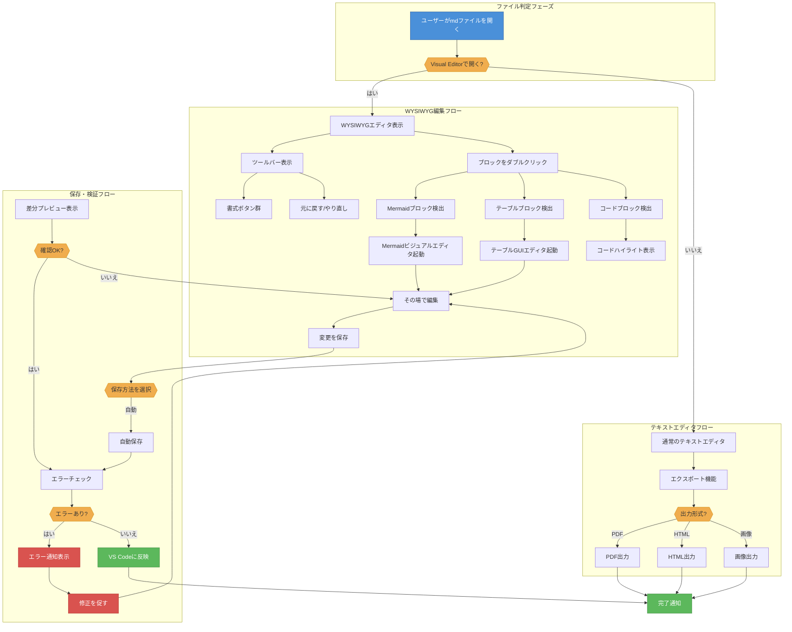
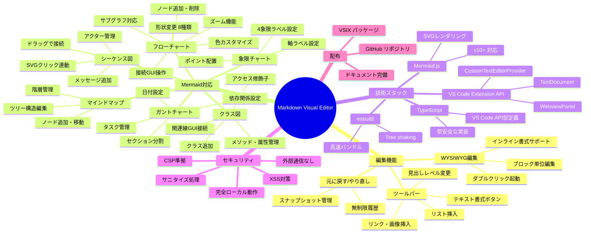
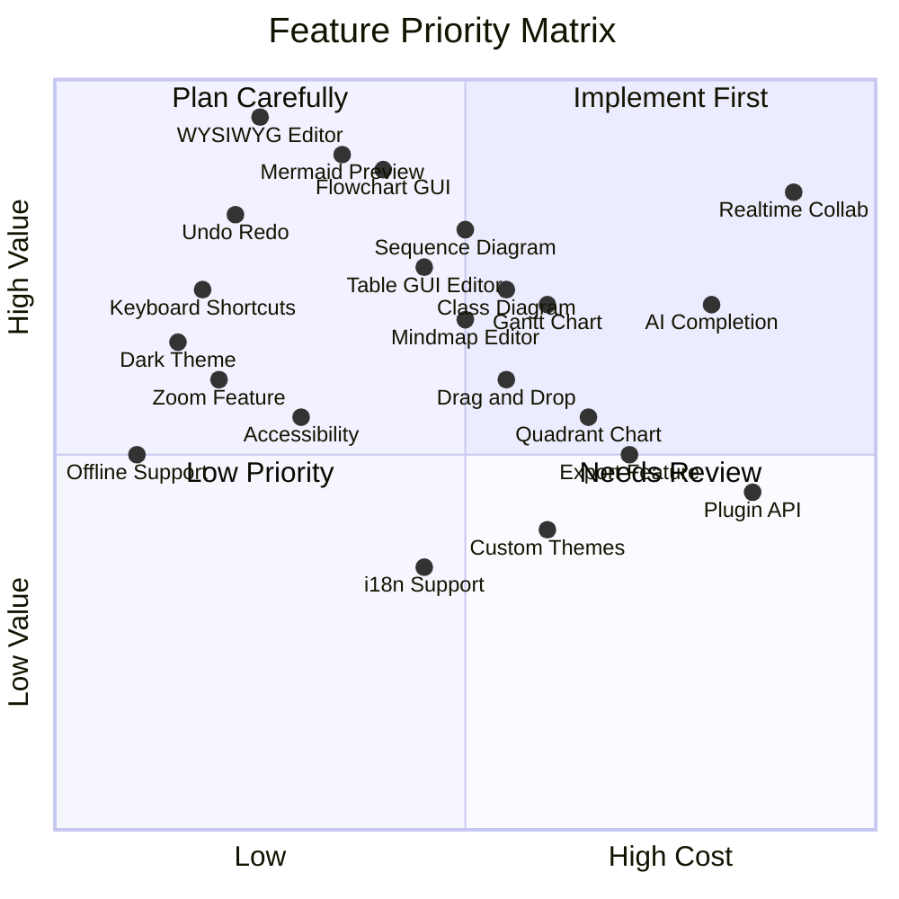
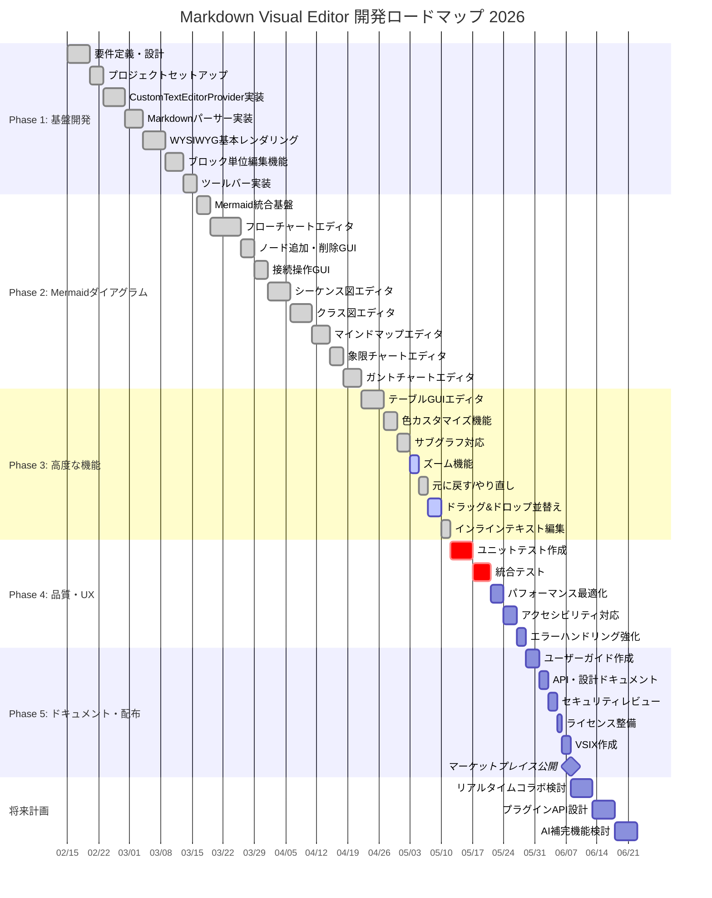
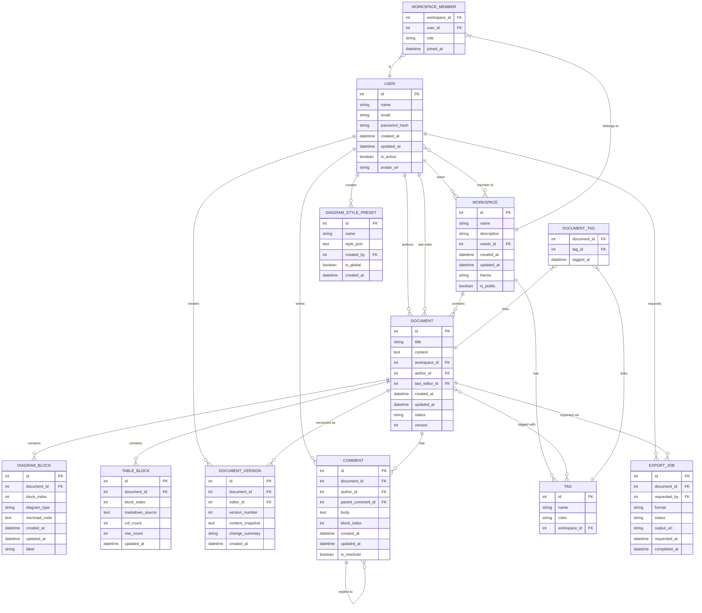
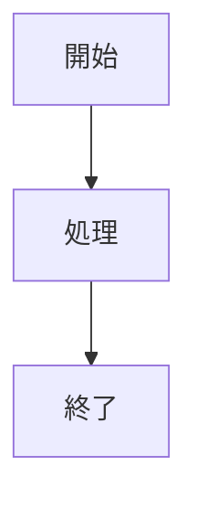

# Markdown Visual Editor テスト

このファイルは **Markdown Visual Editor** のテスト用ドキュメントです。

## 基本的なテキスト書式

これは通常の段落です。**太字**、*斜体*、~~取り消し線~~、`インラインコード` を含みます。

## リスト

- 項目1
- 項目2
  - サブ項目2-1
  - サブ項目2-2
- 項目3

### 番号付きリスト

1. 最初の項目
2. 次の項目
3. 最後の項目

## テーブル

| 機能カテゴリ | 機能名 | 実装状態 | 対応バージョン | 備考 |
| --- | --- | --- | --- | --- |
| テキスト編集 | インライン書式 (太字・斜体) | ✅ 対応済み | v1.0 | ダブルクリックで編集 |
| テキスト編集 | 見出し (H1〜H6) | ✅ 対応済み | v1.0 | ツールバーから変更可 |
| テキスト編集 | 箇条書きリスト | ✅ 対応済み | v1.0 | ネスト対応 |
| テキスト編集 | 番号付きリスト | ✅ 対応済み | v1.0 | ネスト対応 |
| テキスト編集 | 引用ブロック | ✅ 対応済み | v1.0 | 複数行対応 |
| テキスト編集 | インラインコード | ✅ 対応済み | v1.0 | バッククォート記法 |
| テキスト編集 | コードブロック | ✅ 対応済み | v1.0 | 言語ハイライト対応 |
| テキスト編集 | リンク挿入 | ✅ 対応済み | v1.1 | URL・タイトル設定可 |
| テキスト編集 | 取り消し線 | ✅ 対応済み | v1.1 | ~~ 記法 |
| テーブル編集 | GUIテーブルエディタ | ✅ 対応済み | v1.2 | 行・列の追加削除 |
| テーブル編集 | セル結合 | ⚠️ 部分対応 | v1.3 | 表示のみ |
| テーブル編集 | 列幅調整 | 🚧 開発中 | v1.4 | ドラッグ対応予定 |
| テーブル編集 | ソート機能 | 📋 計画中 | v2.0 | クリックソート予定 |
| Mermaid | フローチャート (GUI) | ✅ 対応済み | v1.2 | ノード・エッジGUI操作 |
| Mermaid | シーケンス図 (GUI) | ✅ 対応済み | v1.2 | ドラッグで接続 |
| Mermaid | クラス図 (GUI) | ✅ 対応済み | v1.2 | SVGクリック接続 |
| Mermaid | マインドマップ (GUI) | ✅ 対応済み | v1.3 | ツリー編集 |
| Mermaid | ガントチャート (GUI) | ✅ 対応済み | v1.3 | タスク管理 |
| Mermaid | 象限チャート (GUI) | ✅ 対応済み | v1.3 | ポイント編集 |
| Mermaid | ER図 (GUI) | 🚧 開発中 | v1.4 | エンティティ・関連 |
| Mermaid | ズーム機能 | ✅ 対応済み | v1.3 | Ctrl+ホイール対応 |
| Mermaid | 色カスタマイズ | ✅ 対応済み | v1.2 | プリセット+カスタム |
| Mermaid | サブグラフ | ✅ 対応済み | v1.2 | グループ化GUI |
| Mermaid | 元に戻す/やり直し | ✅ 対応済み | v1.2 | Ctrl+Z/Y |
| UI/UX | ダークテーマ | ✅ 対応済み | v1.0 | VS Codeテーマ連動 |
| UI/UX | ツールバー | ✅ 対応済み | v1.0 | 書式ボタン群 |
| UI/UX | ステータスバー | ✅ 対応済み | v1.1 | 操作ヒント表示 |
| UI/UX | キーボードショートカット | ✅ 対応済み | v1.1 | Ctrl+Z/Y/Del他 |
| セキュリティ | 外部通信なし | ✅ 対応済み | v1.0 | 完全ローカル動作 |
| セキュリティ | CSP設定 | ✅ 対応済み | v1.0 | Webviewセキュリティ |
| セキュリティ | HTMLサニタイズ | ✅ 対応済み | v1.0 | XSS対策済み |
| 配布 | VSIX パッケージ | ✅ 対応済み | v1.0 | ローカルインストール可 |
| 配布 | マーケットプレイス | 📋 計画中 | v2.0 | 審査申請予定 |
## コードブロック

```javascript
function hello() {
  console.log("Hello, World!");
}
```

## 引用

> これは引用ブロックです。
> 複数行にまたがる引用も対応しています。

## Mermaidダイアグラム

### フローチャート




### シーケンス図

```mermaid
sequenceDiagram
    participant U as ユーザー
    participant TB as ツールバー
    participant E as エディタCore
    participant P as パーサー
    participant R as レンダラー
    participant M as Mermaidエンジン
    participant D as ドキュメント
    participant V as VS Code API
    participant FS as ファイルシステム

    U->>E: mdファイルを開く
    E->>V: CustomTextEditorProvider起動
    V->>E: ドキュメント内容取得
    E->>P: Markdownをパース
    P->>P: トークン分割処理
    P-->>E: トークン配列を返却
    E->>R: HTML生成・レンダリング
    R-->>U: WYSIWYGプレビュー表示

    rect rgb(40, 60, 80)
    Note over U,R: ブロック編集フロー
    U->>E: Mermaidブロックをダブルクリック
    E->>E: 編集モードに切り替え
    E->>M: Mermaidコードをパース
    M-->>E: SVGダイアグラム生成
    E->>R: ビジュアルエディタ表示
    R-->>U: ツールバー＋SVGプレビュー
    end

    U->>TB: ノード追加ボタンをクリック
    TB->>E: addNode(shape)
    E->>M: 再レンダリング要求
    M-->>E: 更新されたSVG
    E->>R: プレビュー更新
    R-->>U: 新しいダイアグラム表示

    U->>TB: 接続モードON
    TB-->>U: 接続元ノード選択を促す
    U->>E: ノードAをクリック
    E-->>U: 接続先ノード選択を促す
    U->>E: ノードBをクリック
    E->>E: エッジ追加
    E->>M: 再レンダリング
    M-->>R: SVG更新

    rect rgb(60, 40, 40)
    Note over U,FS: 保存フロー
    U->>TB: 保存ボタンをクリック
    TB->>E: saveMermaidEdit()
    E->>P: 新しいMermaidコードで再パース
    P->>D: トークン更新
    D->>V: ドキュメント変更通知
    V->>FS: ファイル書き込み
    FS-->>V: 書き込み完了
    V-->>E: 保存成功
    E->>R: 通常プレビューに復帰
    R-->>U: 更新されたプレビュー表示
    end

    U->>TB: 元に戻すボタン
    TB->>E: undo()
    E->>E: スナップショット復元
    E->>M: 再レンダリング
    M-->>R: 復元されたSVG
    R-->>U: 以前の状態を表示
```




### クラス図


### マインドマップ




### 象限チャート




### ガントチャート




### ER図




## リンク

[VS Code公式サイト](https://code.visualstudio.com/) を参照してください。

---

*このドキュメントは Markdown Visual Editor で編集できます。*



