# Markdown Visual Editor — 全機能テストドキュメント
> **使い方:** このファイルを Markdown Visual Editor で開き（右クリック → Open With... → Markdown Visual Editor、または §16 のタイトルバーボタン／コマンドパレット）、各セクションのチェックリストに従って動作を確認してください。
> 対象バージョン: **v0.5.6** / Mermaid 11.14.x / 21 種類対応 / KaTeX 0.17.x
> 最終更新: 2026-07-19

---

- [ ] VS Code 1.80.0 以上
- [ ] 拡張機能 `md-visual-editor-0.5.6.vsix` がインストール済み
- [ ] このファイルを「Markdown Visual Editor」で開けている（タブのアイコンがプレビュー表示になっていること）

---

## 1. WYSIWYG ブロック編集 — 基本

このセクションの各ブロックを **ダブルクリック** して編集モードに入り、`Escape` または `Ctrl + Enter` で確定してください。

### 段落

これは段落です。**太字**、*斜体*、~~取り消し線~~、`インラインコード` が含まれます。  
ダブルクリック → 末尾に「（編集テスト済み）」を追加 → `Escape` で確定できれば OK。

- [ ] 段落をダブルクリックで編集できる
- [ ] `Escape` で確定 / `Ctrl + Enter` で確定 / 他ブロックのクリックで確定
- [ ] 編集中の背景色が VS Code エディタ色に **変化しない**（v0.3.1 の修正点）

### 見出し

# 見出し H1
## 見出し H2
### 見出し H3
#### 見出し H4
##### 見出し H5
###### 見出し H6

- [ ] **【v0.5.4】** 直後に H2 が続く H1 は、H1 単独で 1 ブロックになる
- [ ] **【v0.5.4】** H2「見出し H2」をダブルクリックすると、続く H3〜H6 も**同じブロック**として一括編集できる（H3〜H6 は単体では独立ブロックにならない）
- [ ] 見出しレベル（`#`〜`######`）を保持したまま編集できる

ブロックの単位についての詳細は「2. 【v0.5.4】ブロックモデル」を参照してください。

### リスト

- 箇条書き 1
- 箇条書き 2
  - ネスト項目 A
  - ネスト項目 B
- 箇条書き 3

1. 番号付き 1
2. 番号付き 2
3. 番号付き 3

- [ ] リスト全体をダブルクリックで編集できる
- [ ] ネストしたリストが保持される

### 引用 / 区切り線

> これは引用ブロックです。複数行も可。
> 2 行目。

---

- [ ] 引用ブロックがダブルクリック編集できる
- [ ] 区切り線が表示される

### コードブロック

```javascript
function hello(name) {
  console.log(`Hello, ${name}!`);
  return name.length;
}
```

- [ ] コードブロックがシンタックスハイライト表示される
- [ ] ダブルクリックで編集できる

### リンク / 画像

- 外部 HTTP: <https://example.com/>
- 外部 HTTPS: [Mermaid 公式](https://mermaid.js.org/)
- メール: [連絡先](mailto:test@example.com)
- 相対パス: [README へ](README.md)
- 画像（外部 URL は表示されない場合があります）: 

**リンク動作テスト:**

- [ ] **通常クリック（修飾キーは不要）** で `https://mermaid.js.org/` が外部ブラウザで開く
- [ ] **通常クリック** で `mailto:test@example.com` がメールクライアントで開く
- [ ] **通常クリック** で `README.md` が VS Code 内で開く（相対パスは md ファイルの階層基準で解決される）
- [ ] `#` だけのリンクはクリックしても何も起こらない
- [ ] 誤クリック防止のための修飾キー要求は **存在しない**（`Ctrl+Click` でなくても開く）点に注意

---

## 2. 【v0.5.4】ブロックモデル — H1/H2 セクションと特殊ブロック

v0.5.4 で、ブロックの単位が「トークン 1 つ = 1 ブロック」から「範囲(range)」に変更されました。

- **特殊ブロック**（テーブル / コードフェンス全般 = プレーンコード・Mermaid・数式）は**単独で 1 ブロック**になります。
- **それ以外**は、**H1 または H2 見出しから次の H1/H2 の直前まで**をまとめて 1 ブロック（「セクション」）にします。H3〜H6・段落・リスト・引用・区切り線は同じセクションに含まれます。

以下の構造で確認してください。

## セクションテスト A

このセクションの先頭は H2 見出しです。

### 中身の H3

段落が続きます。

- リスト項目 1
- リスト項目 2

> 引用も同じセクションに含まれます

---

## セクションテスト B

別のセクションです。

| a | b |
|---|---|
| 1 | 2 |

```text
コードブロックはセクションに含まれず独立ブロック
```

- [ ] 「セクションテスト A」の H2 見出しをクリック（選択）すると、H3・段落・リスト・引用・水平線までが**まとめて 1 つのブロック**として選択される
- [ ] そのブロックを編集すると、H2 から次の H2（「セクションテスト B」）直前までの Markdown が **1 つの textarea** にまとまって表示される
- [ ] 上のテーブルはセクションに取り込まれず、**独立したブロック**として GUI 編集できる
- [ ] 上のコードブロックもセクションに取り込まれず、**独立したブロック**として編集できる
- [ ] Mermaid ブロック・数式ブロックも同様に、前後に H1/H2 見出しがなくても独立ブロックとして扱われる（§7・§8・§13 参照）

---

## 3. ツールバー — 挿入

ツールバー左側のボタンで以下を順に挿入してください。

- [ ] **H1〜H6** を順に挿入
- [ ] **B / I / S / `</>`** を順に挿入
- [ ] **• List / 1. List** を挿入
- [ ] **🔗 リンク** を挿入
- [ ] **⊞ テーブル** を挿入（3×3 のテンプレートが入る）
- [ ] **{ } コードブロック** を挿入
- [ ] **--- 区切り線** を挿入

### 挿入位置ピッカー（ブロック編集していない状態でテスト）

- [ ] ツールバーボタンを押すと「挿入位置ピッカー」が表示される
- [ ] 「先頭に挿入」を選ぶとドキュメント先頭に入る
- [ ] 「○○の後に挿入」で任意ブロックの直後に入る
- [ ] ブロックを 1 つ選択した状態でツールバーボタンを押すと、ピッカーは**そのブロックの項目を初期選択・フォーカス・スクロール**した状態で開く
- [ ] その状態のまま `Enter` を押すと即座に確定し、選択していたブロックの直後に挿入される
- [ ] ドキュメントが空の状態でボタンを押すと、ピッカーは表示されずそのまま先頭に挿入される
- [ ] ◇ Mermaid ボタンは、ブロックを編集中かどうかに関わらず常に種別ピッカーを開く

---

## 4. ツールバー右端 — v0.3.1 ユーティリティ

### 4.1 🔍 検索 / 置換バー

- [ ] ツールバー右端の **🔍** をクリック → 検索バーが表示される
- [ ] **`Ctrl + F`** でも検索バーが開く
- [ ] **`Ctrl + H`** で検索バーが開き、置換ボックスにフォーカスが移る
- [ ] 検索ボックスに `テスト` と入力 → 一致箇所が黄色でハイライト、現在位置がオレンジ
- [ ] `↑` / `↓` ボタン（または Enter / Shift+Enter）で次／前へ移動
- [ ] カウンタ表示（例: `3 / 12`）が正しい
- [ ] **`Aa`**（大文字小文字区別）を ON にして再検索 → 件数が変化する
- [ ] **`.*`**（正規表現）を ON にして `\d+` で検索 → 数字にマッチ
- [ ] 置換ボックスに `OK` と入力 → 「1 つ置換」で 1 箇所だけ置換される
- [ ] 「すべて置換」で残り全部が置換される（Undo で戻せる）
- [ ] **`Esc`** で検索バーが閉じる
- [ ] 検索対象は**レンダリング結果ではなく生の Markdown 全文**（HTML タグの中の文字列などもヒットしうる）
- [ ] 本文中の Mermaid 図（SVG）内のテキストにも `<tspan class="svg-search-highlight">` でハイライトが入る（件数は HTML 側とは厳密には一致しない目安表示）

### 4.2 ☀️ / 🌙 テーマ強制切替

- [ ] ボタンをクリックするたびに `自動` → `ライト強制` → `ダーク強制` → `自動` と循環
- [ ] テーマを変えると Mermaid 図の色も追従する（再初期化されて全図が再描画される）
- [ ] 一度設定したら、ファイルを閉じて開き直しても保持される
- [ ] VS Code 自体のテーマを変えても、強制設定中は固定される
- [ ] **【v0.4.3】ライト強制時、Mermaid エディタのオンボーディングバナー / 通知パネル / ツールバー / チェックボックス / タブが正しくライト配色になる（ダークのまま残らない）**

### 4.3 📝 テキストエディタで開く

- [ ] **📝** をクリック → 同じファイルが標準テキストエディタで開く
- [ ] 標準エディタで編集して保存 → ビジュアルエディタ側に変更が反映される

---

## 5. テーブル GUI 編集

| 商品名 | 数量 | 単価 |
|---|---:|---:|
| りんご | 3 | 150 |
| みかん | 5 | 80 |
| ぶどう | 2 | 400 |

- [ ] テーブル右上の「✎ テーブルを編集」ボタンが表示される
- [ ] ボタンをクリック → GUI 編集モードに切り替わる
- [ ] 各セルは自動で高さ調整される `<textarea>` になっており、長い文字列は折り返される
- [ ] **【v0.5.0】** セル内で改行を入力する → Markdown 上は `<br>` として保存され、再度開くと改行として復元される（双方向変換）
- [ ] 「➕ 列追加」「➕ 行追加」で拡張できる（左右・上下）
- [ ] 列・行の「✕」で削除できる（列は 2 列以上、行は 2 行以上のときのみ削除可）
- [ ] 右クリックで「列追加(左/右)」「行追加(上/下)」「この列を削除」「この行を削除」ができる
- [ ] **【v0.5.0】** 列の境界をドラッグ（`.col-resize-handle`、最小 50px）すると列幅が変わる。ただし**表示上だけの変更で、保存してもファイルの Markdown には反映されない**
- [ ] 「保存」で確定 / 「キャンセル」で破棄
- [ ] エディタ内に Undo 機能は無い（`Ctrl+Z` はドキュメント全体の Undo）

### 既知の制限（テーブル）

- [ ] 列の配置（左揃え/中央揃え/右揃え、`:---:` 等）を GUI から変更する機能は**存在しない**
- [ ] 上の例のテーブルのように既存の配置指定（`---:` など）があっても、GUI 編集で保存すると配置指定は失われ、区切り行はすべて `---` になる

---

## 6. 【v0.5.0】未保存の変更ハイライト

適当なブロック（例: 上のテーブルや、このファイル中の任意の段落）を編集して確定してください。**まだ `Ctrl+S` は押さないこと。**

- [ ] 変更したブロックの左側に**ガターバー**（縦線）が表示される
- [ ] 変更したブロックの背景がうっすら色付けされる
- [ ] ブロック右上に「未保存」バッジが表示される
- [ ] ブロックにマウスをホバーしている間、または編集中は、バッジ・ハイライト表示が隠れる
- [ ] `Ctrl+S` で保存すると、ガターバー・背景色・バッジがすべて消える
- [ ] 変更内容を元の文字列に戻して確定すると（他に未保存の変更がなければ）ハイライトが消える

---

## 7. Mermaid — 高機能 GUI 7 種

各図にマウスを乗せて「✎ ダイアグラムを編集」をクリックし、専用ビジュアルエディタで操作してください。ズーム / パン操作の詳細は §10 を参照してください（フローチャートのみパン非対応の例外です）。

### 7.1 フローチャート


- [ ] ノード追加・編集・削除（形状: 矩形・角丸・ひし形・円形 等）
- [ ] エッジの追加（接続元 → 接続先）
- [ ] エッジをダブルクリック → 方向反転 ⇄ / 削除 / 線種変更 / ラベル編集
- [ ] サブグラフをダブルクリック → 名前変更・ノード追加／除外
- [ ] 方向切り替え `TB / LR / RL / BT`
- [ ] **【v0.3.1】レイアウト切替: Dagre / ELK / ELK ツリー**
  - [ ] ELK を選んで保存 → コードに `%%{init:{"layout":"elk"}}%%` が付く
  - [ ] 再度開いてもレイアウト選択が復元される
- [ ] **【v0.3.1】サブグラフ入れ子化**
  - [ ] サブグラフを 2 つ以上作る
  - [ ] 一覧の「親グループ」プルダウンで片方をもう片方の中に入れる
  - [ ] サイクルになる組み合わせは選択肢に出ない（拒否される）
  - [ ] 複数選択 → 「🗂️ 複数グループを 1 つに結合」で 1 つのサブグラフにまとめられる
- [ ] **【v0.3.1】SVG が描画領域に収まる図は、初期表示で勝手に拡大されない（倍率 1.0）**
- [ ] 🔍+ / 🔍− / ⊞フィット ボタンと `Ctrl`+ホイールでズームできる
- [ ] **【v0.5.5】方向ボタン（◀▶▲▼）や中ボタンドラッグによるパンは存在しない**（他 6 種の専用エディタ・14 種の汎用フォームエディタとは非対称。仕様であり不具合ではない。詳細は §10）
- [ ] Undo（`Ctrl + Z`）/ Redo（`Ctrl + Y`）が動く

### 7.2 シーケンス図

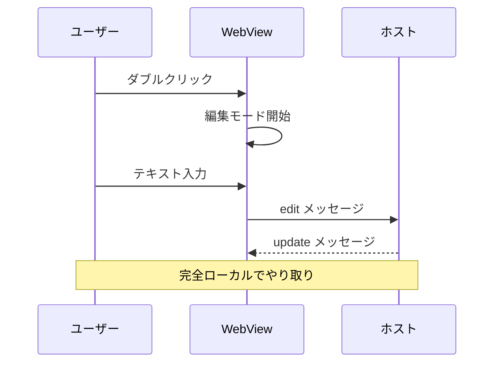

- [ ] アクター / 参加者の追加・編集・削除・並べ替え
- [ ] メッセージの追加・編集・並び替え（↑↓）
- [ ] ノートの追加（right of / left of / over）
- [ ] SVG 上のメッセージ線をクリック → 種類変更
- [ ] SVG 上のメッセージテキストをダブルクリック → 編集
- [ ] 中ボタンドラッグでパン、`Ctrl`+ホイールでズームできる（§10 参照）
- [ ] **`alt` / `opt` / `loop` / `par` / `activate` を GUI から追加する機能は無い**（未対応。既存コードは編集で保持されるがフォームからは編集できない）

### 7.3 クラス図

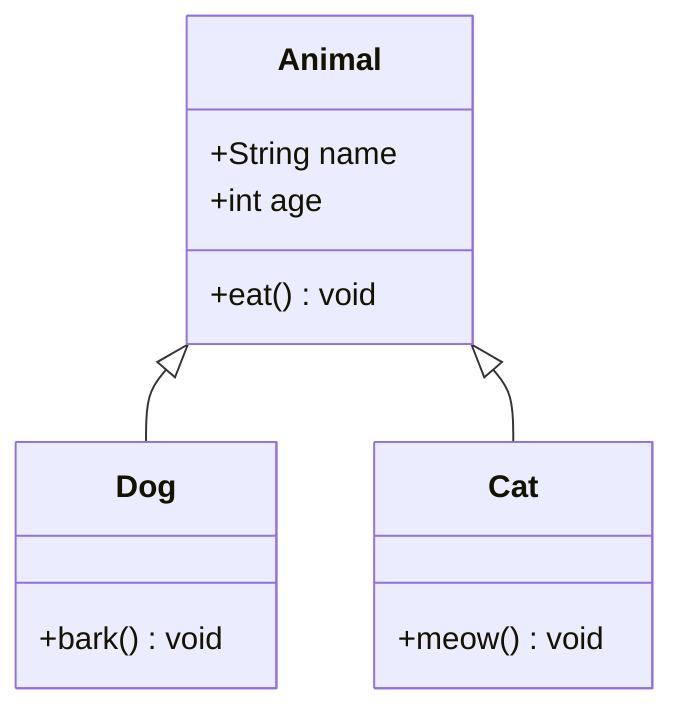

- [ ] クラスの追加・編集・削除
- [ ] 属性・メソッドの追加・編集・削除
- [ ] リレーション（継承・実装・関連・依存等）の追加・編集・削除
- [ ] SVG 上のクラスをクリック → リストパネルがスクロール・ハイライト
- [ ] 右クリックからの属性・メソッド追加は、他のエディタと異なり**ネイティブの `prompt()`** ダイアログが出る

### 7.4 マインドマップ

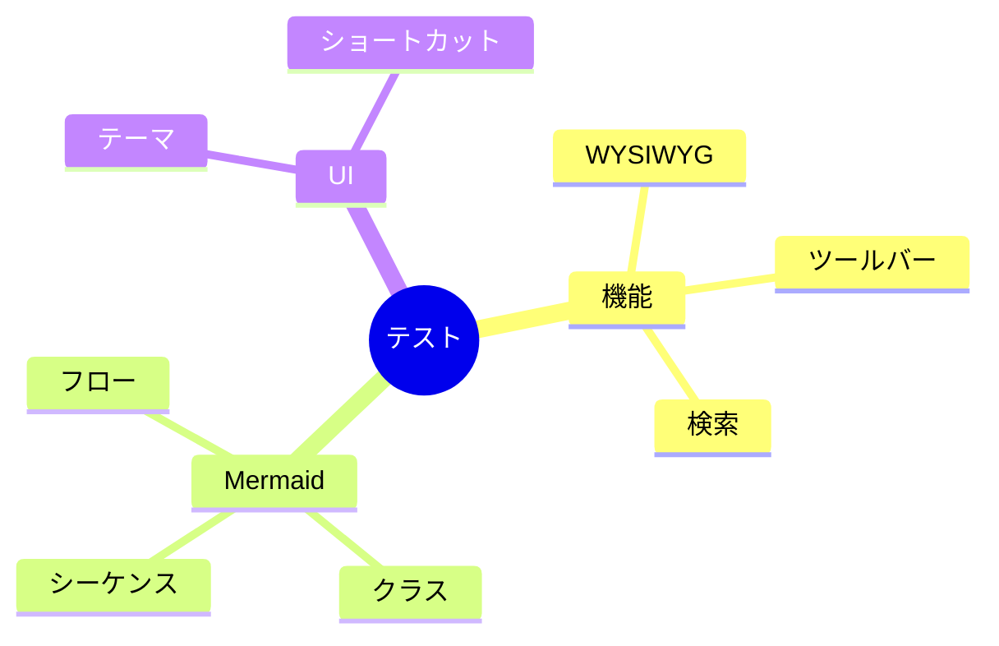

- [ ] ノードの追加・編集・削除（形状選択）
- [ ] SVG 上のノードをドラッグ＆ドロップで親変更（子孫ノードへのドロップは禁止される）
- [ ] SVG 上のノードをダブルクリックでインライン編集
- [ ] ルートノードは削除できない

### 7.5 象限チャート

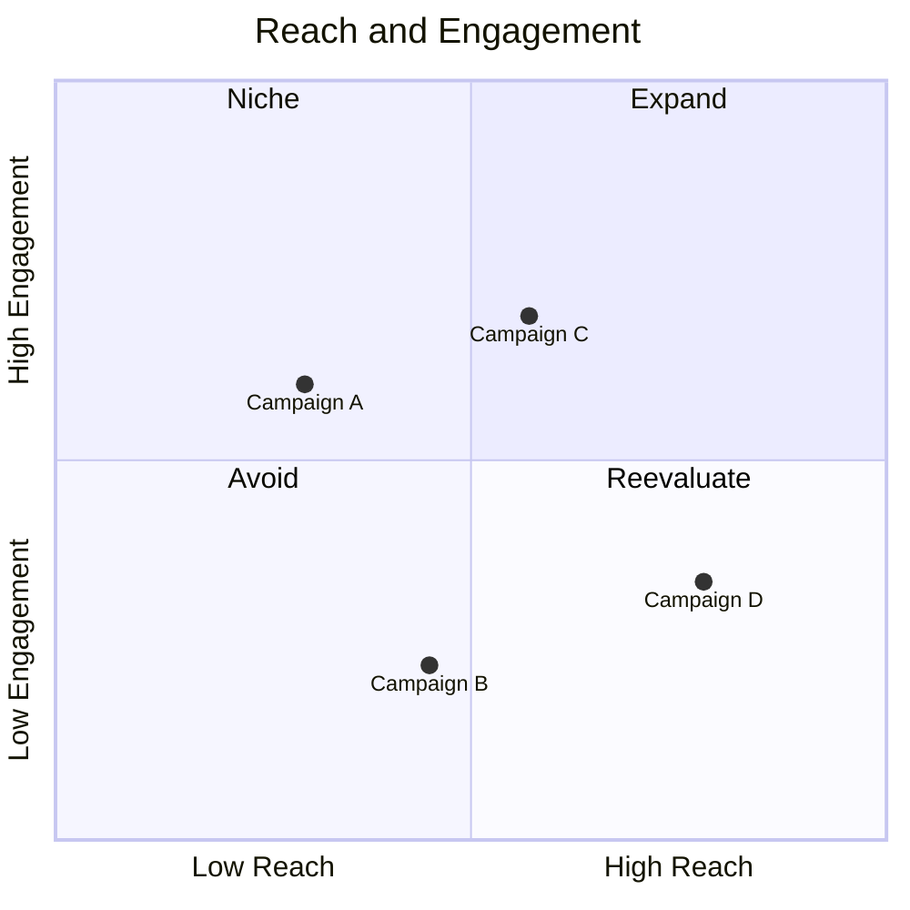

- [ ] タイトル・軸ラベル・象限ラベルの編集
- [ ] **【v0.5.1】軸ラベル・象限ラベル・データ点名に日本語を入力して保存できる**（保存時に自動で `"..."` に囲まれる。`title` のみ引用符なしで保存される）
- [ ] **【v0.5.1】ラベルに `"`（二重引用符）を含めて保存すると、その文字は削除される**（引用符の入れ子を避けるための仕様であり不具合ではない）
- [ ] データポイントの追加・編集・削除
- [ ] SVG 上のデータポイントをドラッグして移動（座標がリアルタイム表示される）
- [ ] ダブルクリックで名前変更
- [ ] データ点が密集していると、点と円の対応付けがラベル近傍推定のため誤対応することがある（既知の制限）

### 7.6 ガントチャート

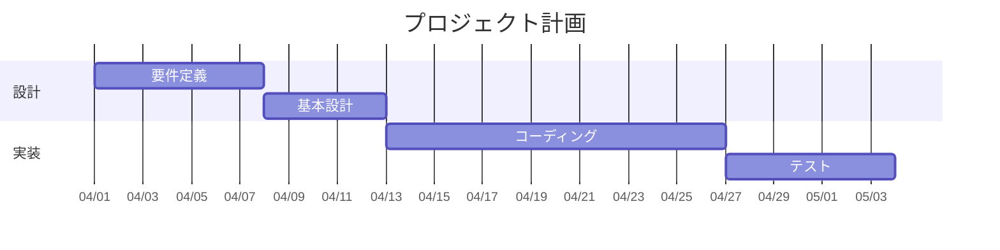

- [ ] セクション・タスクの追加・編集・削除
- [ ] 日付・期間・依存関係・ステータス
- [ ] セクション折りたたみ（▼/▶）
- [ ] タスクのドラッグ＆ドロップ並び替え（セクション内・間）
- [ ] セクション色 → 配下タスクに自動適用（独自 `%%gantt-style bg:` メタコメント。Mermaid 標準構文ではない）

### 7.6.1 【v0.4.1】ガント図 — タスク直接操作

上記 7.6 のガント図を使用して、SVG プレビュー上で以下を確認してください。

- [ ] タスクバーを掴んで左右にドラッグ → `startDate` が更新される
- [ ] タスクバー **右端 8px** にカーソルを合わせる → `ew-resize` に変化
- [ ] 右端ドラッグで `duration` が 1 日単位で増減
- [ ] タスクバー右クリック → `±1日 / ±7日 / 削除` メニューが出る
- [ ] `after X` 依存タスクはドラッグ不可（`not-allowed` カーソル）

### 7.7 ER 図

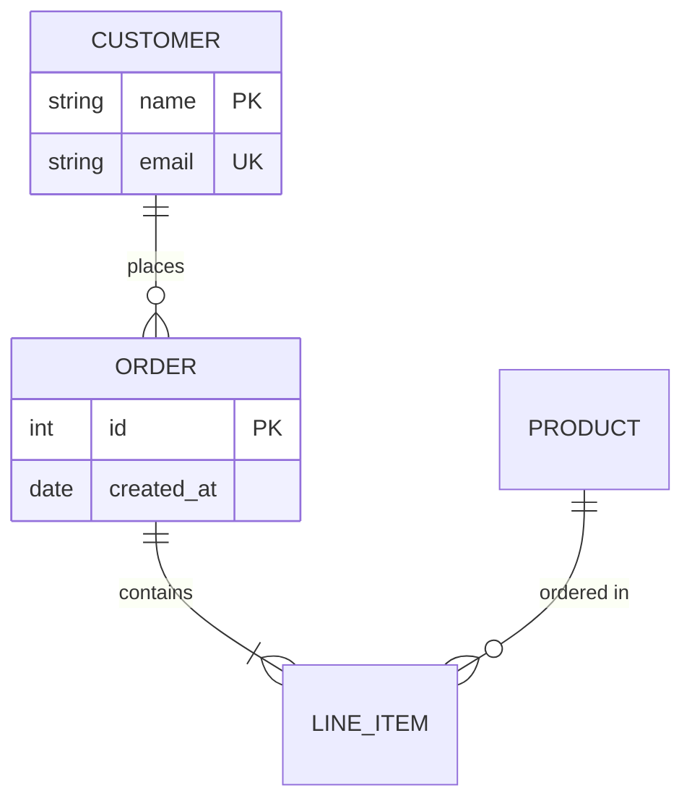

- [ ] エンティティの追加・名前変更・削除
- [ ] 属性の追加・編集（PK/FK/UK 設定）
- [ ] リレーション（6 種カーディナリティ）の追加・編集
- [ ] エンティティ名ダブルクリック → コンテキストメニュー

---

## 8. Mermaid — 汎用フォーム GUI 14 種（v0.3.0 追加）

各図でも「✎ ダイアグラムを編集」から汎用フォームエディタが起動します。  
共通機能: **セクション別リスト編集 + ライブ SVG プレビュー + コードモード切替**。ズーム/パン操作は §10 の「専用ダイアグラムエディタ」系統（中ボタンドラッグでパン）と共通です。

### 8.1 状態遷移図

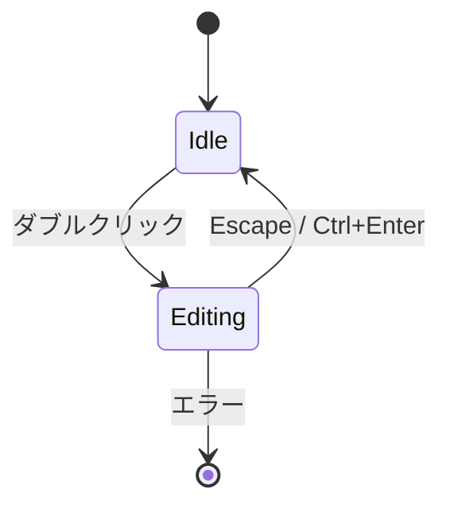

- [ ] フォームで状態追加・遷移追加・削除
- [ ] コードモード切替で Mermaid ソースを直接編集
- [ ] ライブプレビューが更新される

### 8.2 パイチャート

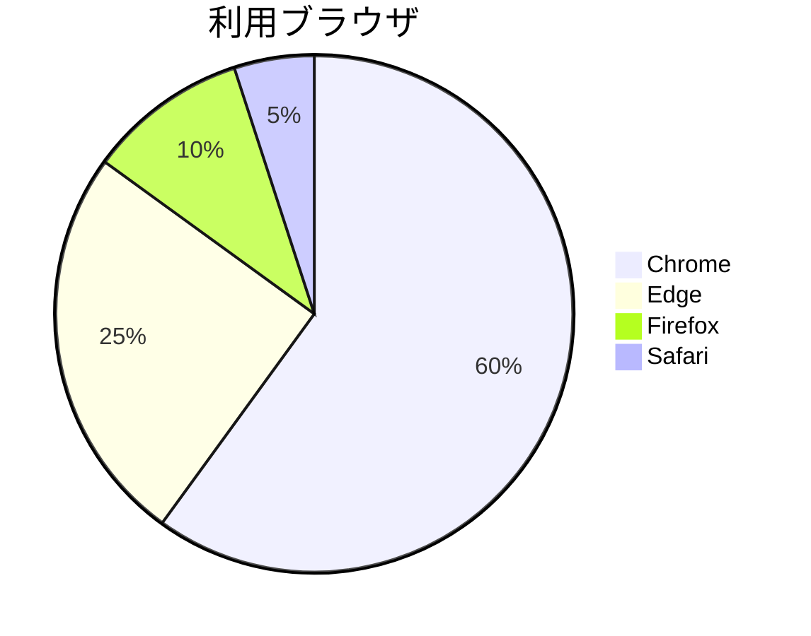

- [ ] 表編集モード（既定 ON）でラベルと値を表形式のまま編集できる

### 8.3 ユーザージャーニー

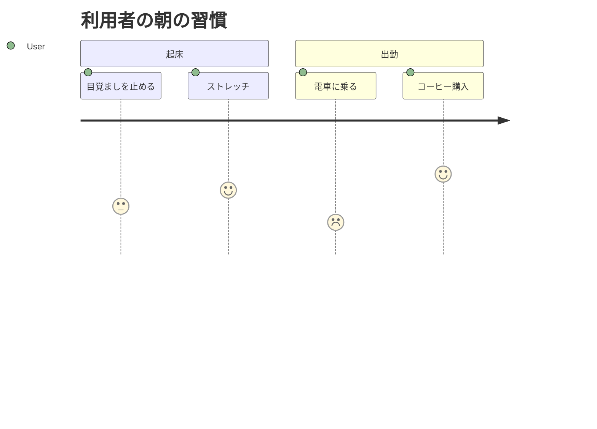

### 8.4 Git グラフ

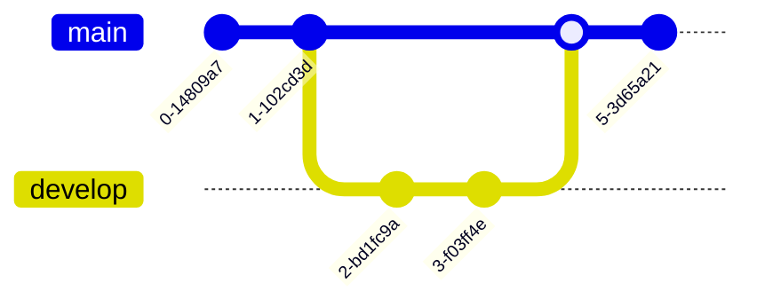

### 8.5 タイムライン

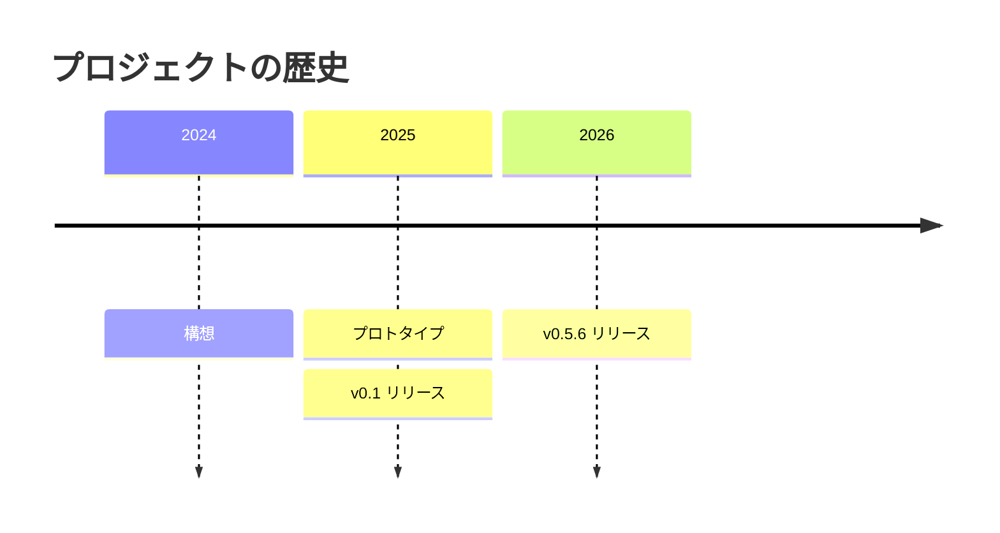

### 8.6 要求図

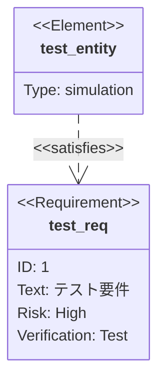

- [ ] 非 ASCII（日本語等）の値は保存時に自動で引用符化される
- [ ] ネストした波括弧を含む複雑な構文は、正規表現ベースのパースのため崩れることがある（既知の制限）

### 8.7 C4 図

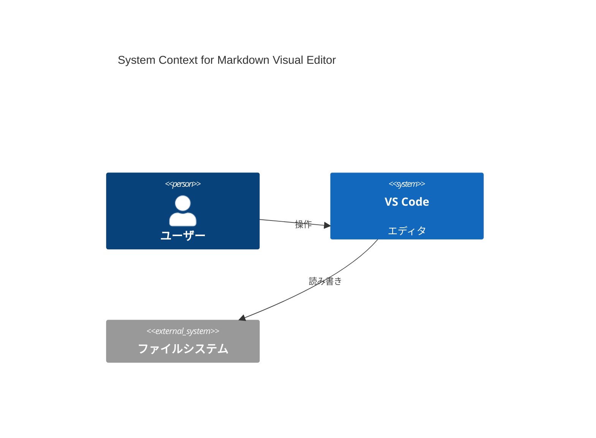

### 8.8 Sankey 図

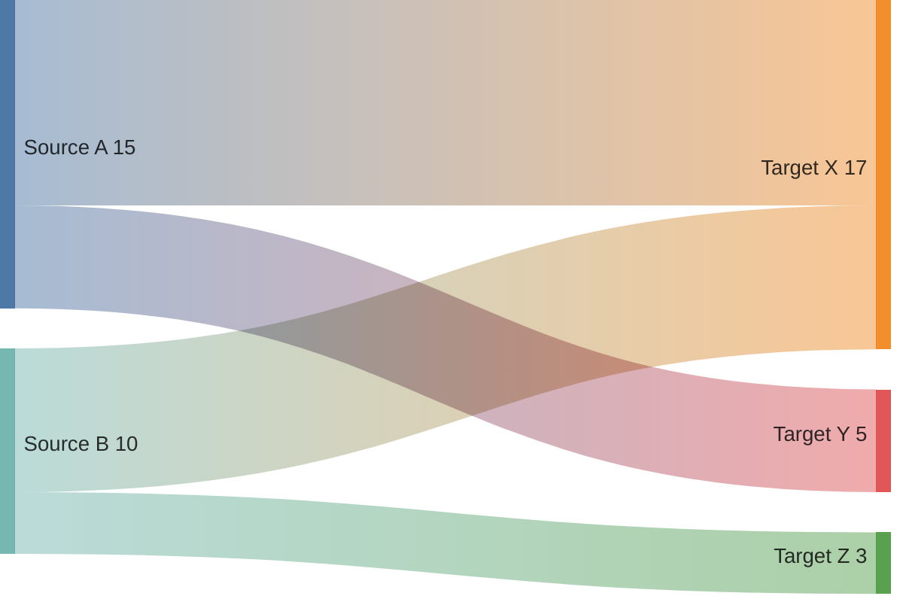

- [ ] **【v0.4.3】ダークテーマ**でリンク帯／ノードバーが視認できる（薄すぎず潰れない）
- [ ] 表編集モードでノード名・値を編集できる

### 8.9 XY チャート

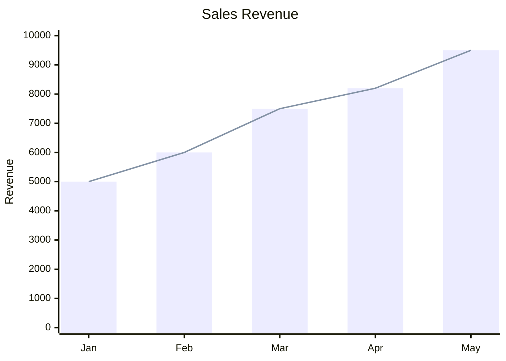

- [ ] 向き（縦 / 横）を切り替えできる
- [ ] カテゴリ（x-axis）の追加・編集・削除ができる
- [ ] Y 軸のラベル・min・max を編集できる
- [ ] **【v0.4.1】Y 軸 自動追従**（既定 ON）— OFF にすると min/max を手動指定でき、ON では値が振り切れない
- [ ] bar / line シリーズの追加・編集・削除ができる
- [ ] **表編集モード**（既定 ON）でシリーズの値を表形式のまま編集できる
- [ ] 保存して再オープンしても内容が保持される
- [ ] 「表示モード（重ね合わせ / 積み上げ / 横並び）」の切替は**存在しない**（§17 参照）

### 8.10 ブロック図

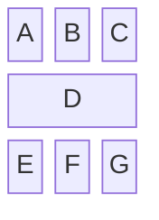

- [ ] 行ごとの自由テキスト編集ができる（ソース上「簡易版(simplified)」と明記されている構文のサブセット）

### 8.12 パケット図

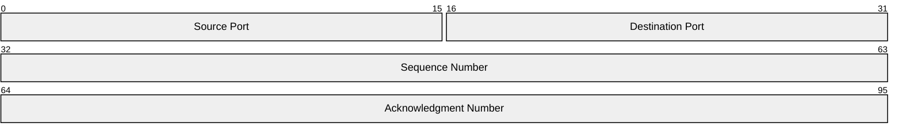

- [ ] ビット範囲が他のフィールドと重複していても、保存時にエラーやブロックはされない（検証なし。既知の制限）

### 8.13 アーキテクチャ図

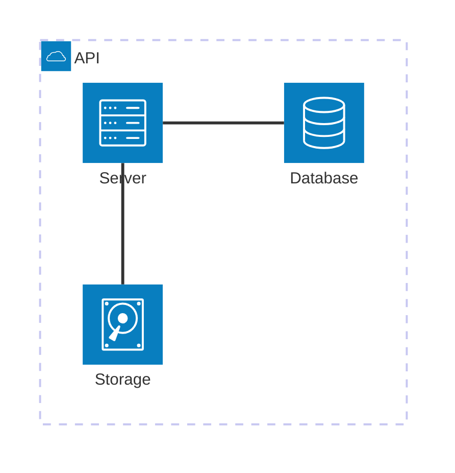

- [ ] 組込みアイコンは `cloud` / `database` / `disk` / `internet` / `server` の **5 種のみ**選択でき、それ以外（カスタムアイコンパック）は使用できない（CSP により無効化されているため。§17 参照）

### 8.14 Kanban

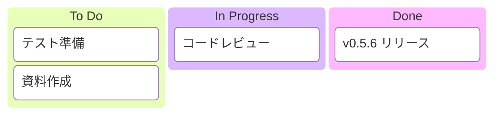

**14 種共通チェック:**

- [ ] 各図でビジュアルエディタが起動する
- [ ] フォーム入力でリスト追加・編集・削除ができる
- [ ] ライブ SVG プレビューが更新される
- [ ] コードモードに切り替えて直接編集できる
- [ ] 保存して再オープンしても内容が保持される
- [ ] 一覧の `↑ / ↓` ボタンは**フォーカス移動のみ**で並べ替えではない（並べ替えは D&D か右クリックメニューで行う）
- [ ] エディタ内に独自の Undo スタックは無い（`Ctrl+Z` はドキュメント全体の Undo）

---

## 9. Mermaid コードフォールバック

未知の構文や判定不能な図は、コード + プレビュー分割エディタにフォールバックします。

```mermaid
%% コメントだけのブロック（判定不能）
%% Mermaid 構文として判定できない場合のフォールバックテスト
graph TD
    %% 上の comment ヘッダーで始まる場合の挙動
    A --> B
```

- [ ] 判定不能な構文でも編集ボタンが表示され、コード+プレビュー分割で編集できる
- [ ] エラーがあるとプレビュー側にエラー表示される

---

## 10. 【v0.5.5】Mermaid ズーム / パン

Mermaid 関連のズーム/パンには **3 系統の実装** があり、操作方法が異なります。区別して確認してください。

### 10.1 本文プレビュー中の Mermaid 図（種別問わず）

このファイルの本文中に描画されている Mermaid 図（§1・§2・§7・§8・§9・§18 のいずれでも可）を対象に確認してください。

- [ ] 図にマウスを乗せるとズーム操作パネル（🔍+ / 🔍− / ⊞フィット / ◀▶▲▼ / 倍率%表示）が表示される
- [ ] `Ctrl` + ホイールでズームできる
- [ ] **左ドラッグ**でパンできる
- [ ] 表示領域に収まりきらない大きな図は、初回表示で自動的にフィットする
- [ ] 図の表示コンテナは最大 `70vh`（画面縦幅の 70%）に制限されている
- [ ] 倍率は 0.2〜4.0 の範囲でしか変化しない

### 10.2 専用ダイアグラムエディタ（sequence / class / mindmap / quadrant / gantt / er ＋ 汎用フォーム 14 種、計 20 種）

- [ ] 編集画面のズーム操作パネル（🔍+ / 🔍− / ⊞フィット / ◀▶▲▼ / 倍率%表示）が動作する
- [ ] `Ctrl` + ホイールでズームできる
- [ ] **中ボタン（ホイールクリック）ドラッグ**でパンできる
- [ ] 倍率は 0.2〜3.0 の範囲でしか変化しない

### 10.3 フローチャート編集画面（例外）

- [ ] ズーム操作パネル（🔍+ / 🔍− / ⊞フィット）が動作する
- [ ] `Ctrl` + ホイールでズームできる
- [ ] **方向ボタンや中ボタンドラッグによるパンは無い**（20 種の他エディタと非対称。既知の仕様であり不具合ではない）

---

## 11. ブロック操作 — 右クリックメニュー / キーボードでのブロック追加

任意のブロック（段落・見出し・リスト・コード・テーブル・Mermaid 等）を **右クリック** すると、コンテキストメニューが表示されます。

### 単一ブロック選択時

- [ ] `✎ 編集` … 選択ブロックの編集モードに入る
- [ ] **【v0.5.2】`⬆ 上にブロックを追加…`** … クリックしたブロックの直前に新規ブロックを追加するサブメニューを開く
- [ ] **【v0.5.2】`⬇ 下にブロックを追加…`** … クリックしたブロックの直後に新規ブロックを追加するサブメニューを開く
- [ ] サブメニューの項目: ¶ 段落 / H1 / H2 / H3 見出し / • 箇条書き / 1. 番号付き / ☑ タスクリスト / ⊞ 表 / `{ }` コードブロック / ∑ 数式 / ❝ 引用 / ─ 水平線 / ◇ Mermaid ダイアグラム…（20 種ピッカーへ）
- [ ] 追加すると**挿入後そのまま編集状態に入る**（続けてテキスト入力できる）
- [ ] **【v0.5.2】** 段落やリストの隣に挿入しても、既存の段落・リストと**意図せず結合されない**（挿入したブロックと既存ブロックはそれぞれ独立を保つ）
- [ ] `✂ 切り取り` / `⧉ コピー` … ブロック全体を Markdown としてクリップボードへ
- [ ] `📋 貼り付け (このブロックの後ろ)` … クリップボードの内容をブロックとして直後に挿入
- [ ] `↑ 上に移動` / `↓ 下に移動` … セクション/ブロック並び替え（先頭/末尾では disabled）
- [ ] `📄 PDF として出力` … 後述の §14 を参照
- [ ] `🗑 削除` … 「クリップボードへコピー → 確認ダイアログ → 削除」のフローで削除
- [ ] `Delete` キーでも同様にブロック削除できる

### 複数ブロック選択時（2 件以上）

- [ ] `✂ 切り取り(N件)` / `⧉ コピー(N件)` … まとめて操作できる
- [ ] `📋 貼り付け` … クリップボードを一括貼り付け
- [ ] `📄 PDF として出力`
- [ ] `🗑 N件のブロックを削除`
- [ ] `Delete` → まとめて削除される（**2 個以上選択時のみ** `Backspace` でも削除可）
- [ ] 削除後、貼り付け（右クリック「貼り付け」）で復元できる

### エディタ余白の右クリック

ブロック外の余白で右クリックすると、軽量メニューが出ます。

- [ ] `📋 貼り付け (末尾に追加)` … 文書末尾にブロック追加
- [ ] `📄 PDF として出力` … PDF 出力

### 【v0.5.2】キーボードでのブロック追加

- [ ] ブロックを選択（編集はしていない）した状態で `Ctrl+Enter` → 「下にブロックを追加」のサブメニューが開く
- [ ] `Ctrl+Shift+Enter` → 「上にブロックを追加」のサブメニューが開く

---

## 12. 画像のドラッグ＆ドロップ挿入

外部から画像ファイル（対応拡張子: `png` / `jpg` / `jpeg` / `gif` / `webp` / `svg` / `bmp` / `ico` / `avif`）をエディタ領域に **ドラッグ＆ドロップ** すると、Markdown ファイルと同じ階層の **`images/` フォルダ**（無ければ自動作成）にコピーされ、`` として挿入されます。同名ファイルがある場合は重複しないようリネームされます。

- [ ] エクスプローラから画像 1 枚をブロック領域へドロップ → 画像ブロックとして挿入される
- [ ] エクスプローラから複数枚を一度にドロップ → 複数の画像ブロックが追加される
- [ ] ブロックとブロックの間にドロップ → 当該位置に挿入される
- [ ] ドロップ先のブロック内（例: 段落内）にドロップ → そのブロックの後に挿入される
- [ ] 挿入後、画像が即座にプレビューに表示される
- [ ] 保存先の相対パス（`images/...`）が Markdown ソースに記録されている
- [ ] **【v0.4.3】** `` のような **相対パス画像** が WebView に表示される
- [ ] 日本語ファイル名や `.JPG` (大文字拡張子) の画像も表示される
- [ ] `file://` 絶対パスや `data:` URL の画像もそのまま表示される
- [ ] 同一画像が複数箇所にあっても再描画コストが体感で増えない（`_imageUriCache` によるキャッシュ動作）

### 12.1 【v0.4.3】ブロックのドラッグ & ドロップで並び替え

レンダリング済みプレビュー上で、各ブロック（見出し・段落・リスト・コード・Mermaid・テーブル・画像など）をマウスで掴んで並び替えできます。

- [ ] ブロック左端にホバーすると **ドラッグハンドル `⋮⋮`** が表示される
- [ ] ドラッグハンドルを掴んで他のブロックの上下にドロップ → 並び順が変わる
- [ ] ブロック本体（リンク・入力欄等は除く）を掴んでも並び替えできる
- [ ] 移動中に **ゴーストとドロップ位置インジケータライン** が表示される
- [ ] 複数ブロックを選択した状態でドラッグ → まとめて移動できる
- [ ] 並び替えた結果が Markdown ソース（トークン順）にも反映される
- [ ] Undo（`Ctrl + Z`）で並び順を元に戻せる

---

## 13. 【v0.4.3】LaTeX / KaTeX 数式

本文中の数式は完全ローカルバンドルの KaTeX 0.17 でレンダリングされます。ネットワーク通信は発生しません。

インライン例: 質量とエネルギーの関係 $E = mc^2$ は有名。  
もう一例: 二次方程式の解 $x = \frac{-b \pm \sqrt{b^2 - 4ac}}{2a}$。

ディスプレイ例（`$$ ... $$`）:

$$
\int_{-\infty}^{\infty} e^{-x^2}\,dx = \sqrt{\pi}
$$

$$
\sum_{k=1}^{n} k = \frac{n(n+1)}{2}
$$

ディスプレイ例（` ```math ` コードブロック）:

```math
\nabla \cdot \mathbf{E} = \frac{\rho}{\varepsilon_0}
```

構文エラー例（赤くツールチップでエラー詳細が出ること）:

$$
\frac{a}{b
$$

- [ ] 上記の **インライン / `$$` / ` ```math ` ** 全てが崩れず描画される
- [ ] 構文エラーの式は `<span class="math-error">` で赤く表示され、ホバーで原因がツールチップ表示される
- [ ] 数式ブロックを **ダブルクリック** → TeX ソース編集モードに切り替わる（textarea + 約 200ms デバウンスのライブプレビュー）
- [ ] 数式エディタに **LaTeX 記号パレット**（構造 / 演算子 / 関係 / 大記号 / ギリシャ / 集合・論理 / 行列・整列 の 7 グループ）がある
- [ ] パレットから記号を挿入すると、複数プレースホルダを持つ記号（`$1`/`$2` 相当）ではカーソル位置が期待通りに配置される
- [ ] 編集確定後、再描画される（`$...$` / `$$...$$` のまま保存される）
- [ ] コードブロック内（` ```js ` などの非 math 言語）の `$...$` は数式化されない
- [ ] インラインコード内（`` `$x$` ``）の `$x$` は数式化されない
- [ ] ツールバーの「Mermaid / ブロック挿入」ピッカーに `math` テンプレートがあり、選択するとディスプレイ数式テンプレートが挿入される
- [ ] PDF 出力でも KaTeX 数式が正しくレンダリングされる（後述 §14）

---

## 14. 【v0.4.2】PDF として出力

ブロック右クリック → `📄 PDF として出力`、またはエディタ余白の右クリック → `📄 PDF として出力` を実行してください。
v0.4.2 から、VS Code Webview が `window.print()` をブロックする問題に対処するため、**一時 HTML を書き出して OS 既定ブラウザで開き、自動的に印刷ダイアログを起動する** 方式に変更されました。「PDF として保存」を選択して保存先を指定してください。
画像の相対パスは md ファイルのディレクトリ基準で絶対 `file://` URI に解決されます。

### 基本動作

- [ ] メニューから PDF 出力を実行 → 既定ブラウザでプレビュー HTML が開く
- [ ] 自動的に印刷ダイアログが立ち上がる（`load` 後 600ms 程度で自動実行）
- [ ] 「PDF として保存」で保存できる
- [ ] 保存先案内バナーに **md ファイルのディレクトリパス** が表示される
- [ ] 未保存（無題）ファイルでは「保存済みのファイルが必要」エラーが出る

### 表示品質（直近の修正点）

- [ ] VS Code がダークテーマでも、**PDF はライトモード**（白背景・黒文字）で出力される
- [ ] Mermaid 図がライト配色（白背景・濃灰ノード）で出力される
- [ ] Mermaid 図の **縮尺が暴走しない**（小さい図が無理やり 100% に引き伸ばされない）
- [ ] 大きい図はページ幅に収まる（`max-width: 100%`）
- [ ] テーブルが右端で **見切れない**（長い文字列は折り返される）
- [ ] 画像が極端に大きくならない（`max-height: 90vh`）
- [ ] **空白ページが連発しない**（背の高いブロックはページ境界で分割される）
- [ ] コードブロックが薄いグレー背景で出力される
- [ ] 検索ハイライト（黄色マーカー）は紙面に持ち込まれない
- [ ] 編集ハンドル / ✎ 編集ボタン / コンテキストメニュー は紙面に出ない
- [ ] LaTeX 数式が正しくレンダリングされている
- [ ] ヘッダーに `<ファイル名> — PDF出力` のタイトルが出る

---

## 15. キーボードショートカット まとめ

### グローバル（capture フェーズ。ただしテキスト入力中は除く）

| キー | 動作 |
|---|---|
| `Ctrl + F` | 検索バーを開く |
| `Ctrl + H` | 検索 / 置換バーを開いて置換へフォーカス |
| `Esc`（検索バー中） | 検索バーを閉じる |
| `Ctrl + Z` | Undo |
| `Ctrl + Shift + Z` / `Ctrl + Y` | Redo |
| クリック（修飾キー不要） | リンクを開く |

※ `INPUT` / `TEXTAREA` / contentEditable にフォーカスしている間、Undo/Redo はブラウザ標準の挙動に委ねられます。
※ **`Ctrl + S` はビジュアルエディタが横取りしません**（VS Code 標準の保存フローがそのまま働きます）。

### ブロック選択中（編集はしていない状態）

| キー | 動作 |
|---|---|
| `Enter` / `F2` | 編集開始 |
| `Delete` | 削除（確認ダイアログあり、事前にクリップボードへコピーされる） |
| `↑` / `↓` | 前後のブロックへフォーカス移動＋単一選択 |
| **【v0.5.2】`Ctrl + Enter`** | 「下にブロックを追加」メニューを開く |
| **【v0.5.2】`Ctrl + Shift + Enter`** | 「上にブロックを追加」メニューを開く |
| `Tab` | 次のブロックへフォーカス移動（各ブロックは `tabIndex=0`） |

### テキストセクション編集中（textarea）

| キー | 動作 |
|---|---|
| `Escape` | 変更があれば破棄確認 → 編集完了。**【v0.5.3】完了後、そのブロックにフォーカス＋選択が戻る** |
| `Ctrl + Enter` | 確定。**【v0.5.3】同様にフォーカス＋選択が戻る** |
| **【v0.5.3】`Alt + ↑`** | 確定して**直前のブロックの編集へ直接ジャンプ**する |
| **【v0.5.3】`Alt + ↓`** | 確定して**直後のブロックの編集へ直接ジャンプ**する |
| `Ctrl + B` | 太字 |
| `Ctrl + I` | 斜体 |
| `Tab` | 半角スペース 4 個を挿入 |

### 複数ブロック選択時（2 個以上選択が条件のものあり）

| キー | 動作 |
|---|---|
| `Ctrl + C` / `Ctrl + X` / `Ctrl + V` | コピー / 切り取り / 貼り付け |
| `Delete` / `Backspace` | まとめて削除（**2 個以上選択時のみ**） |
| `Escape` | 選択解除 |

### Mermaid / 数式のコードエディタ

| キー | 動作 |
|---|---|
| `Ctrl + Enter` | 保存 |
| `Escape` | キャンセル（変更があれば確認） |
| `Tab` | 半角スペース 4 個を挿入 |

### フローチャート編集中

| キー | 動作 |
|---|---|
| `Delete` / `Backspace` | 選択ノード／エッジ削除 |
| `Esc` | 選択解除・接続モード終了 |
| `Ctrl + Z` / `Ctrl + Y` | Undo / Redo |

- [ ] 上記すべてが期待通り動作する

---

## 16. ファイル間連携

- [ ] このファイルと別の `.md` を両方ビジュアルエディタで開ける
- [ ] 一方を VS Code 標準エディタで開いても **同時には開けない**（`supportsMultipleEditorsPerDocument: false`）
- [ ] 標準エディタで保存 → ビジュアルエディタ側に反映される
- [ ] 外部エディタや git 操作でファイルが変更された場合も、ビジュアルエディタ側に反映される
- [ ] ビジュアルエディタで編集すると、その時点ではファイルは**保存されず「未保存」状態になる**（`Ctrl+S` で保存が必要。§6 の未保存ハイライトも参照）。**「編集すると自動的にファイル保存される」わけではない**点に注意

### 【v0.5.3】「Markdown ビジュアルエディタで開く」ボタン / コマンド

- [ ] `.md` ファイルを VS Code 標準のテキストエディタで開く
- [ ] エディタタイトルバーに「Markdown ビジュアルエディタで開く」ボタン（`$(preview)` アイコン）が表示される
- [ ] ボタンをクリック → 同じファイルがビジュアルエディタで開く
- [ ] コマンドパレット（`Ctrl+Shift+P`）で「Markdown Visual Editor: Markdown ビジュアルエディタで開く」を実行しても同様に開ける
- [ ] ビジュアルエディタで既に開いている状態では、このボタン・コマンドはタイトルバーに表示されない

---

## 17. 既知の制限

このセクションは「不具合ではなく仕様」の一覧です。該当項目の通りに動作しても **バグとして報告しないでください**。

- [ ] 象限チャートの日本語ラベルは **v0.5.1 で解消済み**（自動で `"..."` に囲まれる）。ただしラベル内に `"` を含めると保存時に取り除かれる
- [ ] テーブルの列配置（`:---:` 等の左/中央/右揃え）は GUI から変更できず、既存の配置指定があっても編集して保存すると失われる（§5 参照）
- [ ] シーケンス図に `alt` / `opt` / `loop` / `par` / `activate` の GUI 編集機能はない（未対応。コードとして存在する分には保持されるが、フォームから追加はできない）
- [ ] ガントチャートで `after X` のように他タスクに依存するタスクは、SVG 上でドラッグして日付変更できない
- [ ] ZenUML (`zenuml`) は挿入ピッカーに存在せず、既存のコードブロックもコード編集のみ（Mermaid の ZenUML レンダラーがバンドルに含まれないため、プレビューが描画されないことがある）
- [ ] architecture-beta の組込みアイコンは `cloud` / `database` / `disk` / `internet` / `server` の 5 種のみ。カスタムアイコンパックは CSP により使用不可
- [ ] xychart-beta に「表示モード（重ね合わせ/積み上げ/横並び）」の切替は**存在しない**
- [ ] 汎用フォームエディタ 14 種の一覧の `↑ / ↓` ボタンは**フォーカス移動のみ**で、並べ替えではない（並べ替えは D&D か右クリックメニューを使う）
- [ ] 汎用フォームエディタ 14 種にはエディタ内 Undo スタックがない（`Ctrl+Z` はドキュメント全体の Undo）
- [ ] デフォルトエディタではない（Open With... で選択、または §16 のボタン/コマンドを使う）
- [ ] 検証 OS は Windows 10/11 のみ

---

## 18. 【v0.5.6】回帰チェック — 空行を挟む特殊ブロック

v0.5.4 で導入したブロックモデルには、v0.5.5 まで「Mermaid・テーブル・数式ブロックの直後に空行があると、その特殊ブロックが生の Markdown テキストのまま表示されてしまう」という回帰バグがありました。v0.5.6 で修正されています。

以下のように、各特殊ブロックの直後に空行を入れた状態で確認してください。

```mermaid
flowchart LR
    A --> B
```

上のフローチャートの直後には空行があります。

| x | y |
|---|---|
| 1 | 2 |

上の表の直後にも空行があります。

$$
a^2 + b^2 = c^2
$$

上の数式の直後にも空行があります。

- [ ] 上の Mermaid 図が**ダイアグラムとして描画され**、生のコードテキストのまま表示されていない
- [ ] 上のテーブルが**表として描画され**、生の Markdown テキストとして表示されていない
- [ ] 上の数式が **KaTeX でレンダリングされ**、生の `$$...$$` テキストとして表示されていない
- [ ] それぞれのブロックを編集 → 確定しても、直後の空行を挟んだまま再度正しく描画される

---

## チェック完了サイン

```
テスト実施日:
テスト実施者:
不具合報告:
```

---

> 完了したら、見つかった不具合を [`拡張機能要望.md`](拡張機能要望.md) に追記してください。
