# Markdown Visual Editor — 全機能テストドキュメント
> **使い方:** このファイルを Markdown Visual Editor で開き（右クリック → Open With... → Markdown Visual Editor）、各セクションのチェックリストに従って動作を確認してください。  
> 対象バージョン: **v0.4.4** / Mermaid 11.14.x / 21 種類対応 / KaTeX 0.17

---

- [ ] VS Code 1.80.0 以上
- [ ] 拡張機能 `md-visual-editor-0.4.4.vsix` がインストール済み
- [ ] このファイルを「Markdown Visual Editor」で開けている（タブのアイコンがプレビュー表示になっていること）

---

## 1. WYSIWYG ブロック編集 — 基本

このセクションの各ブロックを **ダブルクリック** して編集モードに入り、`Escape` または `Ctrl + Enter` で確定してください。

### 段落

これは段落です。**太字**、*斜体*、~~取り消し線~~、`インラインコード` が含まれます。  
ダブルクリック → 末尾に「（編集テスト済み）」を追加 → `Escape` で確定できれば OK。

- [ ] 段落をダブルクリックで編集できる
- [ ] `Escape` で確定 / `Ctrl + Enter` で確定 / 他ブロックのクリックで確定
- [ ] 編集中の背景色が VS Code エディタ色に **変化しない**（v0.3.1 の修正点）

### 見出し

# 見出し H1
## 見出し H2
### 見出し H3
#### 見出し H4
##### 見出し H5
###### 見出し H6

- [ ] 各見出しをダブルクリック編集できる

### リスト

- 箇条書き 1
- 箇条書き 2
  - ネスト項目 A
  - ネスト項目 B
- 箇条書き 3

1. 番号付き 1
2. 番号付き 2
3. 番号付き 3

- [ ] リスト全体をダブルクリックで編集できる
- [ ] ネストしたリストが保持される

### 引用 / 区切り線

> これは引用ブロックです。複数行も可。
> 2 行目。

---

- [ ] 引用ブロックがダブルクリック編集できる
- [ ] 区切り線が表示される

### コードブロック

```javascript
function hello(name) {
  console.log(`Hello, ${name}!`);
  return name.length;
}
```

- [ ] コードブロックがシンタックスハイライト表示される
- [ ] ダブルクリックで編集できる

### リンク / 画像

- 外部 HTTP: <https://example.com/>
- 外部 HTTPS: [Mermaid 公式](https://mermaid.js.org/)
- メール: [連絡先](mailto:test@example.com)
- 相対パス: [README へ](README.md)
- 画像（外部 URL は表示されない場合があります）: 

**v0.3.1 リンク動作テスト:**

- [ ] 通常クリック → 何も起こらない（誤クリック防止）
- [ ] **`Ctrl + Click`**（macOS は `Cmd + Click`）で `https://mermaid.js.org/` が外部ブラウザで開く
- [ ] **`Ctrl + Click`** で `mailto:test@example.com` がメールクライアントで開く
- [ ] **`Ctrl + Click`** で `README.md` が VS Code 内で開く

---

## 2. ツールバー — 挿入

ツールバー左側のボタンで以下を順に挿入してください。

- [ ] **H1〜H6** を順に挿入
- [ ] **B / I / S / `</>`** を順に挿入
- [ ] **• List / 1. List** を挿入
- [ ] **🔗 リンク** を挿入
- [ ] **⊞ テーブル** を挿入（3×3 のテンプレートが入る）
- [ ] **{ } コードブロック** を挿入
- [ ] **--- 区切り線** を挿入

### 挿入位置ピッカー（ブロック編集していない状態でテスト）

- [ ] ツールバーボタンを押すと「挿入位置ピッカー」が表示される
- [ ] 「先頭に挿入」を選ぶとドキュメント先頭に入る
- [ ] 「○○の後に挿入」で任意ブロックの直後に入る

---

## 3. ツールバー右端 — v0.3.1 ユーティリティ

### 3.1 🔍 検索 / 置換バー

- [ ] ツールバー右端の **🔍** をクリック → 検索バーが表示される
- [ ] **`Ctrl + F`** でも検索バーが開く
- [ ] **`Ctrl + H`** で検索バーが開き、置換ボックスにフォーカスが移る
- [ ] 検索ボックスに `テスト` と入力 → 一致箇所が黄色でハイライト、現在位置がオレンジ
- [ ] `↑` / `↓` ボタン（または Enter / Shift+Enter）で次／前へ移動
- [ ] カウンタ表示（例: `3 / 12`）が正しい
- [ ] **`Aa`**（大文字小文字区別）を ON にして再検索 → 件数が変化する
- [ ] **`.*`**（正規表現）を ON にして `\d+` で検索 → 数字にマッチ
- [ ] 置換ボックスに `OK` と入力 → 「1 つ置換」で 1 箇所だけ置換される
- [ ] 「すべて置換」で残り全部が置換される（Undo で戻せる）
- [ ] **`Esc`** で検索バーが閉じる

### 3.2 ☀️ / 🌙 テーマ強制切替

- [ ] ボタンをクリックするたびに `自動` → `ライト強制` → `ダーク強制` → `自動` と循環
- [ ] テーマを変えると Mermaid 図の色も追従する
- [ ] 一度設定したら、ファイルを閉じて開き直しても保持される
- [ ] VS Code 自体のテーマを変えても、強制設定中は固定される
- [ ] **【v0.4.3】ライト強制時、Mermaid エディタのオンボーディングバナー / 通知パネル / ツールバー / チェックボックス / タブが正しくライト配色になる（ダークのまま残らない）**

### 3.3 📝 テキストエディタで開く

- [ ] **📝** をクリック → 同じファイルが標準テキストエディタで開く
- [ ] 標準エディタで編集して保存 → ビジュアルエディタ側に変更が反映される

---

## 4. テーブル GUI 編集

| 商品名 | 数量 | 単価 |
|---|---:|---:|
| りんご | 3 | 150 |
| みかん | 5 | 80 |
| ぶどう | 2 | 400 |

- [ ] テーブル右上の「✎ テーブルを編集」ボタンが表示される
- [ ] ボタンをクリック → GUI 編集モードに切り替わる
- [ ] セルを直接クリック → 値を入力できる
- [ ] 「➕ 列追加」「➕ 行追加」で拡張できる
- [ ] 列・行の「✕」で削除できる
- [ ] 列ヘッダーで配置（左 / 中央 / 右）を変更できる
- [ ] 「保存」で確定 / 「キャンセル」で破棄

---

## 5. Mermaid — 高機能 GUI 7 種

各図にマウスを乗せて「✎ ダイアグラムを編集」をクリックし、専用ビジュアルエディタで操作してください。

### 5.1 フローチャート

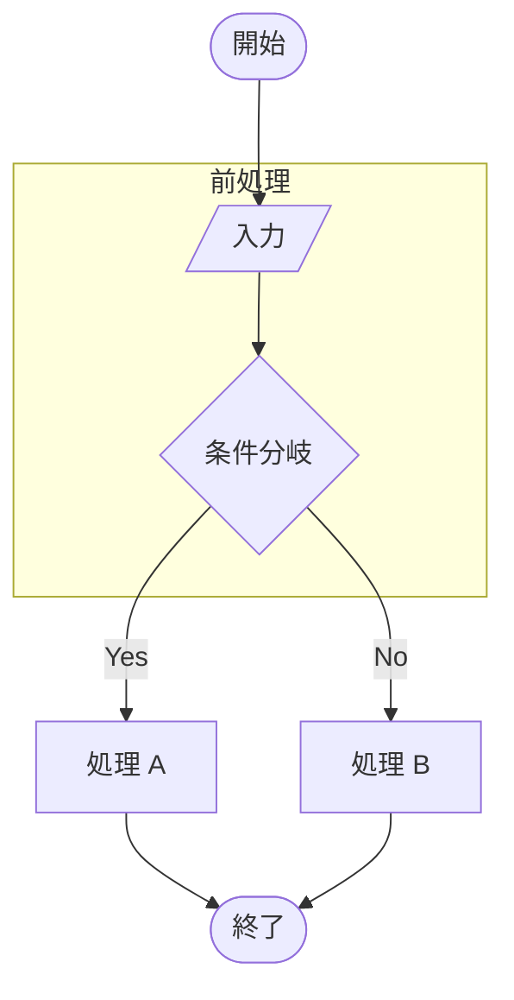

- [ ] ノード追加・編集・削除（形状: 矩形・角丸・ひし形・円形 等）
- [ ] エッジの追加（接続元 → 接続先）
- [ ] エッジをダブルクリック → 方向反転 ⇄ / 削除 / 線種変更 / ラベル編集
- [ ] サブグラフをダブルクリック → 名前変更・ノード追加／除外
- [ ] 方向切り替え `TB / LR / RL / BT`
- [ ] **【v0.3.1】レイアウト切替: Dagre / ELK / ELK ツリー**
  - [ ] ELK を選んで保存 → コードに `%%{init:{"layout":"elk"}}%%` が付く
  - [ ] 再度開いてもレイアウト選択が復元される
- [ ] **【v0.3.1】サブグラフ入れ子化**
  - [ ] サブグラフを 2 つ以上作る
  - [ ] 一覧の「親グループ」プルダウンで片方をもう片方の中に入れる
  - [ ] サイクルになる組み合わせは選択肢に出ない（拒否される）
  - [ ] 複数選択 → 「🗂️ 複数グループを 1 つに結合」で 1 つのサブグラフにまとめられる
- [ ] **【v0.3.1】SVG が描画領域に収まる図は、初期表示で勝手に拡大されない（倍率 1.0）**
- [ ] Undo（`Ctrl + Z`）/ Redo（`Ctrl + Y`）が動く

### 5.2 シーケンス図

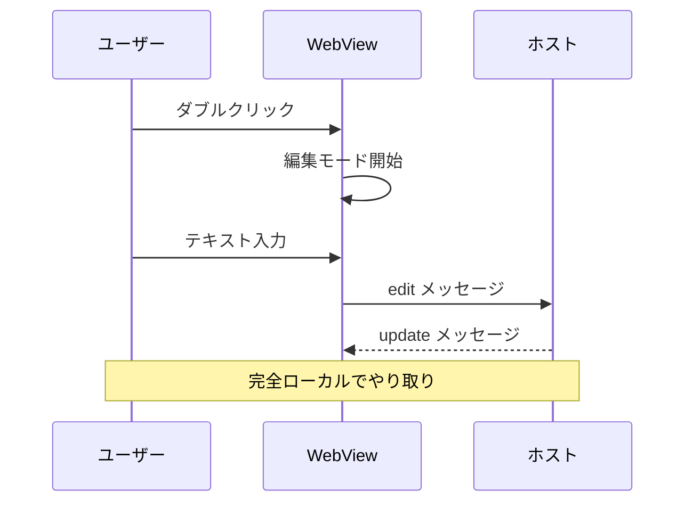

- [ ] アクター / 参加者の追加・編集・削除・並べ替え
- [ ] メッセージの追加・編集・並び替え（↑↓）
- [ ] ノートの追加（right of / left of / over）
- [ ] SVG 上のメッセージ線をクリック → 種類変更
- [ ] SVG 上のメッセージテキストをダブルクリック → 編集

### 5.3 クラス図

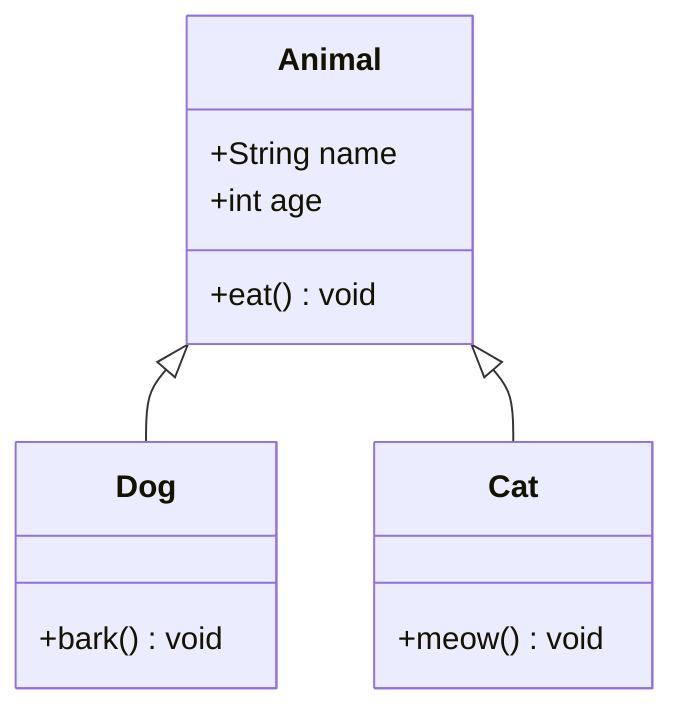

- [ ] クラスの追加・編集・削除
- [ ] 属性・メソッドの追加・編集・削除
- [ ] リレーション（継承・実装・関連・依存等）の追加・編集・削除
- [ ] SVG 上のクラスをクリック → リストパネルがスクロール・ハイライト

### 5.4 マインドマップ

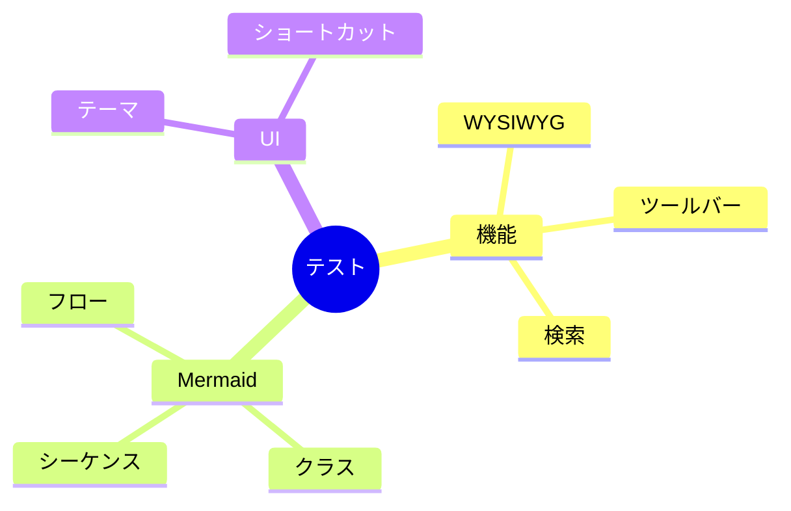

- [ ] ノードの追加・編集・削除（形状選択）
- [ ] SVG 上のノードをドラッグ＆ドロップで親変更
- [ ] SVG 上のノードをダブルクリックでインライン編集

### 5.5 象限チャート

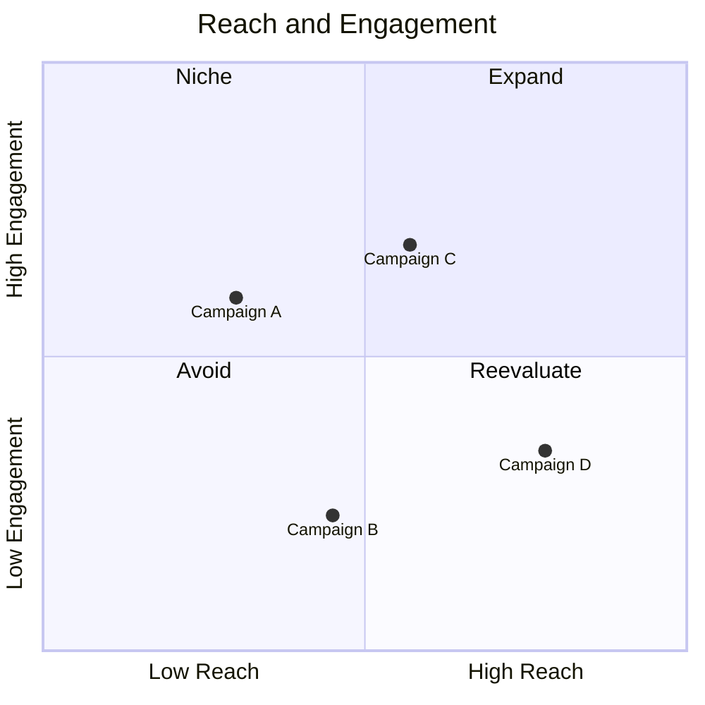

- [ ] タイトル・軸ラベル・象限ラベルの編集（**ASCII 推奨**）
- [ ] データポイントの追加・編集・削除
- [ ] SVG 上のデータポイントをドラッグして移動
- [ ] ダブルクリックで名前変更

### 5.6 ガントチャート

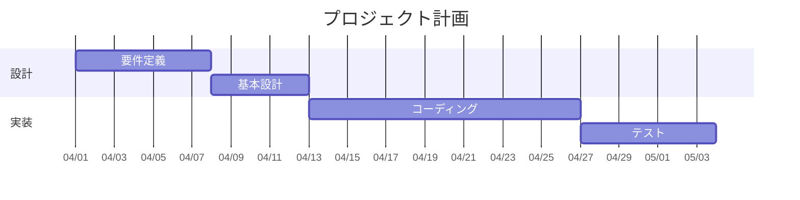

- [ ] セクション・タスクの追加・編集・削除
- [ ] 日付・期間・依存関係・ステータス
- [ ] セクション折りたたみ（▼/▶）
- [ ] タスクのドラッグ＆ドロップ並び替え（セクション内・間）
- [ ] セクション色 → 配下タスクに自動適用

### 5.6.1 【v0.4.1】ガント図 — タスク直接操作

上記 5.6 のガント図を使用して、SVG プレビュー上で以下を確認してください。

- [ ] タスクバーを掴んで左右にドラッグ → `startDate` が更新される
- [ ] タスクバー **右端 8px** にカーソルを合わせる → `ew-resize` に変化
- [ ] 右端ドラッグで `duration` が 1 日単位で増減
- [ ] タスクバー右クリック → `±1日 / ±7日 / 削除` メニューが出る
- [ ] `after X` 依存タスクはドラッグ不可（`not-allowed` カーソル）

### 5.7 ER 図

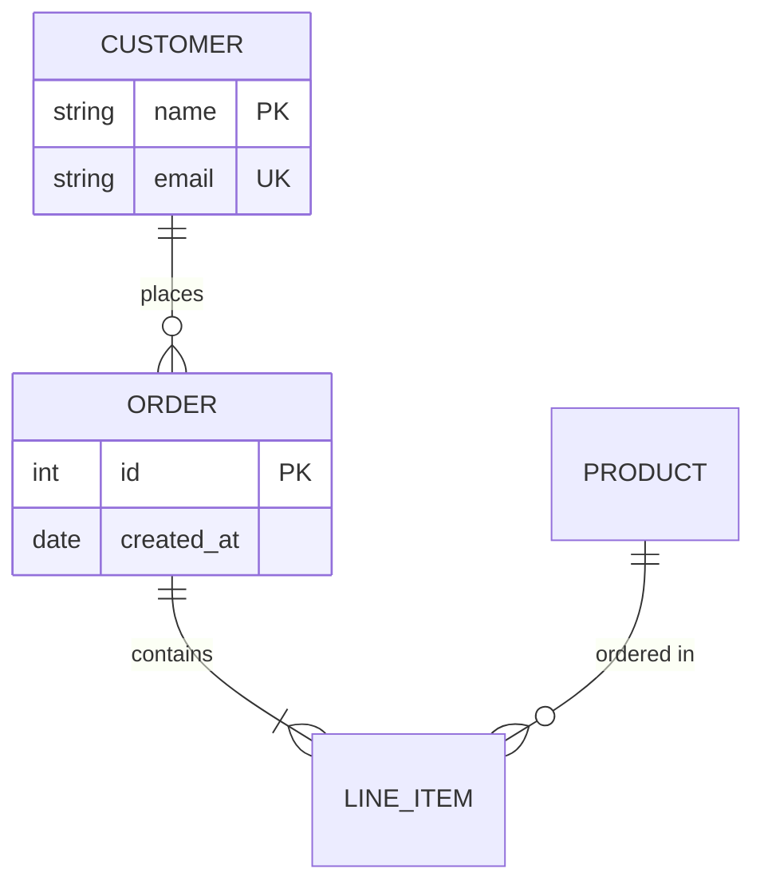

- [ ] エンティティの追加・名前変更・削除
- [ ] 属性の追加・編集（PK/FK/UK 設定）
- [ ] リレーション（6 種カーディナリティ）の追加・編集
- [ ] エンティティ名ダブルクリック → コンテキストメニュー

---

## 6. Mermaid — 汎用フォーム GUI 14 種（v0.3.0 追加）

各図でも「✎ ダイアグラムを編集」から汎用フォームエディタが起動します。  
共通機能: **セクション別リスト編集 + ライブ SVG プレビュー + コードモード切替**

### 6.1 状態遷移図

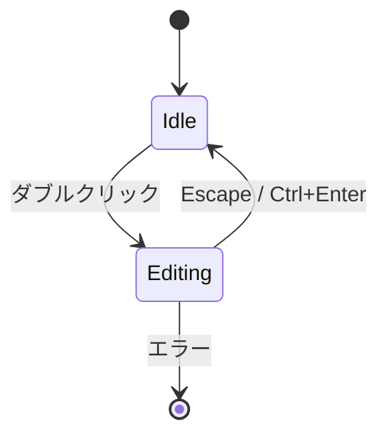

- [ ] フォームで状態追加・遷移追加・削除
- [ ] コードモード切替で Mermaid ソースを直接編集
- [ ] ライブプレビューが更新される

### 6.2 パイチャート

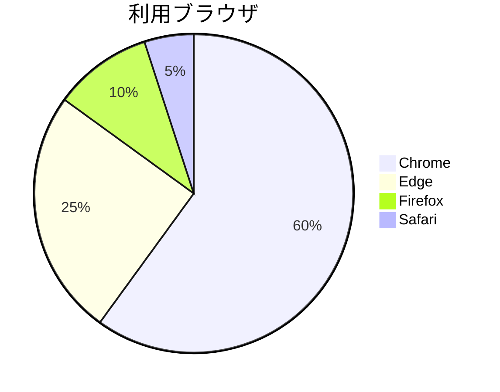

### 6.3 ユーザージャーニー

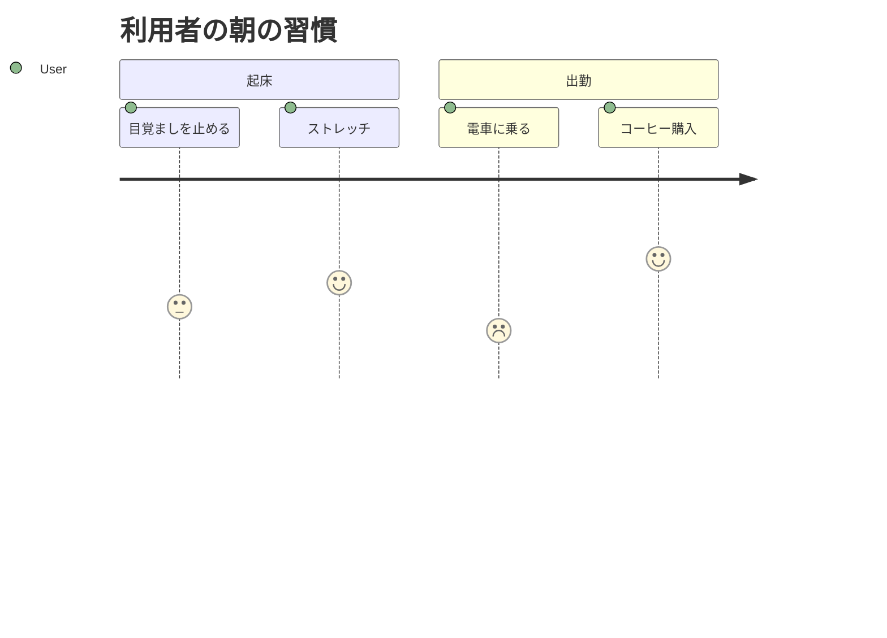

### 6.4 Git グラフ

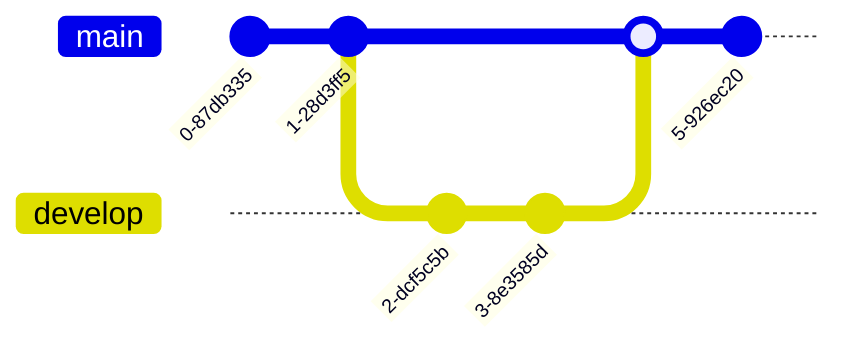

### 6.5 タイムライン


### 6.6 要求図

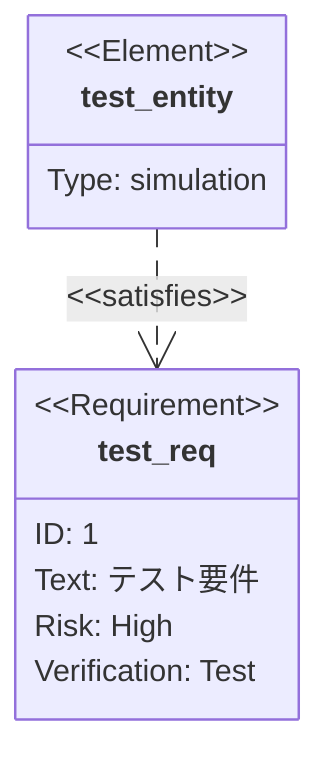

### 6.7 C4 図

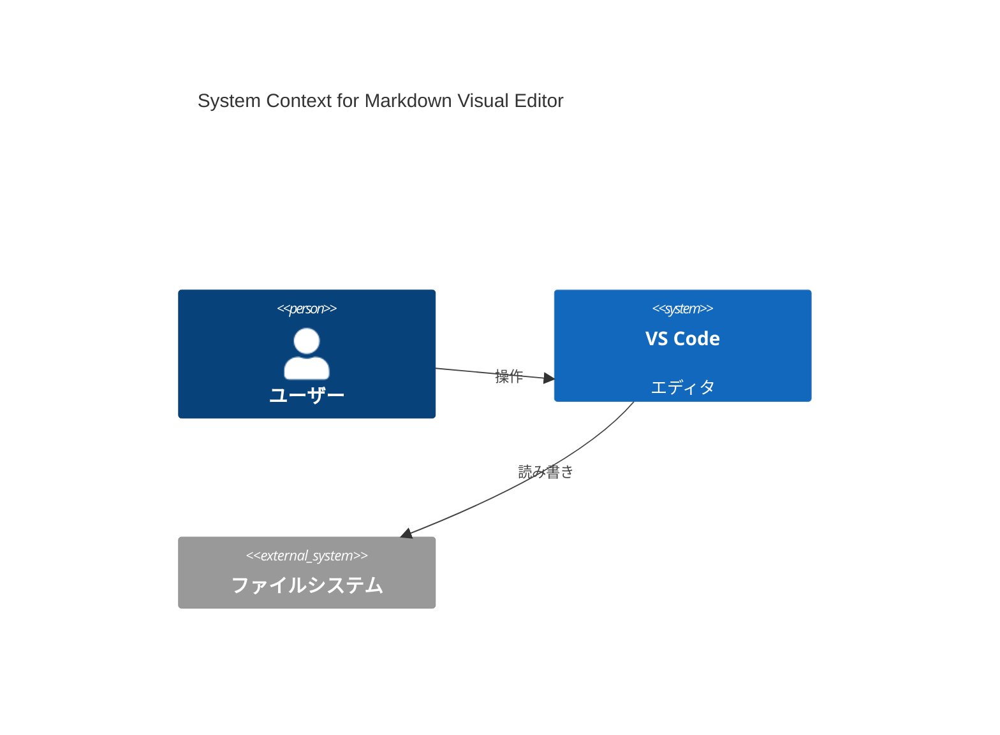

### 6.8 Sankey 図

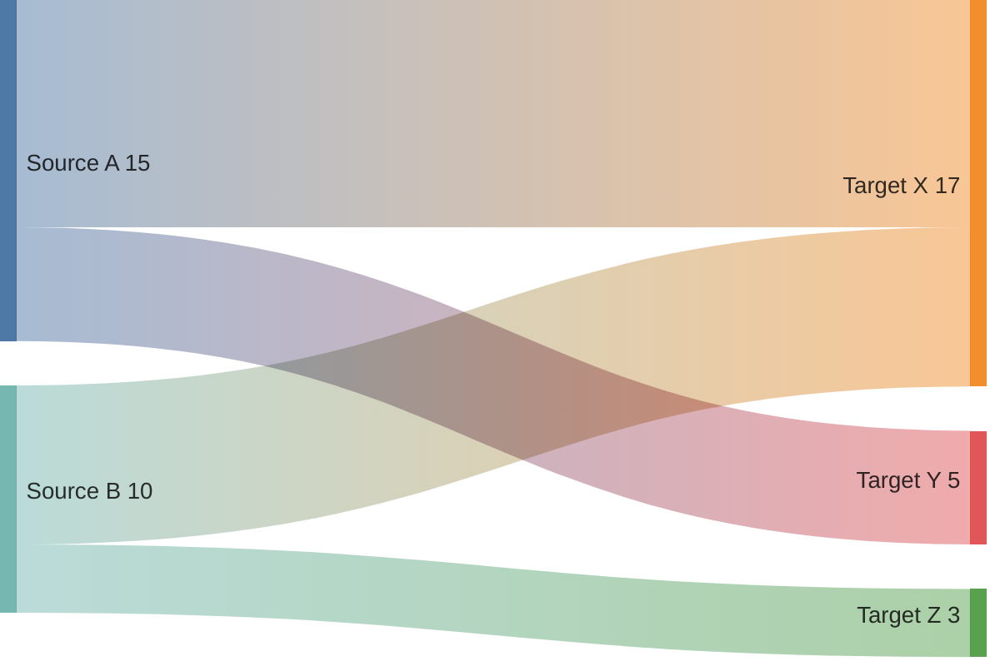

- [ ] **【v0.4.3】ダークテーマ**でリンク帯／ノードバーが視認できる（薄すぎず潰れない）

### 6.9 XY チャート

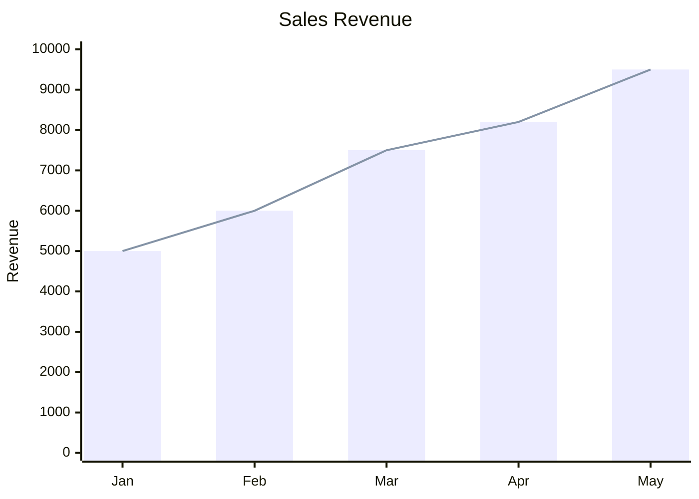

- [ ] **【v0.4.1】Y 軸 自動追従** — 「データに自動追従: ON / OFF」を切替可、ON で値が振り切れない
- [ ] **【v0.4.3】表示モード切替** — 「重ね合わせ / 積み上げ / 横並び (グループ)」の 3 種が切替できる
- [ ] 表示モードを変えて保存 → ファイルに `%% mdve:xy=...` メタコメントが書き込まれる
- [ ] 保存後に再オープン → 表示モードが復元され、元のシリーズ値も保持される

### 6.10 ブロック図

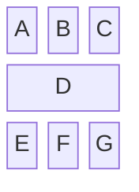

### 6.12 パケット図

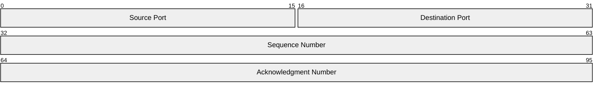

### 6.13 アーキテクチャ図

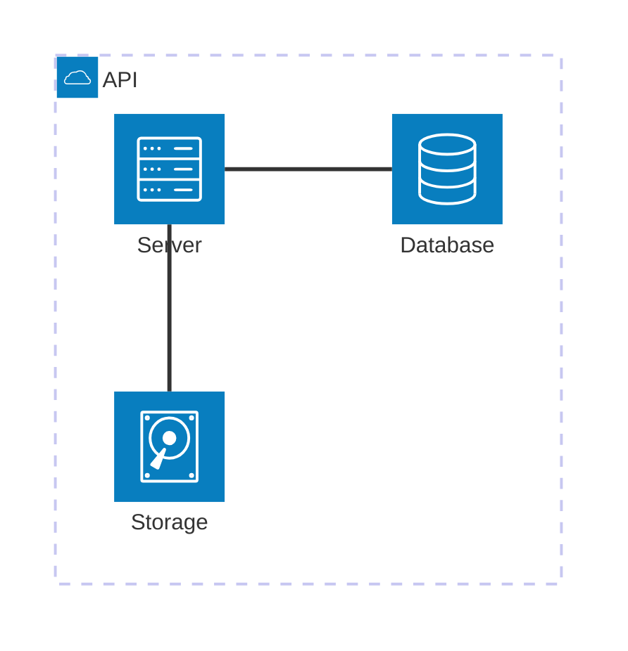

### 6.14 Kanban


**14 種共通チェック:**

- [ ] 各図でビジュアルエディタが起動する
- [ ] フォーム入力でリスト追加・編集・削除ができる
- [ ] ライブ SVG プレビューが更新される
- [ ] コードモードに切り替えて直接編集できる
- [ ] 保存して再オープンしても内容が保持される

---

## 7. Mermaid コードフォールバック

未知の構文や判定不能な図は、コード + プレビュー分割エディタにフォールバックします。

```mermaid
%% コメントだけのブロック（判定不能）
%% Mermaid 構文として判定できない場合のフォールバックテスト
graph TD
    %% 上の comment ヘッダーで始まる場合の挙動
    A --> B
```

- [ ] 判定不能な構文でも編集ボタンが表示され、コード+プレビュー分割で編集できる
- [ ] エラーがあるとプレビュー側にエラー表示される

---

## 8. ブロック操作 — 右クリックメニュー

任意のブロック（段落・見出し・リスト・コード・テーブル・Mermaid 等）を **右クリック** すると、コンテキストメニューが表示されます。

- [ ] `✎ 編集` … 選択ブロックの編集モードに入る
- [ ] `✂ 切り取り` / `⧉ コピー` … ブロック全体を Markdown としてクリップボードへ
- [ ] `📋 貼り付け (このブロックの後ろ)` … クリップボードの内容をブロックとして直後に挿入
- [ ] `↑ 上に移動` / `↓ 下に移動` … セクション/ブロック並び替え（先頭/末尾では disabled）
- [ ] `📄 PDF として出力` … 後述の §11 を参照
- [ ] **【v0.4.3】** `🗑 削除` … 「クリップボードへコピー → 確認ダイアログ → 削除」のフローで削除
- [ ] **【v0.4.3】** `Delete` キーでも同様にブロック削除できる
- [ ] 複数ブロックを選択した状態で `Delete` → まとめて削除される
- [ ] 削除後、貼り付け（`Ctrl+V` 相当の右クリック「貼り付け」）で復元できる

### エディタ余白の右クリック

ブロック外の余白で右クリックすると、軽量メニューが出ます。

- [ ] `📋 貼り付け (末尾に追加)` … 文書末尾にブロック追加
- [ ] `📄 PDF として出力` … PDF 出力

---

## 9. 画像のドラッグ＆ドロップ挿入

外部から画像ファイル（PNG / JPG / GIF / WebP / SVG など）をエディタ領域に **ドラッグ＆ドロップ** すると、Markdown ファイルと同じディレクトリ（または `images/` サブフォルダ）にコピーされ、`` として挿入されます。

- [ ] エクスプローラから画像 1 枚をブロック領域へドロップ → 画像ブロックとして挿入される
- [ ] エクスプローラから複数枚を一度にドロップ → 複数の画像ブロックが追加される
- [ ] ブロックとブロックの間にドロップ → 当該位置に挿入される
- [ ] ドロップ先のブロック内（例: 段落内）にドロップ → そのブロックの後に挿入される
- [ ] 挿入後、画像が即座にプレビューに表示される
- [ ] 保存先の相対パスが Markdown ソースに記録されている
- [ ] **【v0.4.3】** `` のような **相対パス画像** が WebView に表示される
- [ ] 日本語ファイル名や `.JPG` (大文字拡張子) の画像も表示される
- [ ] `file://` 絶対パスや `data:` URL の画像もそのまま表示される
- [ ] 同一画像が複数箇所にあっても再描画コストが体感で増えない（キャッシュ動作）

### 9.1 【v0.4.3】ブロックのドラッグ & ドロップで並び替え

レンダリング済みプレビュー上で、各ブロック（見出し・段落・リスト・コード・Mermaid・テーブル・画像など）をマウスで掴んで並び替えできます。

- [ ] ブロック左端にホバーすると **ドラッグハンドル `⋮⋮`** が表示される
- [ ] ドラッグハンドルを掴んで他のブロックの上下にドロップ → 並び順が変わる
- [ ] ブロック本体（リンク・入力欄等は除く）を掴んでも並び替えできる
- [ ] 移動中に **ゴーストとドロップ位置インジケータライン** が表示される
- [ ] 複数ブロックを選択した状態でドラッグ → まとめて移動できる
- [ ] 並び替えた結果が Markdown ソース（トークン順）にも反映される
- [ ] Undo（`Ctrl + Z`）で並び順を元に戻せる

---

## 10. 【v0.4.3】LaTeX / KaTeX 数式

本文中の数式は完全ローカルバンドルの KaTeX 0.17 でレンダリングされます。ネットワーク通信は発生しません。

インライン例: 質量とエネルギーの関係 $E = mc^2$ は有名。  
もう一例: 二次方程式の解 $x = \frac{-b \pm \sqrt{b^2 - 4ac}}{2a}$。

ディスプレイ例（`$$ ... $$`）:

$$
\int_{-\infty}^{\infty} e^{-x^2}\,dx = \sqrt{\pi}
$$

$$
\sum_{k=1}^{n} k = \frac{n(n+1)}{2}
$$

ディスプレイ例（` ```math ` コードブロック）:

```math
\nabla \cdot \mathbf{E} = \frac{\rho}{\varepsilon_0}
```

構文エラー例（赤くツールチップでエラー詳細が出ること）:

$$
\frac{a}{b
$$

- [ ] 上記の **インライン / `$$` / ` ```math ` ** 全てが崩れず描画される
- [ ] 構文エラーの式は `<span class="math-error">` で赤く表示され、ホバーで原因がツールチップ表示される
- [ ] 数式ブロックを **ダブルクリック** → TeX ソース編集モードに切り替わる
- [ ] 編集確定後、再描画される（`$...$` / `$$...$$` のまま保存される）
- [ ] コードブロック内（` ```js ` などの非 math 言語）の `$...$` は数式化されない
- [ ] インラインコード内（`` `$x$` ``）の `$x$` は数式化されない
- [ ] ツールバーの **「Mermaid / ブロック挿入」ピッカー** に `math` テンプレートがあり、選択するとディスプレイ数式テンプレートが挿入される
- [ ] PDF 出力でも KaTeX 数式が正しくレンダリングされる（後述 §11）

---

## 11. 【v0.4.2】PDF として出力

ブロック右クリック → `📄 PDF として出力`、またはエディタ余白の右クリック → `📄 PDF として出力` を実行してください。
v0.4.2 から、VS Code Webview が `window.print()` をブロックする問題に対処するため、**一時 HTML を書き出して OS 既定ブラウザで開き、自動的に印刷ダイアログを起動する** 方式に変更されました。「PDF として保存」を選択して保存先を指定してください。
画像の相対パスは md ファイルのディレクトリ基準で絶対 `file://` URI に解決されます。

### 基本動作

- [ ] メニューから PDF 出力を実行 → 既定ブラウザでプレビュー HTML が開く
- [ ] 自動的に印刷ダイアログが立ち上がる
- [ ] 「PDF として保存」で保存できる
- [ ] 保存先案内バナーに **md ファイルのディレクトリパス** が表示される
- [ ] 未保存（無題）ファイルでは「保存済みのファイルが必要」エラーが出る

### 表示品質（直近の修正点）

- [ ] VS Code がダークテーマでも、**PDF はライトモード**（白背景・黒文字）で出力される
- [ ] Mermaid 図がライト配色（白背景・濃灰ノード）で出力される
- [ ] Mermaid 図の **縮尺が暴走しない**（小さい図が無理やり 100% に引き伸ばされない）
- [ ] 大きい図はページ幅に収まる（`max-width: 100%`）
- [ ] テーブルが右端で **見切れない**（長い文字列は折り返される）
- [ ] 画像が極端に大きくならない（`max-height: 90vh`）
- [ ] **空白ページが連発しない**（背の高いブロックはページ境界で分割される）
- [ ] コードブロックが薄いグレー背景で出力される
- [ ] 検索ハイライト（黄色マーカー）は紙面に持ち込まれない
- [ ] 編集ハンドル / ✎ 編集ボタン / コンテキストメニュー は紙面に出ない
- [ ] LaTeX 数式が正しくレンダリングされている
- [ ] ヘッダーに `<ファイル名> — PDF出力` のタイトルが出る

---

## 12. キーボードショートカット まとめ

### グローバル

| キー | 動作 |
|---|---|
| `Ctrl + F` | 検索バーを開く |
| `Ctrl + H` | 検索 / 置換バーを開いて置換へフォーカス |
| `Esc`（検索バー中） | 検索バーを閉じる |
| `Ctrl + Click` | リンクを開く |

### ブロック編集中

| キー | 動作 |
|---|---|
| `Escape` | 編集確定 |
| `Ctrl + Enter` | 編集確定 |
| `Ctrl + B` | 太字 |
| `Ctrl + I` | 斜体 |
| `Tab` | インデント |

### フローチャート編集中

| キー | 動作 |
|---|---|
| `Delete` / `Backspace` | 選択ノード／エッジ削除 |
| `Esc` | 選択解除・接続モード終了 |
| `Ctrl + Z` / `Ctrl + Y` | Undo / Redo |

- [ ] 上記すべてが期待通り動作する

---

## 13. ファイル間連携

- [ ] このファイルと別の `.md` を両方ビジュアルエディタで開ける
- [ ] 一方を VS Code 標準エディタで開いても **同時には開けない**（`supportsMultipleEditorsPerDocument: false`）
- [ ] 標準エディタで保存 → ビジュアルエディタ側に反映される
- [ ] ビジュアルエディタで編集 → ファイルが自動保存される

---

## 14. 既知の制限

- [ ] 象限チャートで日本語ラベルを使うと一部解析エラーになる（Mermaid 仕様）
- [ ] デフォルトエディタではない（Open With... で選択）
- [ ] 検証 OS は Windows 10/11 のみ

---

## チェック完了サイン

```
テスト実施日:
テスト実施者:
不具合報告:
```

---

> 完了したら、見つかった不具合を [`拡張機能要望.md`](拡張機能要望.md) に追記してください。
